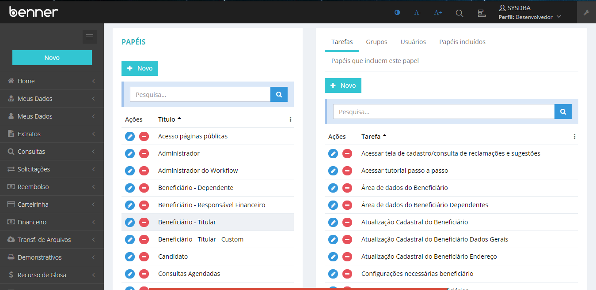
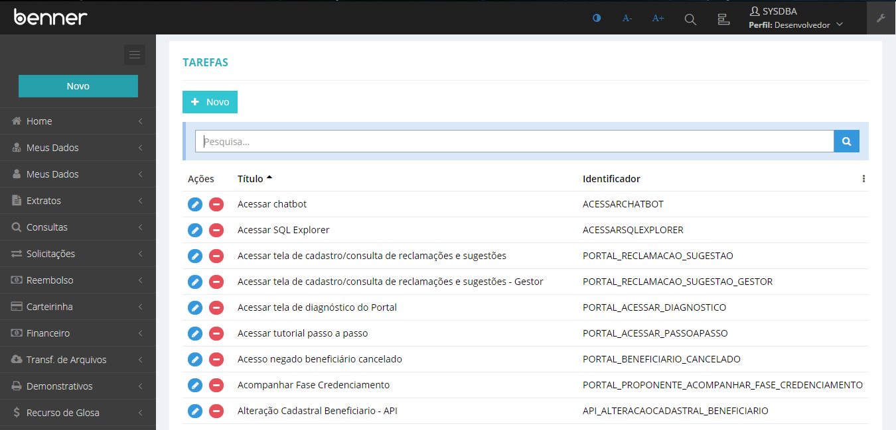
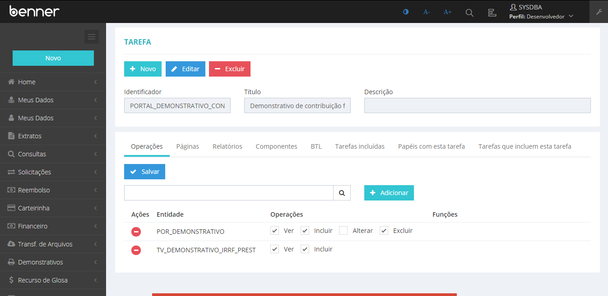
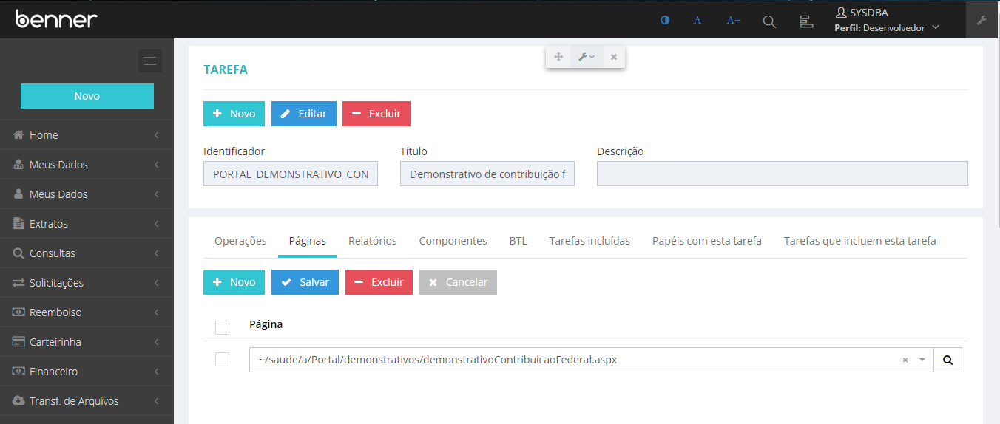
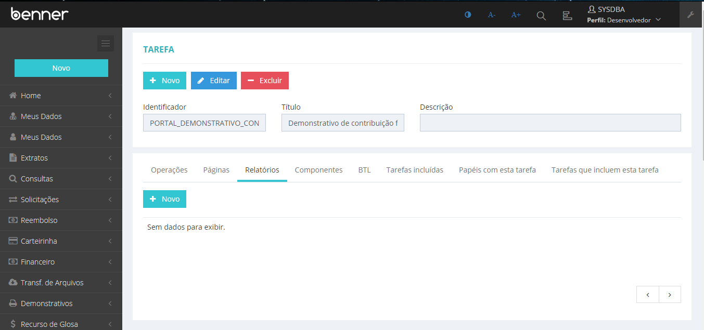
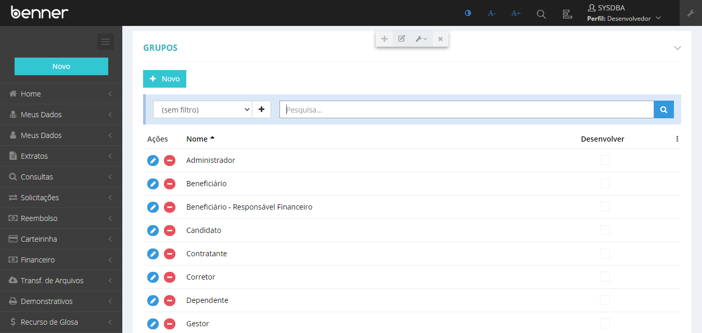
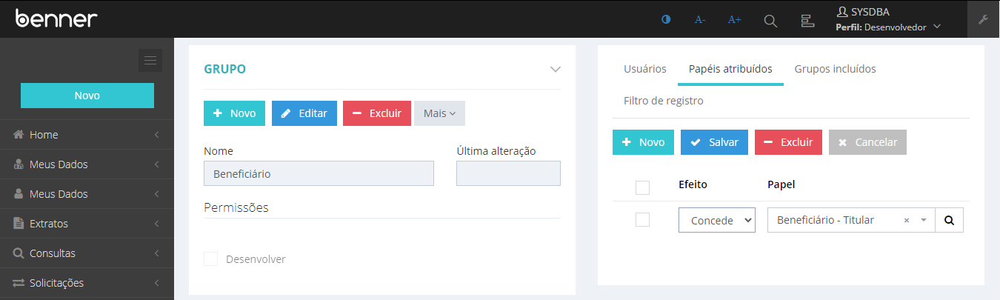

# Autorização Baseada em Papéis - Portal de serviços

1. **[Introdução](#introdução)**
2. **[Definição de Papéis](#definição-de-papéis)**
	* **[Papéis](#papéis)**
	* **[Tarefas](#tarefas)**
	* **[Operações, Páginas e Relatórios](#operações-páginas-e-relatórios)**
3. **[Configuração de Permissões](#configuração-de-permissões)**
    * **[Usuários e Grupo de Usuários](#usuários-e-grupo-de-usuários)**
    * **[Atribuições de papéis](#atribuições-de-papéis)**

## Introdução
Neste manual serão abordados de forma simples os conceitos básicos para pleno entendimento destes mecanismos no Portal.

A autorização baseada em papéis apóia-se em dois conceitos: Definição de Papéis e Configuração de Permissões.

## Definição de Papéis

Define os papéis que podem ser desempenhados em um sistema, e as respectivas definições de tarefas e suas operações.

### Papéis

* O Papel é a atuação dos usuários em relação ao portal.
* Um usuário desempenha um ou mais papéis
* Um papel pode conter um conjunto de papéis incluídos.
	* O conceito papel incluído forma uma estrutura de composição, onde os papéis incluídos compõem o todo (o papel que os inclui).
* Papéis suportam customização por camadas.
* Um papel é definido pelas [Tarefas](#tarefas) que lhe competem.
* Papéis podem ser atribuídos a grupos de usuários ou a usuários específicos.

> **Configurações > Papéis**

### Tarefas

* Um papel é definido pelas tarefas que lhe competem.
* Uma tarefa é um agrupamento de [Operações, Páginas e Relatórios](#operações-páginas-e-relatórios). A tarefa centraliza quais operações são necessárias para concluir determinado procedimento, um procedimento qualquer que faça parte do dia-dia do usuário do portal.
	* Por exemplo, um usuário com o papel "Prestador" pode executar as tarefas "Área de dados do prestador" e "Consultar status do protocolo".
* Uma tarefa pode ser executada por vários papéis.
	* Por exemplo, a tarefa "Transferência de arquivos" pode ser executada por pessoas que desempenhem os papéis de "Beneficiário" ou mesmo "Prestador".
* Uma tarefa pode conter um conjunto de tarefas incluídas.
	* O conceito de tarefa incluída forma uma estrutura de composição, onde as tarefas incluídas compõem o todo (a tarefa que as inclui).
* Tarefas suportam customização por camadas.

> **Configurações > Tarefas**

### Operações, Páginas e Relatórios

* Uma Tarefa é composta por um conjunto de operações, páginas e relatórios.
* Operações são conceitos de sistema, representam ações sobre determinadas entidades.
	* Por exemplo, a entidade TV_DEMONSTRATIVO_IRRF_PREST possui ações de ver, incluir e assim por diante.
* Operações suportam customização por camadas.

> **Configurações > Tarefas**

## Configuração de Permissões

Define quem pode ou não desempenhar papéis do sistema, neste caso estamos falando de usuários e grupos de usuários, e suas respectivas atribuições.

### Usuários e Grupo de Usuários
 
* Um grupo de usuários é um agrupamento de vários usuários que desempenham papéis em comum.
* Um usuário pode pertencer à vários grupos.
* Usuários ou grupos de usuários podem receber atribuições de vários papéis.

> **Configurações > Grupos**

### Atribuições de papéis

* Para cada grupo de usuários pode-se atribuir um ou mais papéis.
* A atribuição de papéis também pode ser feita diretamente para usuários individuais, dispensando da criação de grupos especificamente para esta finalidade.
* As atribuições tem um efeito que pode ser ou positivo, ou negativo.
	* Isto simplifica a administração, permitindo atribuir um papel a vários usuários de um grupo, excetuando determinados usuários individuais.

> **Configurações > Grupos**

