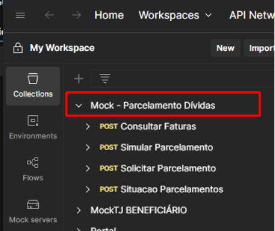
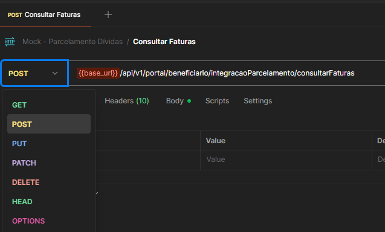
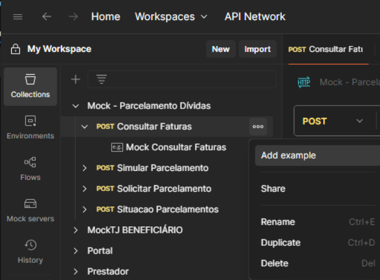
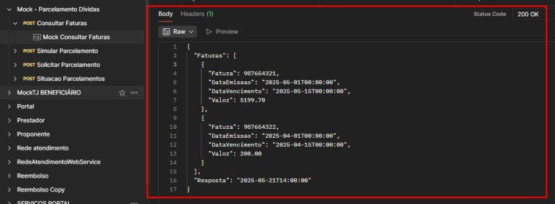
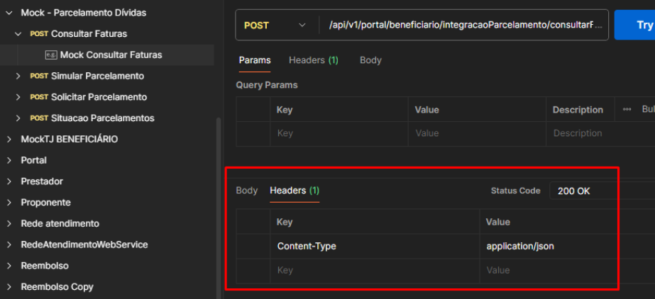
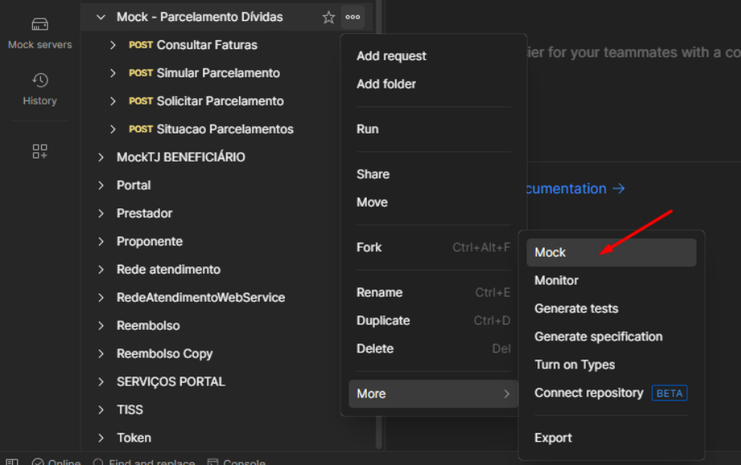
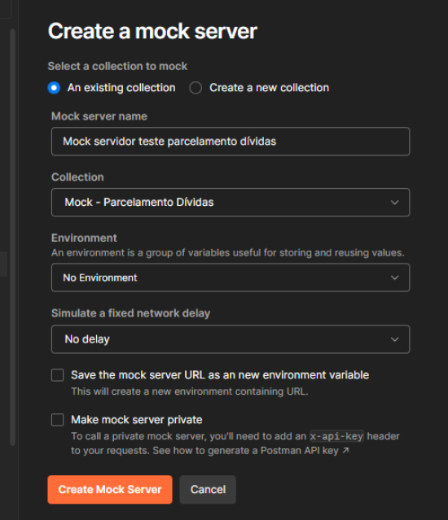
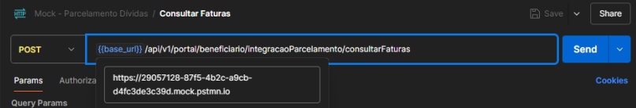
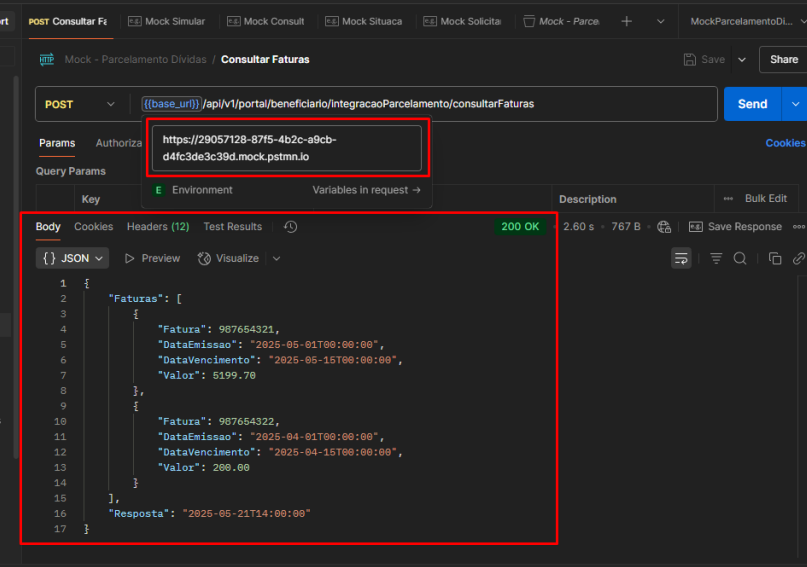
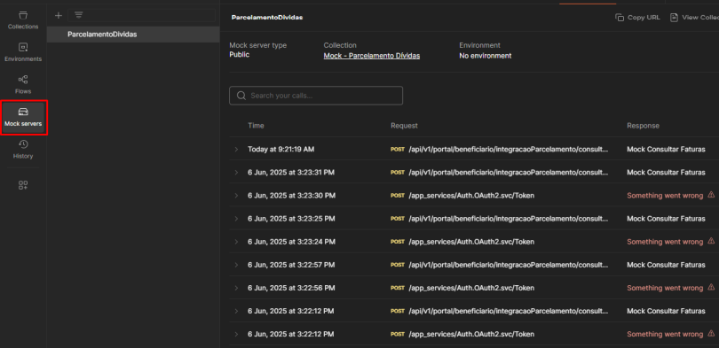

# Guia: Como Criar um Mock Server no Postman

1. **[Definição de Mock Server](#definição-de-mock-server)**

2. **[Criando o Mock Server](#criando-o-mock-server)**

    2.1 **[Passo 1: Criar uma "Collection"](#passo-1-criar-uma-collection)**
	
    2.2 **[Passo 2: Adicionar requisições e salvar exemplos de respostas](#passo-2-adicionar-requisições-e-salvar-exemplos-de-respostas)**
    
    2.3 **[Passo 3: Criar o Mock Server a partir da Collection](#passo-3-criar-o-mock-server-a-partir-da-collection)**
    
    2.4 **[Passo 4: Testar o Mock Server](#passo-4-testar-o-mock-server)**
    
3. **[Fontes](#fontes)**

## Definição de Mock Server

> Um Mock Server é um servidor que simula o comportamento de uma API real. Ele permite que uma aplicação seja desenvolvida mesmo antes da API estar totalmente implementada. O servidor responde a requisições com dados estáticos ou dinâmicos previamente definidos, facilitando o desenvolvimento e os testes de forma independente e paralela.

## Criando o Mock Server

### Passo 1: Criar uma "Collection"

A base de um mock server no Postman é uma *Collection*. Ela agrupa todas as suas requisições de API.

Para criar uma nova *Collection*:

1. No menu lateral, selecione a aba **Collections**.
2. Clique no ícone de **+** para adicionar uma nova *Collection*.
3. Dê um nome para a sua *Collection* e pressione Enter.

### Passo 2: Adicionar requisições e salvar exemplos de respostas

Para cada endpoint que você deseja simular, é preciso primeiro criar a requisição correspondente dentro da sua *Collection*. 
A resposta de exemplo (*Example*) é o que o seu mock server irá retornar quando essa requisição for chamada.

1. Primeiro, configure a requisição:
    * Adicione uma nova requisição à sua *Collection* (clique nos três pontinhos ao lado do nome da *Collection* e selecione **Add Request**).
    * Defina o **método HTTP**. Pode ser **GET**, **POST**, **PUT**, etc., dependendo da ação que você está simulando.
    * No campo da URL, insira apenas o caminho do endpoint. A URL base será adicionada depois.
    

2. Com a sua nova requisição selecionada, você verá a área principal para construir a requisição.
3. À direita de uma requisição, clique nos três pontinhos (...) e acesse **Add example**.
    

4. Agora você pode "desenhar" a resposta que o servidor simulado deve enviar:

    * **Body (Corpo):** Insira o JSON, XML ou texto que você quer como resposta.
    
    * **Headers (Cabeçalhos):** Adicione cabeçalhos de resposta, como `Content-Type: application/json`
    `Content-Type: application/xml`
    * **Status Code (Código de Status):** Defina o código de status HTTP, por exemplo, `200 OK`.
    

5. Clique em **Save**.
    > Nota: É possível criar vários exemplos para a mesma requisição para simular diferentes cenários (ex: sucesso e erro).

### Passo 3: Criar o Mock Server a partir da Collection

Com as requisições e seus exemplos salvos, agora é hora de gerar o mock server.

1. Clique nos três pontinhos (...) ao lado do nome da sua *Collection*.
2. No menu suspenso, selecione a opção **Mock**.

    

3. Uma nova janela de configuração se abrirá:

    * **Mock Server Name:** Dê um nome para o seu servidor simulado.
    * **Environment:** (Opcional) Associe um ambiente se estiver usando variáveis.
    * **Save the mock server URL as a new environment variable:** Marcação que cria uma variável de ambiente com a URL do mock.
    * **Simulate a fixed network delay:** Simula um atraso fixo de rede (latência).
    * **Save the mock server URL as a new environment variable:**  
    Ao marcar essa opção, o Postman cria automaticamente uma variável de ambiente com a URL do mock server.
    * **Make mock server private:**  (Opcional) Se você marcar esta opção, será necessário enviar uma chave de API do Postman no cabeçalho de cada requisição (`x-api-key`) para acessá-lo. Para testes rápidos, pode deixá-la desmarcada.

    

4. Clique no botão **Create Mock Server**.

### Passo 4: Testar o Mock Server

O Postman irá gerar uma **URL única** para o seu mock server. Essa é a URL base que você usará para fazer as chamadas.

1. O Postman exibirá a URL gerada. Clique em **Copy URL**.  A URL terá um formato como:  `https://<ID_DO_MOCK>.mock.pstmn.io`.
2. Volte para a sua requisição dentro da *Collection*.
3. Cole a URL do mock server no campo de endereço da requisição e adicione o caminho do endpoint.

4. Clique em **Send**.

> A resposta recebida no painel "Response" deve ser exatamente o JSON que você configurou no "Example".

Para verificar os logs de requisição, acesse a aba **Mock Servers** no menu esquerdo e selecione seu servidor para visualizar o "Mock Server Log".

### Fontes

* [Postman Learning Center - Setting up mock servers](https://learning.postman.com/docs/design-apis/mock-apis/set-up-mock-servers/)
* [Postman Answers - Postman mock services](https://www.postman.com/postman/postman-answers/documentation/6na8wuz/postman-mock-services)
