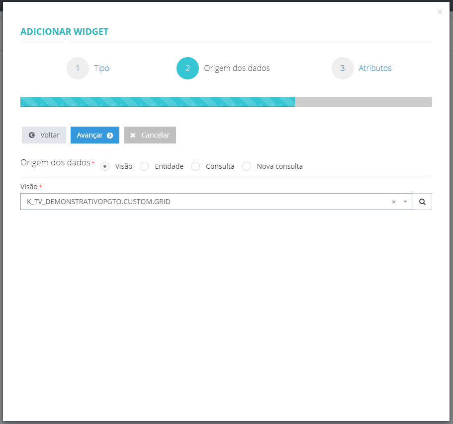
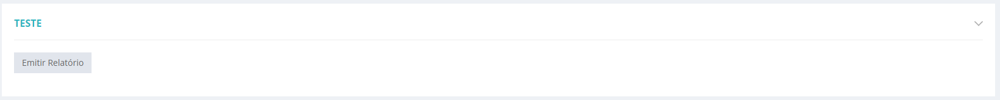
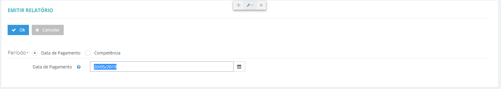

# Inclusão de relatórios - Portal de serviços

1. **[Introdução](#introdução)**
2. **[Definindo a tabela virtual no builder](#definindo-a-tabela-virtual-no-builder)**
3. **[Criando o relatório stimulsoft](#criando-o-relatório-stimulsoft)**
    * **[Criando o layout do relatório](#criando-o-layout-do-relatório)**
    * **[Criando filtros para o relatório](#criando-filtros-para-o-relatório)**
4. **[Criando a visão](#criando-a-visão)**
    * **[Criando a página para a visão](#criando-a-página-para-o-relatório)**
    * **[Vinculando a página criada a algum menu](#vinculando-a-páginacriada-a-algum-menu)**
    * **[Adicionando widget na página criada](#adicionando-widget-na-página-criada)**
    * **[Editando comandos do widget](#editando-comandos-do-widget)**

## Introdução
Neste manual será abordado de forma simples como adicionar no portal de serviços novos relatórios Stimulsoft.

É importante saber que para a realização da customização é necessário o entendimento mínimo sobre Stimulsoft e Wes _(páginas, menus, visões...)_

## Definindo a tabela virtual no builder
Iremos inserir um relatório com 2 campos: **NOME** e **CPF**

Inicialmente é necessário acessar a base de dados do Portal utilizando o _builder_ e então criar uma tabela virtual contendo os campos que serão utilizados como filtro para o relatório.

Inclua uma nova tabela e insira os campos desejados, neste exemplos adicionaremos os campos:

 - **NOME** _(string tamanho 70)_ 
 - **CPF** _(string tamanho 11)_

 

A inserção de parâmetros para a geração do relatório será feita através da tabela virtual criada anteriormente, _caso não seja necessário parâmetros para a gerar o relatório, criar somente uma visão de grid e no passo 4, selecionar *SEM ENTRADA DE DADOS*_.

## Criando o relatório stimulsoft
Nosso próximo passo é criar o relatório stimulsoft e vinculá-lo a tabela virtual, e para isso é necessário acessar o portal com um usuário que possua papel **_Desenvolvedor_**. 

> **Configurações > Relatórios e cubos > Relatórios > Novo**

 

 Após informar o código e o nome do novo relatório, clicar em Salvar. Logo após, novos botões estarão disponíveis para que possamos prosseguir.

 _*Para os relatórios/Tv já existentes, selecioná-los na aba "Outros"._

 ### Criando o layout do relatório
 O passo seguinte é criarmos o layout do relatório. Clique no botão de **Layout.** _(necessário conhecimentos básicos sobre a criação de relatórios Stimulsoft)_

 No exemplo abaixo criamos um relatório utilizando **BennerDatabase** e importando a tabela **POR_BENEFICIARIO**

 

### Criando filtros para o relatório
Como o nosso relatório terá um filtro, se faz necessário a edição da nossa fonte de dados para que seja adicionado a tag _@CRITERIOSELECAO_

_Lembre-se de sempre ir salvando as alterações realizadas._

Após toda a criação do relatório, ajustes de cabeçalhos, rodapés e dados que serão listados, salve-o e saia do editor através do menu: **Arquivo > Sair.**

Na tela de dados do relatório vá na aba de _**outros**_ e informe a seleção especial e a tabela virtual criada anteriormente.

## Criando a visão

Após o relatório ser salvo, iremos agora adicionar uma view para este relatório, para isso vá até: 

> Configurações > Artefatos > Visões

Adicione uma visão do tipo **Visão de grid** e uma **Visão de Form**

Em Definição de entidade, selecione a tabela virtual que foi criada anteriormente.

Em Camada, selecione **Cliente** _(veja o exemplo abaixo)_

> **Não esqueça de add a visão do tipo FORM**

### Criando a página para o relatório
O próximo passo é adicionar uma página para o relatório, para isso vá até

> Configuração > Artefatos > Páginas > Novo

### Vinculando a página criada a algum menu
Agora vincula-se esta página criada a algum menu:

> Configurações > Artefatos > Menu

### Adicionando widget na página criada
Vá até a pagina que foi criada e adicione um widget, você tambem pode clicar com o botão direito do mouse e selecionar _adicionar widget_

Prencha os campos conforme as imagens de exemplo abaixo:

* Tipo de Widget: **Painel de comando.**

### Editando comandos do widget
Após a página ser criada e o widget adicionado, falta criar a chamada para o relatório. Para isso vá:

> _ferramentas de desenvolvedor > editar comandos_

Na página de edição dos comandos, clique no botão para adicionar um novo comando do tipo _comando_ e preencha o formulário com os seguintes parâmetros:

* **Título:** emitir relatório _(exemplo)._
* **Entrada de dados:** tabela virtual.
* **Url:** url da página referente ao relatório em questão.
* **Visão:** visão adicionada anteriormente.
* **Processamento:** emissão de relatório
* **Relatório:** escolher o relatório a ser executado.
* **Destino:** volta para a página anterior/fecha modal
* **Formato:** você pode escolher qual o formato do relatório que será exportado, geralmente utiliza-se pdf.

Salvar e entrar na página. Ao clicar no botão de comando, ele abrirá a página da tabela virtual para colocar os filtros.

Após preencher, clicar em OK para gerar o relatório.

Relatório sendo emitido

