# Portal de Serviços (WES 2006) - Starter Pack


1. **[Apresentação](#apresentação)**
2. **[Solution](#solution)**
3. **[Debug local](#debug-local)**
4. **[Build](#build)**
5. **[Preparar para liberação / BS Version](#preparar-para-liberação--bs-version)**
6. **[Arquivos xsd](#arquivos-xsd)**
7. **[Integração com o AG/MG Web](#integração-com-o-agmg-web)**
8. **[Geração de pacotes nuget](#geração-de-pacotes-nuget)**
4. **[Parametrizações](#parametrizações)**

## Apresentação

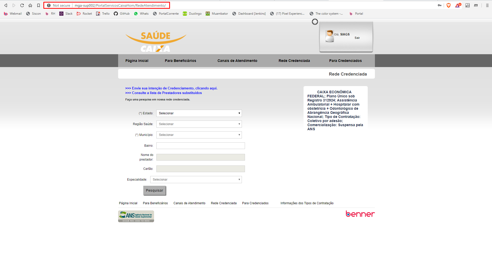

## Solution

No portal antigo, quando a solution é carregada pelo visual studio, os controllers ficam no mesmo local que as páginas, veja o exemplo.

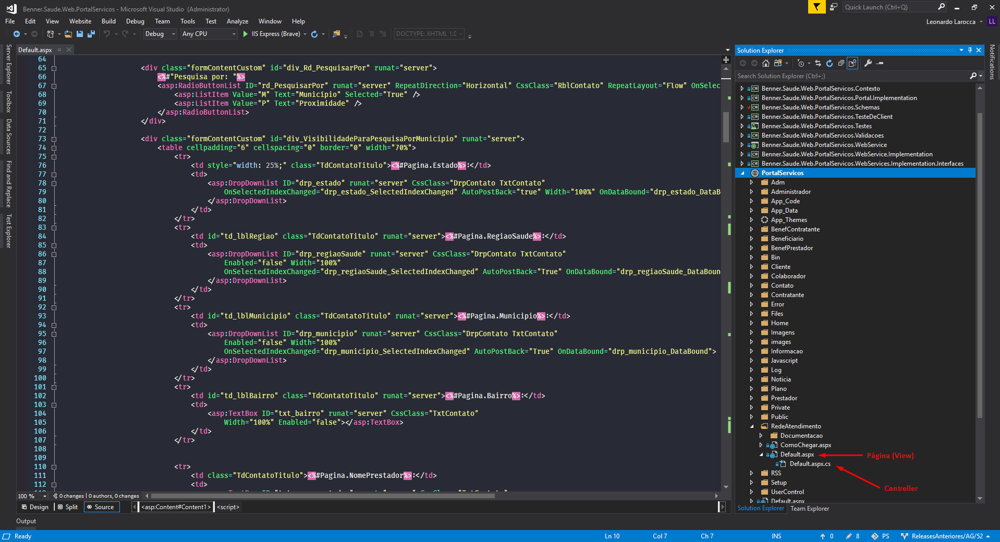

Você pode identificar as ações do controller através do onclick de um botão, por exemplo:

> `protected void btn_pesquisar_Click(object sender, EventArgs e)`

## Debug local

Para realizar o debug local, partindo a execução da sua própria máquina local, modificar o web.config apontando para um endpoint válido, e executar em modo de debug, vide imagem

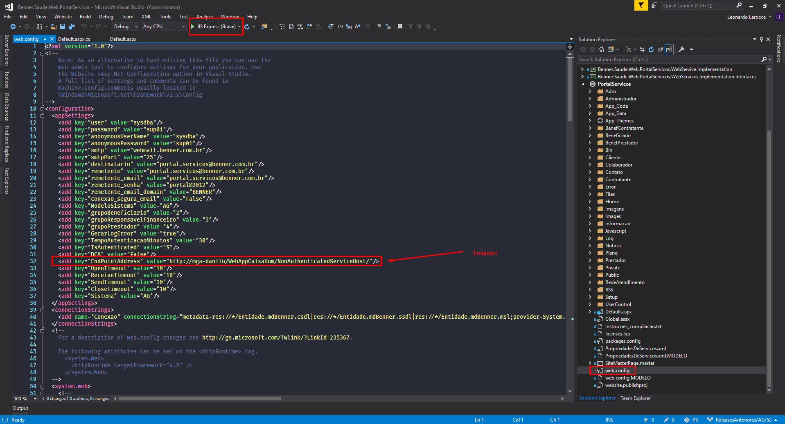

## Build

Após compilar a solution normalmente, com o botão direito no website vá `Publish WebApp`

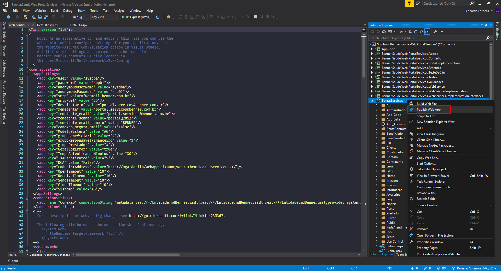

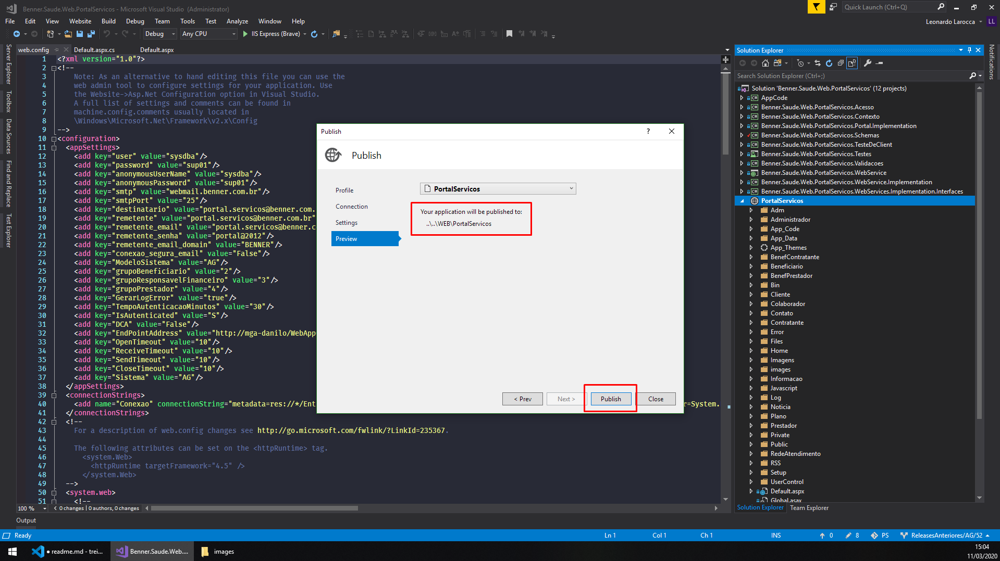

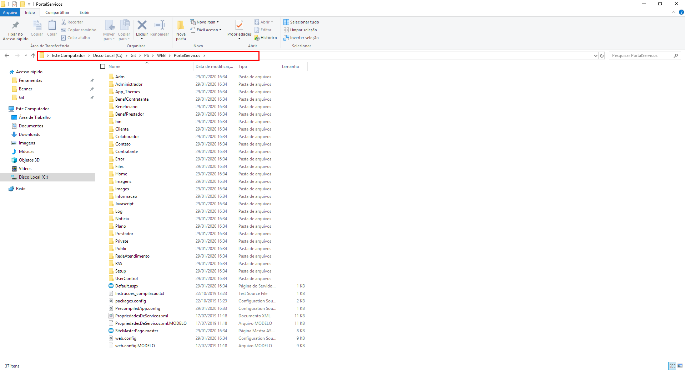

## Preparar para liberação / BS Version

Após realizadas as alterações necessárias, realização do Pull Request e Merge, a SMS deverá ser retornada para o programador anexar o Portal de Serviços zipado.

Depois que todos os passos acima foram realizados, execute a aplicação `PrepararPortalServicosParaLiberacao.exe` 

Ela encontra-se dentro do servidor do suporte (sup001 e sup002), na pasta `C:\Arquivos de Programas(x86)\Benner\Ferramentas`

Selecione a pasta que o visual studio publicou o WebApp, como na imagem

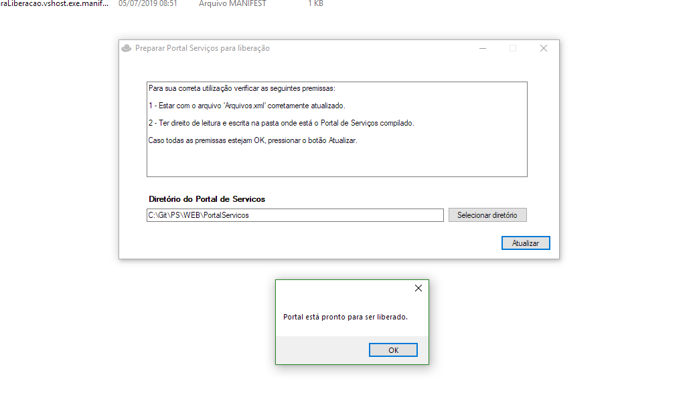

Este executável remove alguns arquivos que não irão para o servidor de Produção/Homolog

Depois de executado, basta zipar a pasta PortalServicos e estará pronto para subir no BS Version.

## Arquivos xsd

Foram criadas interfaces de comunicação entre Portal de Serviços e AG/MG.

Essas interfaces ficam contidas dentro do projeto `Benner.Saude.PortalServicos.Web.Schemas` 

Na pasta Schemas você irá encontrar os arquivos .xsd

No geral, esses arquivos raramente são alterados, salvo exceção de novas implementações...

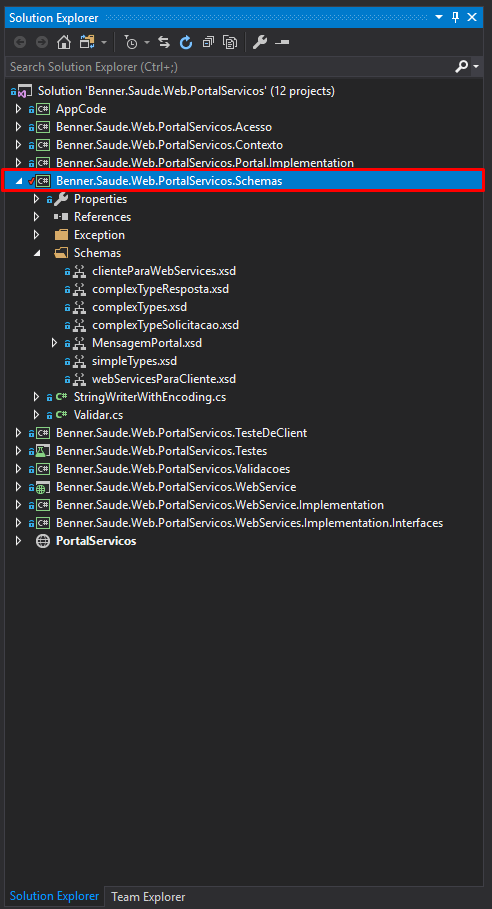

## Integração com o AG/MG Web

Como o Portal de Serviços é integrado tanto para o sistema AG quanto MG, esses sistemas possuem referências que estão ligadas diretamente com o portal de serviços através de pacotes do nuget.

Veja na imagem abaixo um exemplo para o sistema AG:

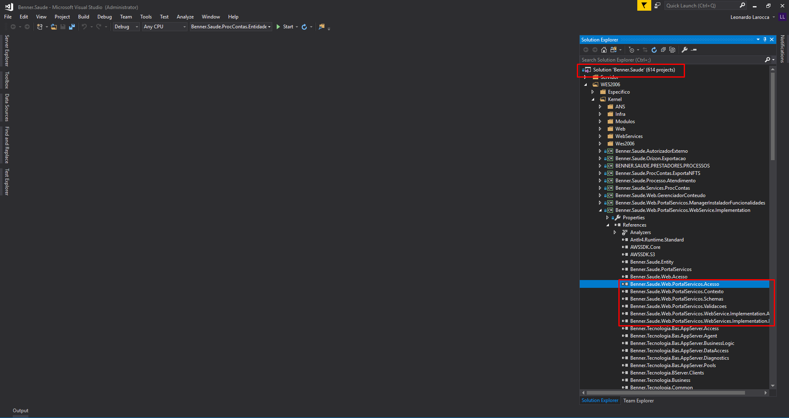

Entao para o funcionamento correto, quaisquer modificações realizadas no portal antigo, essas referências precisam ser atualizadas via pacotes nuget.

> _A nível de desenvolvimento, essas dll's podem ser compiladas pelo portal e serem substituídas diretamente no endPoint que o portal esta consumindo os serviços, na pasta /bin, substitua as dlls em questão. Somente para nível de desenvolvimento local, para liberação ofical é necessário atualizar os pacotes_

Os projetos que possuem referências, no caso do AG são:

```
Benner.Saude.Web.PortalServicos.WebService.Implementation
Benner.Saude.Web.PortalServicos.WebService.Implementation.AG
```

**Verificar com atenção para atualizar todos os projetos.**


## Geração de pacotes nuget

1. Para atualizar os pacotes Nuget, primeiro localize os pacotes antigos no servidor: `mga-tc008\Nuget`;

2. Copie as os arquivos .nupkg desejados nas suas versões mais recentes para uma pasta na sua máquina local;

3. Renomeie o arquivo .nupkg para .zip, para alterar a sua extensão, abra a pasta zipada e descompacte-a;

4. Na pasta descompactada, localize a dll que irá ser substituída dentro da subpasta: `lib\net461\` , cole e substitua pela nova dll;

5. Com o botão direito, edite o arquivo .nuspec que está na raiz da pasta descompactada, atualize o campo `<version>2019.7.24.1</version>`.

6. Abra o prompt de comando e navegue até a pasta descompactada e execute o seguinte comando para gerar o novo pacote: 
        
        nuget pack 'nome_do_pacote.nuspec'

    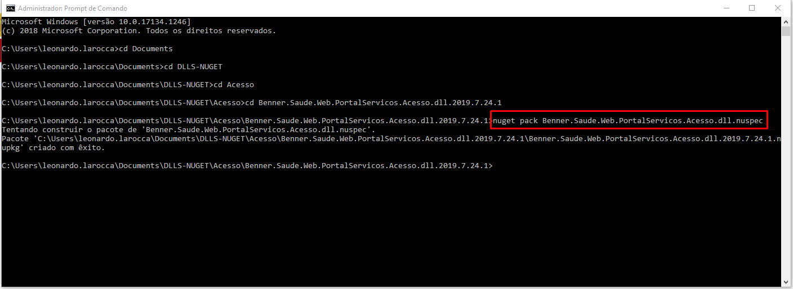

7. O novo pacote .nupkg será gerado na raiz da pasta.

8. Solicitar atualização para o server `mga-tc008`

9. Atualizar os pacotes pelo nuget, no sistema AG/MG através do próprio gerenciador de pacotes padrão.

## Parametrizações

Algumas Parametrizações podem ser realizadas através do sistema desktop, elas são encontradas em:

    Adm > Parâmetros Gerais > Portal Serviços

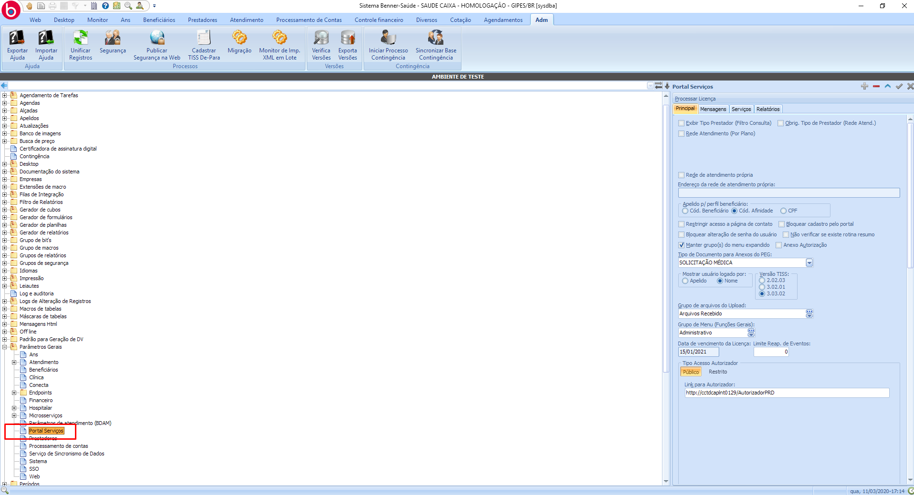
