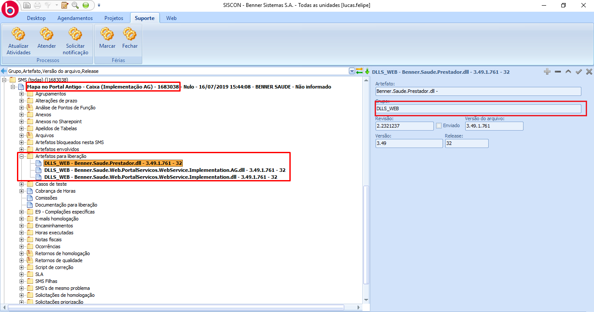

# Instalações e atualizações - Portal de Serviços Legado / AG

1.  **[Introdução](#introdução)**
2.  **[Backup](#backup)**
3.  **[Roteiro de atualização](#roteiro-de-atualização)**
4.  **[Executando/Aplicando scripts](#executandoaplicando-scripts)**
5.  **[Atualização do Portal Serviços](#atualização-do-portal-serviços)**
6.  **[Atualização do WebApp](#atualização-do-webapp)**
7.  **[Atualização do Schema](#atualização-do-schema)**
8.  **[Reciclando a pool e testanto os serviços](#reciclando-a-pool-e-testanto-os-serviços)**
9.  **[Visualizando erros](#visualizando-erros)**

## Introdução

Para facilitar o processo de atualização do portal de serviços legado é necessário entender um pouco como é dividia a sua arquitetura, para isso temos as seguintes divisões:

  - **WebApp** 
    - *(é onde fica o AG WEB, o portal de serviços consome os serviços que estão aqui. Geralmente localizado na pasta:* 
      > C:\Arquivos de Programas (x86)\Benner\WES\CLIENTE\WebAppCliente\Bin)

      *(É possivel tambem, localizar através do Servidor IIS, no servidor no qual está instalada a aplicação, abra o painel de controle do IIS, no painel esquerdo serão listados todas as aplicações instaladas neste sevidor, localize a sua e com o botão direito do mouse clique em 'Explorar/Explore')*
    
  - **Portal Serviços**
    - *Aplicação do portal, onde ficam as páginas/dlls do sistema portal. Geralmente localizado na pasta:*
      > C:\Arquivos de Programas (x86)\Benner\WES\CLIENTE\PortalServicosCliente\bin)

      *(É possivel tambem, localizar através do Servidor IIS, no servidor no qual está instalada a aplicação, abra o painel de controle do IIS, no painel esquerdo serão listados todas as aplicações instaladas neste sevidor, localize a sua e com o botão direito do mouse clique em 'Explorar/Explore')*
    
  - **Schemas**
    - *Pasta que contem os arquivos .xsd, responsáveis por manter a estrutura de comunicação entre o portal de serviços e o WebApp. Geralmente localizado na pasta:*
    > C:\Arquivos de Programas (x86)\Benner\WES\CLIENTE\Schemas_PortalServicosCliente)

      *(É possivel tambem, localizar através do arquivo WebApp/web.config, dentro da tag <appsettings> o path para a pasta onde se localizam os Schemas)*

      `< add key="SCHEMA" value="C:\Program Files (x86)\Benner\WES\CAIXAHOM\Schemas_PortalServicosCaixaHom" />`

## Backup

Faça um backup dos sistemas antes de realizar a atualização, caso se dê necessário voltar as dll's para o estado anterior, o backup é feito de forma manual, proceda da seguinte forma:

  - **WebApp**
    - Realize um backup de toda a pasta \Bin do WebApp 

  - **Portal Serviços**
    - Deve ser realizado uma cópia de toda a pasta do portal (\PortalServicosCliente)

  - **Schemas**
    - Deve ser realizado uma cópia de toda a pasta de Schemas (\Schemas_PortalServicosCliente)
    
> Dica: você pode clicar com o botão direito sobre ela e ir até: Enviar para > Pasta compactada

## Roteiro de atualização

É recomendado seguir os seguintes passos para a atualização dos sistemas:

  1.  Realizar o backup dos sistemas;
  2.  Conferir as versões a serem atualizadas;
  3.  Aplicar a atualização no PortalServicos;
  4.  Aplicar a atualização na Schemas;
  5.  Aplicar a atualização do WebApp;
  6.  Reclicar pool dos aplicativos no IIS;
  7.  Testar se os serviços do WebApp estão funcionando;
  8.  Acessar o portal de serviços;

## Executando/Aplicando scripts

A execução de scripts csx devem ser realizadas pelo builder e dll devem ser realizadas pelo server manager; vide manual.

## Atualização do Portal Serviços

Para atualizar o Portal Serviços, descompacte o arquivo .zip e substitua todos os arquivos na pasta raiz; Não é necessário atualizar ou modificar o arquivo web.config, pois esta atualização não causa impacto nesta configuração nem na personalização do portal.

Certifique-se de que a pasta PortalServicosCliente\bin contenha as seguintes dll's na versão atualizada:

  ```
  Benner.Saude.Web.PortalServicos.Acesso.dll
  Benner.Saude.Web.PortalServicos.Contexto.dll
  Benner.Saude.Web.PortalServicos.Portal.Implementation.dll
  Benner.Saude.Web.PortalServicos.Schemas.dll
  Benner.Saude.Web.PortalServicos.Validacoes.dll
  ```

## Atualização do WebApp

Para atualizar o AG Web (WebApp), descompacte ou baixe as dll's que foram geradas e anexadas na SMS;

Para saber o destino correto de cada dll, a nível de fábrica, é possível visualizar o grupo de destino no siscon desktop, veja nos exemplos a seguir:



O Grupo DLLS_WEB refere-se a pasta \Bin do WebApp

Substitua as antigas dll's da pasta WebApp\bin pelas novas; Certifique-se de que foram atualizadas.

## Atualização do Schema

Para atualizar os schemas simplismente substitua os arquivos .xsd na pasta dos schemas pelos novos que foram descompactados.

## Reciclando a pool e testanto os serviços

### Reciclando a pool do WebApp e Portal Serviços

Para reciclar a pool acesse o IIS no servidor onde as aplicações encontram-se instaladas, você pode encontrar digitando iis na pesquisa do windows ou através do comando: > Windows + R > inetmgr.

Selecione as pool do seus sistemas no painel a esqueda e clique em reciclar no menu a direita.

### Testando serviços

Para testar/subir os services existem algumas maneiras, aqui serão apresentadas 2 delas, sendo:

  1.  Ainda no painel do IIS, selecione a sua aplicação a esqueda e clique em Procurar/Browse no menu a direita, será aberto o navegador e o sistema será carregado caso não hajam erros.
  2.  Para tentar consumir/testar se um serviço específico, acesse diretamente pelo navegador, Exemplo: *http://localhost/WebAppCliente/NonAuthenticatedServiceHost/PrestadorCredenciadoService.svc*

## Visualizando erros

O Portal de serviços gera um log de erros que fica armazenado dentro de PortalServicosCliente\Log

Dentro desse diretório ficam armazenados arquivos .txt de acordo com o dia, e o conteúdo desses aquivos são as mensagens de erros geradas pelo sistema.