# Anexo de PEG

1. **[Introdução](#introdução)**
2. **[Parametrização tipo de documento](#parametrização-tipo-de-documento)**
3. **[Parametrização tipo de prestador](#parametrização-tipo-de-prestador)**
4. **[Sincronização](#sincronização)**
5. **[Parametrização - Portal](#Parametrização---Portal)**
6. **[Anexo de peg - Digitação de Guias](#Anexo-de-peg---Digitação-de-Guias)**
7. **[Anexo de peg - Envio de arquivo XML](#Anexo-de-peg---Envio-de-arquivo-XML)**
8. **[Anexos](#Anexos)**

## Introdução

Neste manual será abordado de forma simples as parametrizações necessárias para a utilização da funcionalidade de anexo de peg do portal de serviços.

## Parametrização tipo de documento

> Prestadores > Tabelas > Tipo de documento

Deve ser marcado o flag "Anexo de PEG via Portal" para que o tipo de documento seja exibido no portal como tipo de documento de anexo de peg.

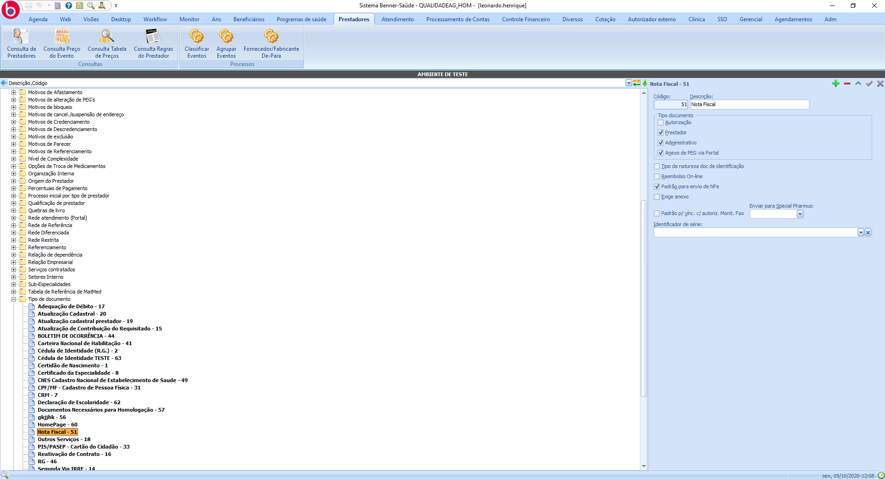

## Parametrização tipo de prestador

> Prestadores > Tabelas > Tipo de prestador

Para que o tipo de documento seja exibido para o prestador no portal, é necessário que o tipo de documento esteja vínculado como documento exigido para o tipo de prestador do usuário logado.

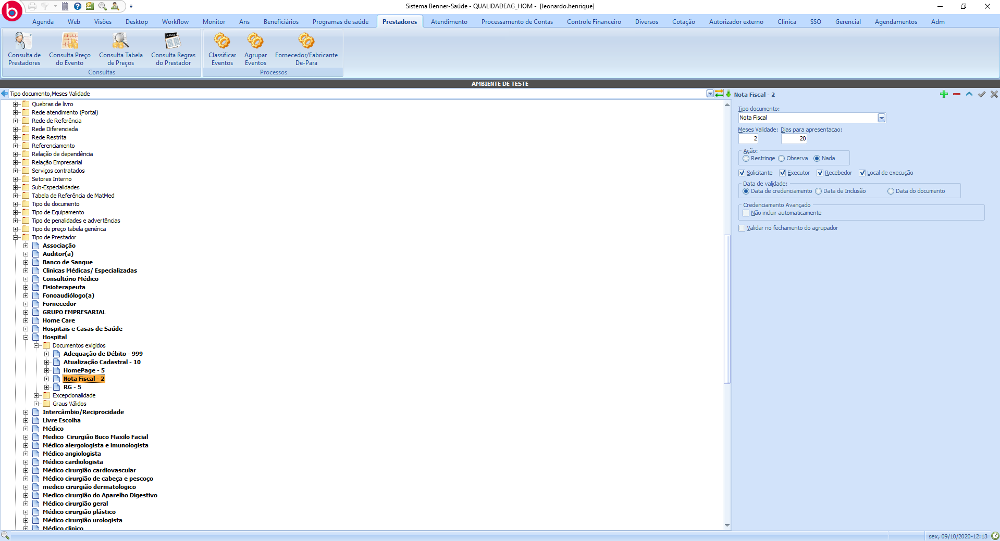

## Sincronização

> Gestor - Portal Serviços > Painel de Sincronização > Gerenciador de Sincronizações > Tipos de Documentos do Prestador

## Parametrização - Portal

> Administrador > Configurações > Papéis

Para que o usuário tenha acesso ao anexo de peg, é necessário que a tarefa "Adicionar Anexo ao Peg" esteja vínculado ao papel.

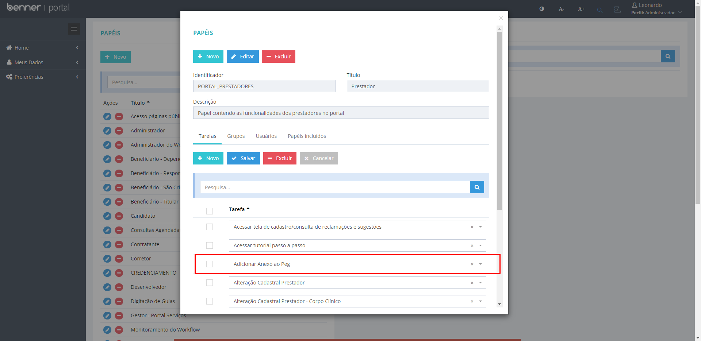

## Anexo de peg - Digitação de Guias

Após a digitação de guia, é possível incluir os anexos. Os anexos são enviados junto com o envio do peg.

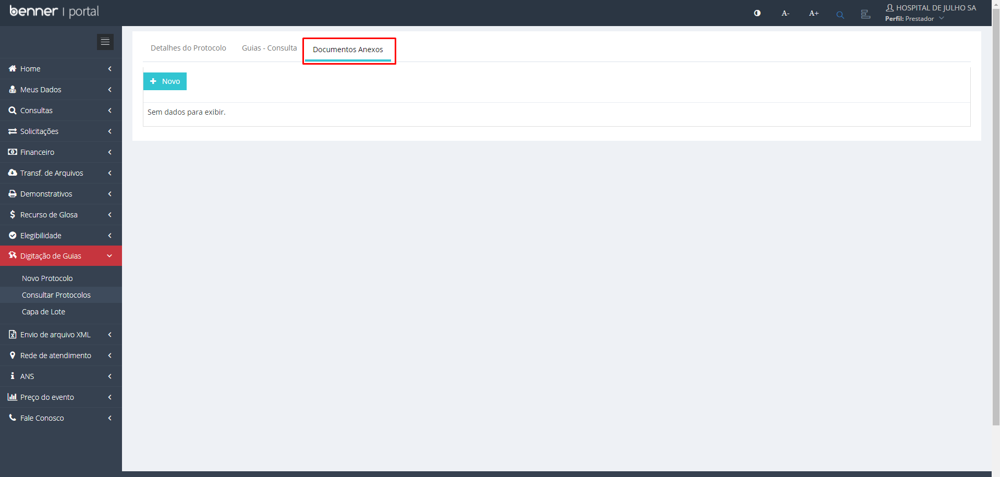

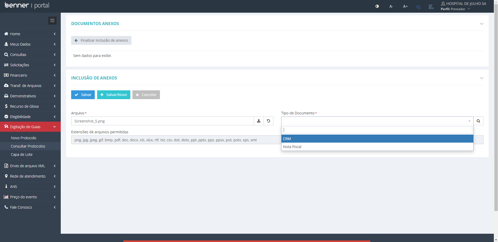

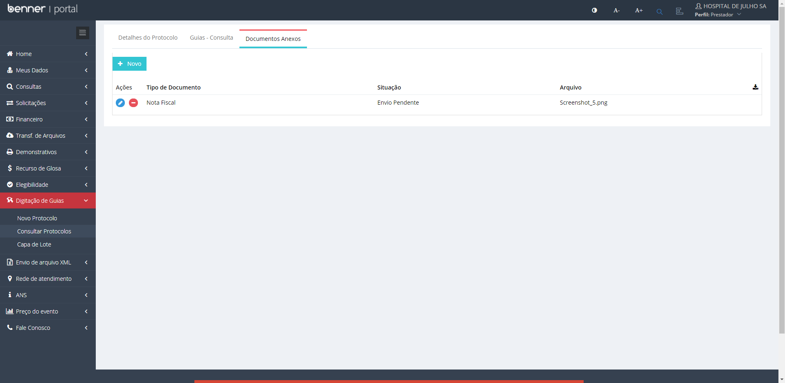

Também é possível incluir anexos em pegs que já foram enviados para a operadora.

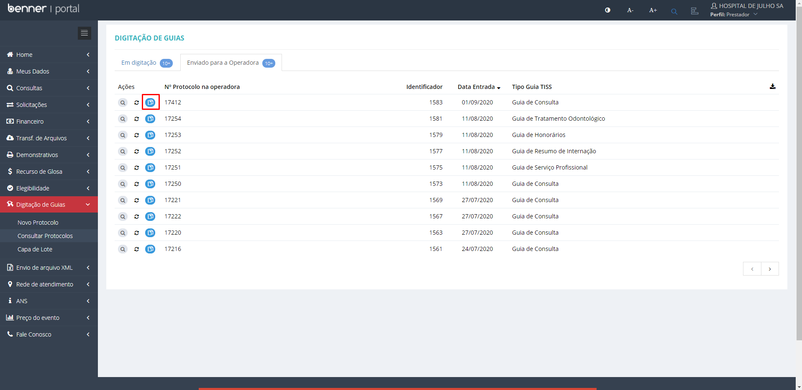

Para que os anexos sejam enviados é necessário clicar no botão "Enviar Documentos".

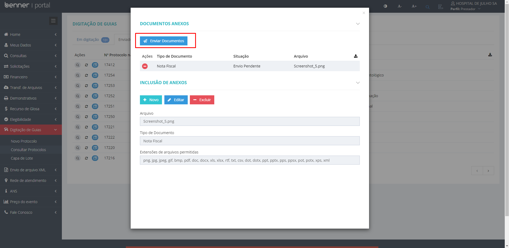

## Anexo de peg - Envio de arquivo XML

Para que seja possível incluir anexo pelo envio de arquivo xml, é necessário que o registro possua número protocolo.

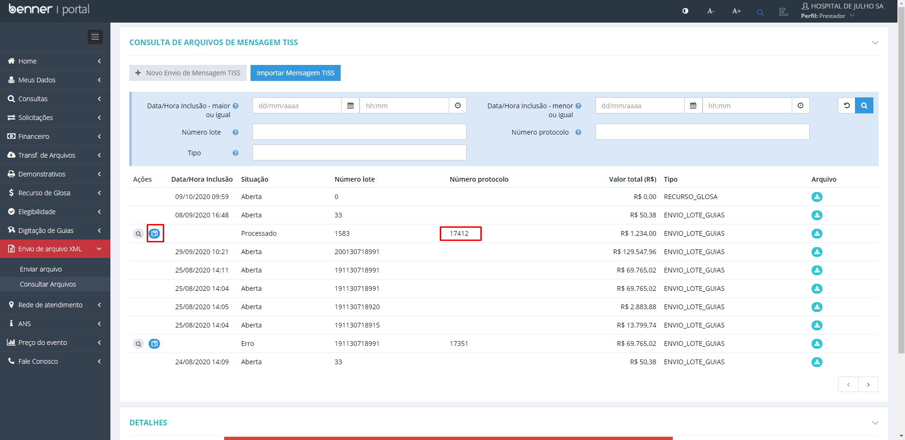

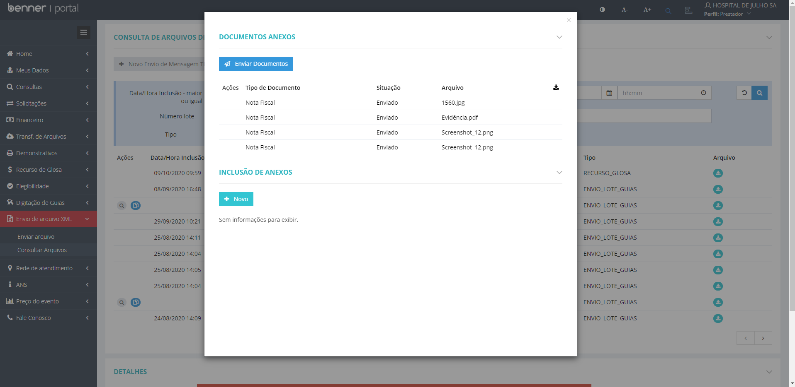

## Anexos

Os anexo podem ser encontrados em:

> Processamento de Contas > Pegs > Anexos

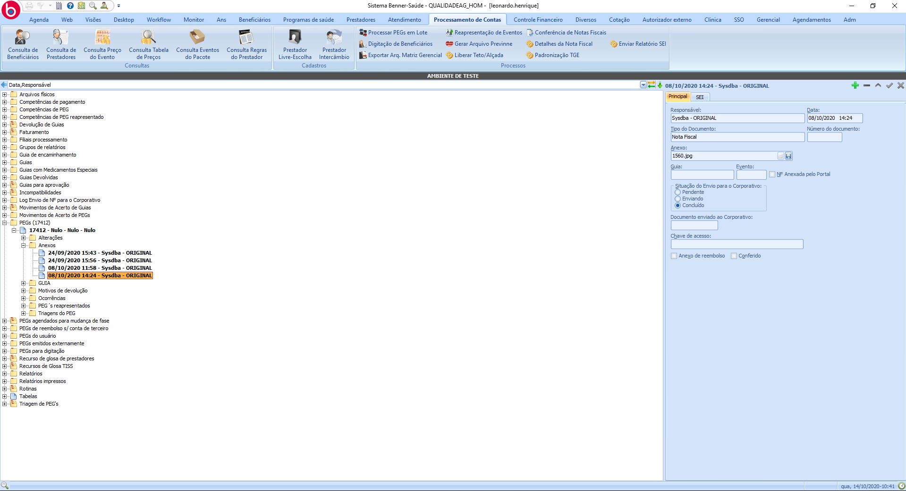