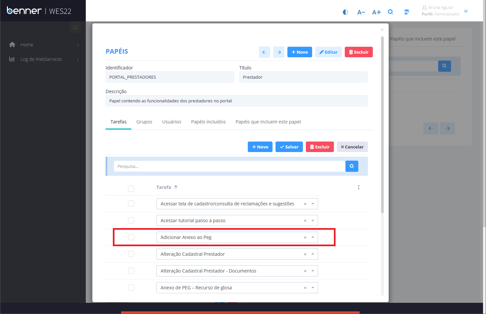
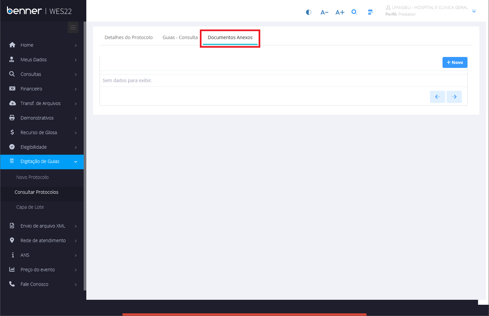
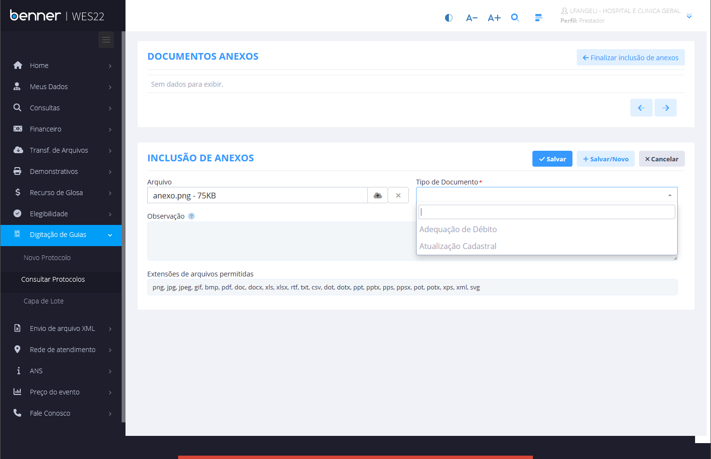
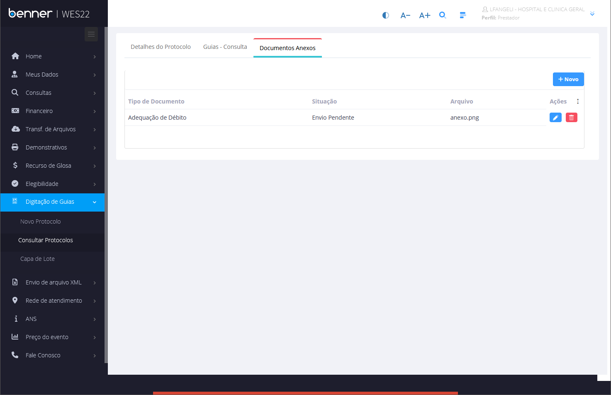
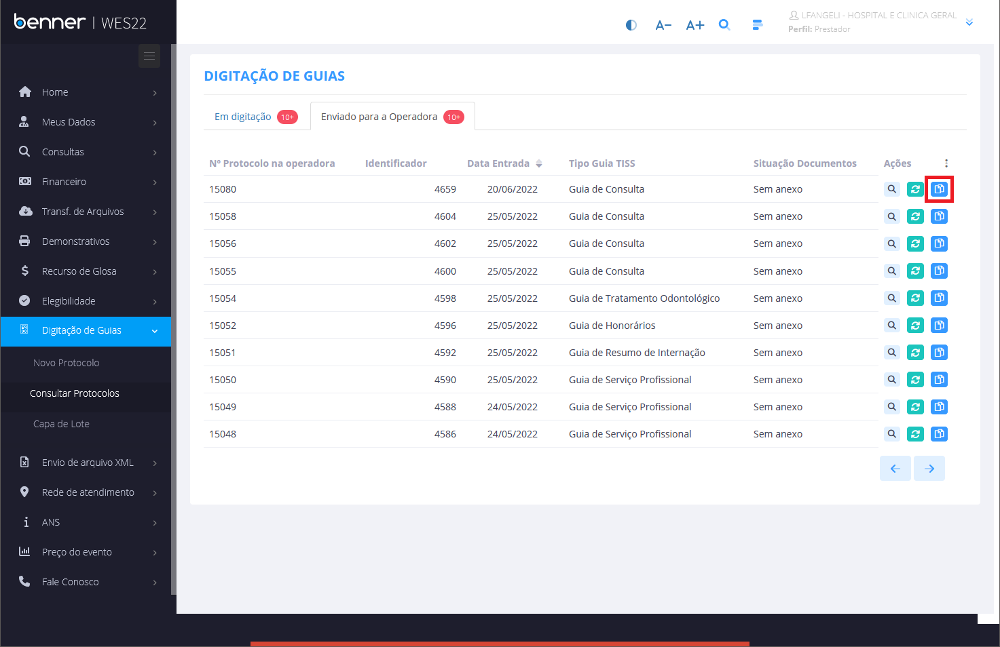
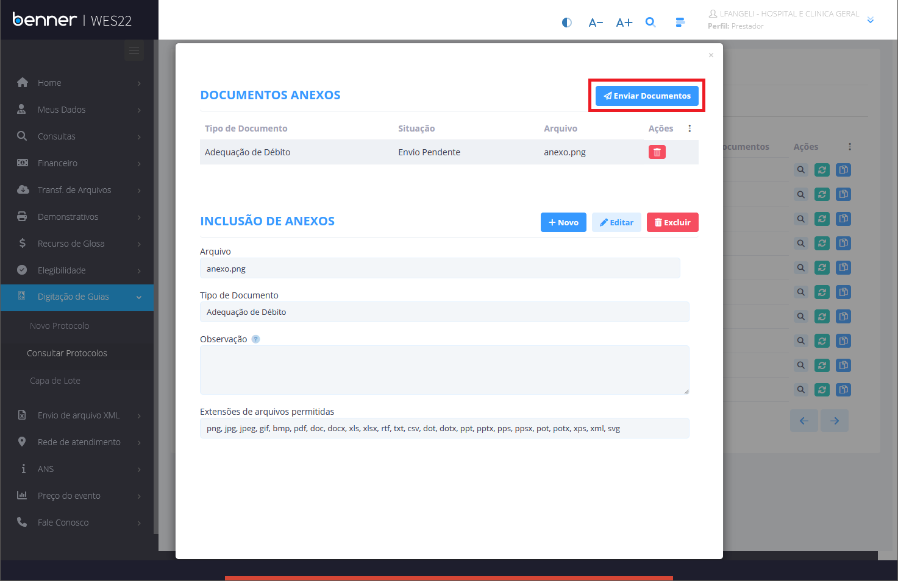
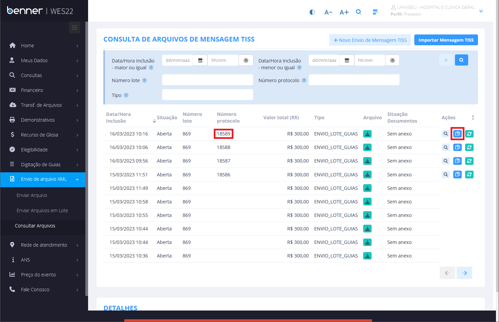
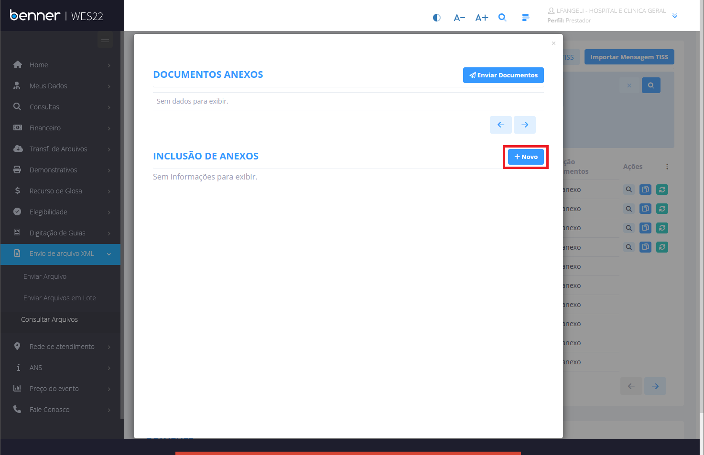
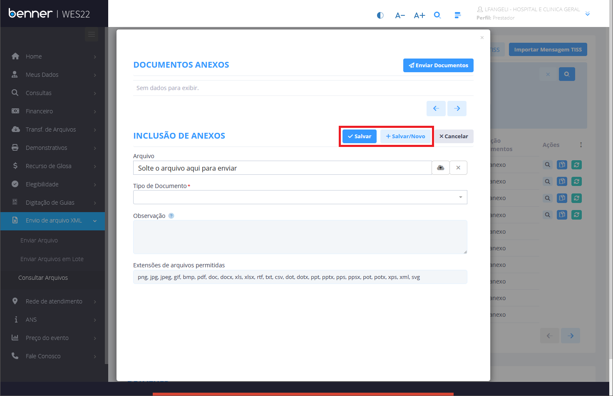
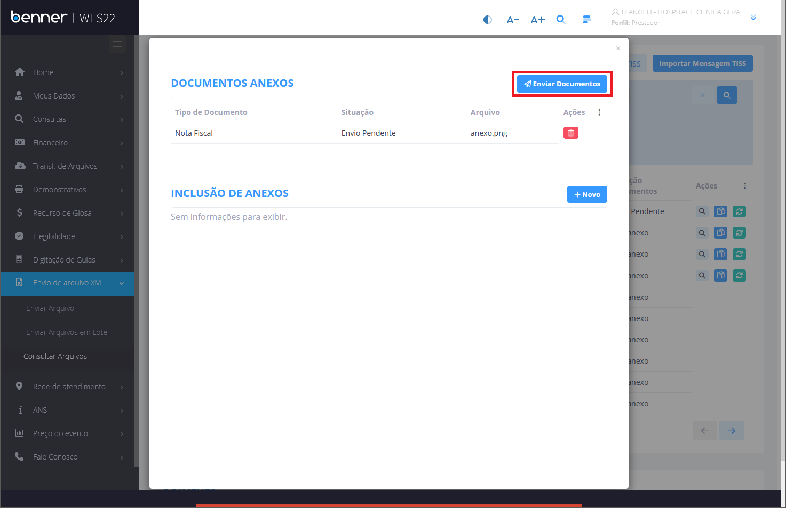

# Anexo de PEG

1. **[Introdução](#introdução)**
2. **[Parametrização tipo de documento](#parametrização-tipo-de-documento)**
3. **[Parametrização tipo de prestador](#parametrização-tipo-de-prestador)**
4. **[Sincronização](#sincronização)**
5. **[Parametrização - Portal](#Parametrização---Portal)**
6. **[Anexo de peg - Digitação de Guias](#Anexo-de-peg---Digitação-de-Guias)**
7. **[Anexo de peg - Envio de arquivo XML](#Anexo-de-peg---Envio-de-arquivo-XML)**
8. **[Anexos](#Anexos)**

## Introdução

Neste manual será abordado de forma simples as parametrizações necessárias para a utilização da funcionalidade de anexo de peg do portal de serviços.

## Parametrização tipo de documento

> Prestadores > Tabelas > Tipo de documento

Deve ser marcado o flag "Anexo de PEG via Portal" para que o tipo de documento seja exibido no portal como tipo de documento de anexo de peg.

## Parametrização tipo de prestador

> Prestadores > Tabelas > Tipo de prestador

Para que o tipo de documento seja exibido para o prestador no portal, é necessário que o tipo de documento esteja vínculado como documento exigido para o tipo de prestador do usuário logado.

## Sincronização

> Gestor - Portal Serviços > Painel de Sincronização > Gerenciador de Sincronizações > Tipos de Documentos do Prestador

## Parametrização - Portal

> Administrador > Configurações > Papéis

Para que o usuário tenha acesso ao anexo de peg, é necessário que a tarefa "Adicionar Anexo ao Peg" esteja vínculado ao papel.

## Anexo de peg - Digitação de Guias

> Prestador > Digitação de Guias > Consultar Protocolos

Após a digitação de guia, é possível incluir os anexos. Os anexos são enviados junto com o envio do peg.

Clicando no botão **+ Novo**, o sistema irá abrir a tela abaixo. Preencha os campos e clique no botão **Salvar**.

Depois de adicionado, o documento aparecerá na listagem como demonstrado na imagem abaixo.

Também é possível incluir anexos em pegs que já foram enviados para a operadora.

Para que os anexos sejam enviados é necessário clicar no botão "Enviar Documentos".

## Anexo de peg - Envio de arquivo XML

> Prestador > Envio de arquivo XML > Consultar Arquivos

Para que seja possível incluir anexo pelo envio de arquivo xml, é necessário que o registro possua número protocolo.

Após clicar no botão **Anexo de documentos**, como destacado na imagem acima, o sistema abrirá uma janela conforme demonstrado na figura abaixo. Para incluir um documento, basta clicar no botão **+ Novo**.

Clicando no botão **+ Novo**, aparecerá o formulário para preenchimento dos dados do anexo, como mostra a figura abaixo.
Depois de preenchidos os campos, clique no botão **Salvar** ou no botão **+ Salvar/Novo** caso precise inserir mais documentos.

Depois de adicionar os documentos, clique no botão **Enviar Documentos**.

## Anexos

Os anexos podem ser encontrados em:

> Processamento de Contas > Pegs > Anexos

