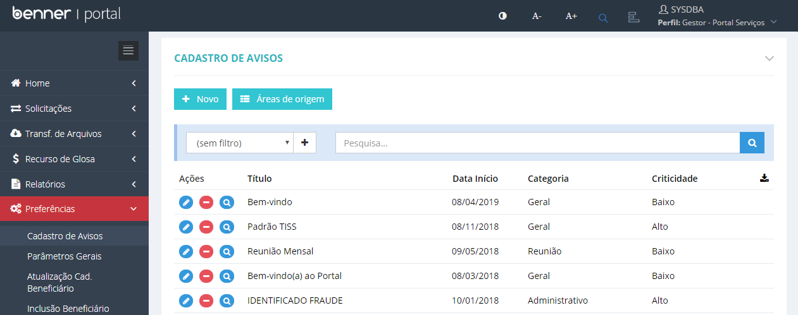
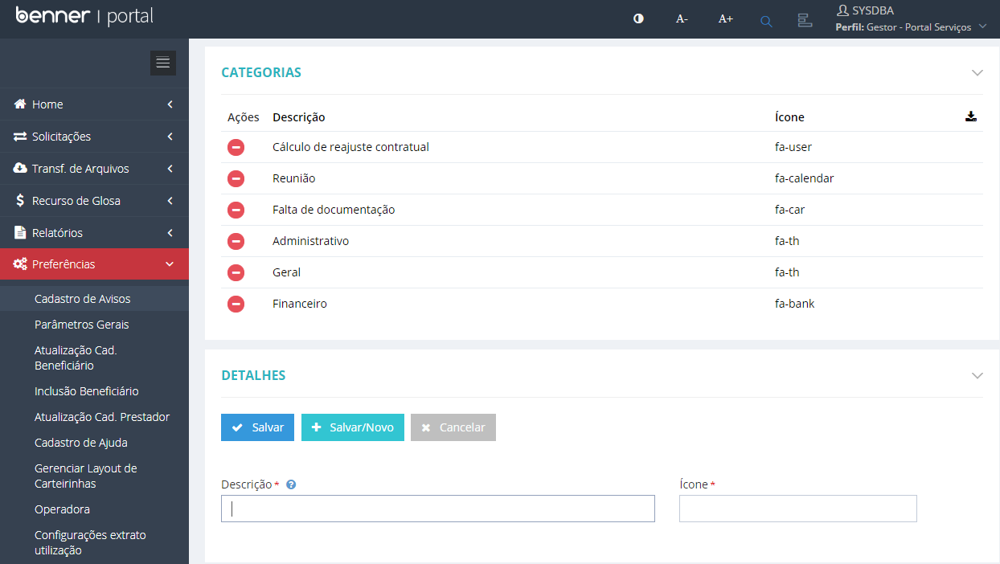
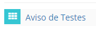
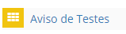
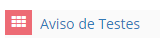
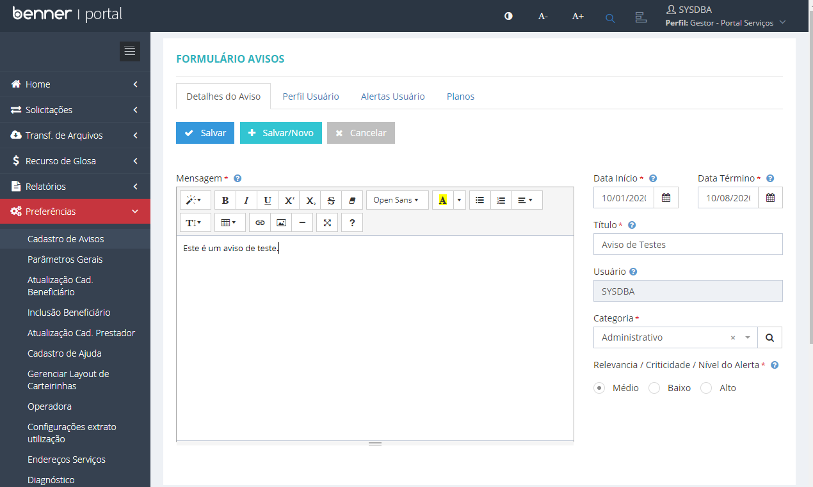
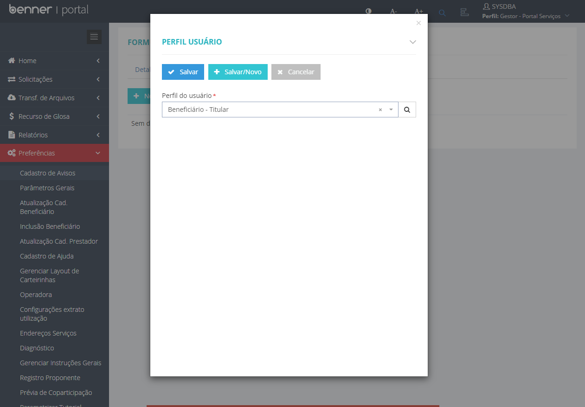
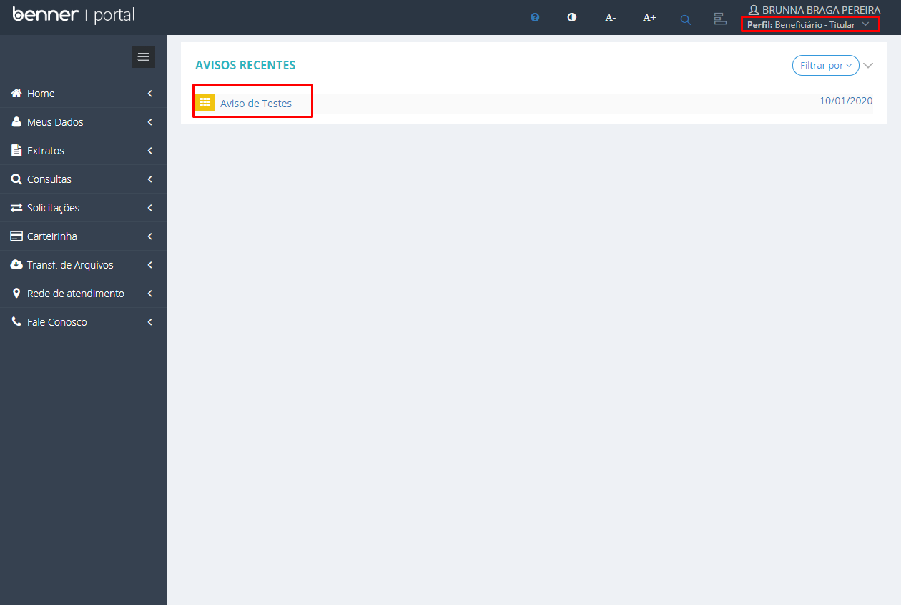
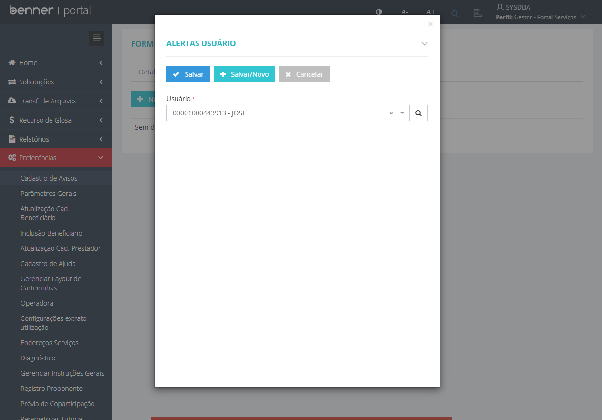
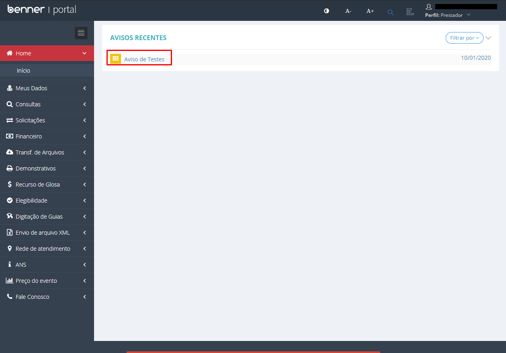

# Parametrizações - Cadastro de Avisos

1.  **[Introdução](#introdução)**
2.  **[Áreas de Origem](#áreas-de-origem)**
3.  **[Novo Aviso](#novo-aviso)**

## Introdução

Neste manual será abordado a configuração e utilização da funcionalidade *'Avisos'* no Portal.

> [Perfil Gestor] Preferências > Cadastro de Avisos

## Áreas de Origem

No botão *'Áreas de Origem'* é possível cadastrar as categorias dos avisos. Os campos para preenchimento são:

* **Descrição:** Descrição da Categoria.
* **Ícone:** Classe de estilo do ícone do Metronic a ser exibido. <a href="http://keenthemes.com/preview/metronic/theme/admin_1/ui_icons.html" target="_blank">Clique aqui</a> para consultar os ícones disponíveis.

## Novo Aviso

* **Detalhes do Aviso:**
Na aba *'Detalhes do Aviso'*, os seguintes campos serão apresentados:

    * **Mensagem:** Campo responsável pela mensagem a ser exibida no aviso. Possui uma caixa de texto com elementos de edição, anexo de imagens, links, listas, tabelas, etc.
    * **Data Inicio:** Campo responsável por estipular o período inicial em que o aviso será exibido no Portal.
    * **Data Término:** Campo responsável por estipular o período Final em que o aviso será exibido no Portal.
    * **Título:** Titulo do aviso.
    * **Usuário:** Campo que salva o usuário que incluiu o aviso. É preenchido automáticamente.
    * **Categoria**: Categoria do aviso (**[Áreas de Origem](#áreas-de-origem)**).
    * **Relevância / Criticidade / Nível do Alerta:** Campo responsável por estipular o grau de importância do aviso. Cada nível possui uma determinada cor para apresentação ao usuário.
        * Criticidade Baixa:

         

        * Criticidade Média:

         

        * Criticidade Alta:

         

>Só será possível editar a aba *'Perfil Usuário', 'Alertas Usuário' e 'Planos'* após salvar o aviso. 

* **Perfil Usuário:** Podem ser informados os Perfis dos usuários que devem receber o aviso.

* **Alertas Usuário:** Caso seja necessário que algum usuário específico receba o aviso, o mesmo deve ser inserido na aba *'Alertas Usuário'*.

* **Planos:** Podem ser informados os Planos dos usuários que devem receber o aviso.

