# Cancelamento de beneficiário (AG)

1.  **[Introdução](#introdução)**
2.  **[Mensagem de cancelamento](#mensagem-de-cancelamento)**
3.  **[Tipo de contratação](#tipo-de-contratação)**
4.  **[Endereço residencial](#endereço-residencial)**
5.  **[Telefone no endereço residencial](#telefone-no-endereço-residencial)**
6.  **[Parametros gerais de atendimento](#parametros-gerais-de-atendimento)**
7.  **[Solicitação de cancelamento (Titular)](#solicitação-de-cancelamento-(titular))**
8.  **[Solicitação de cancelamento (Contratante)](#solicitação-de-cancelamento-(contratante))**
9.  **[Motivos de cancelamento (Contratante)](#motivos-de-cancelamento-(contratante))**
10. **[Atendimento da solicitação de cancelamento (Contratante)](#atendimento-da-solicitação-de-cancelamento-(contratante))**
11.  **[Sincronizações](#sincronizações)**

## Introdução

Neste manual será abordado de forma simples as parametrizações necessárias para a solicitação de cancelamento de beneficiário.

## Mensagem de cancelamento

> Adm > Parâmetros Gerais > Atendimento >  Aba Central de atendimento > Aba Solicitação > Texto Legislação Pedido Cancelamento

* **Texto Legislação Pedido Cancelamento:** Parametrização para a mensagem que será exibida ao beneficiário no momento em que solicitar um pedido de cancelamento.

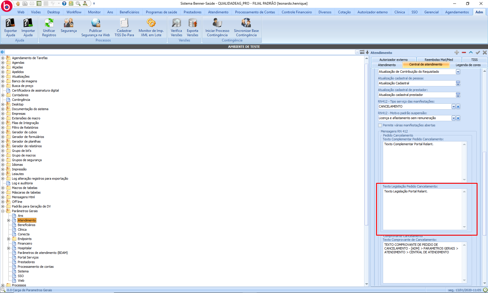

## Tipo de contratação

> Ans > Tabelas > Registro na ANS

* **Tipo de contratação:** Para que seja possível solicitar o cancelamento de um beneficiário, é necessário que o tipo de contratação do plano seja "Individual ou Familiar" ou "Coletivo por Adesão".

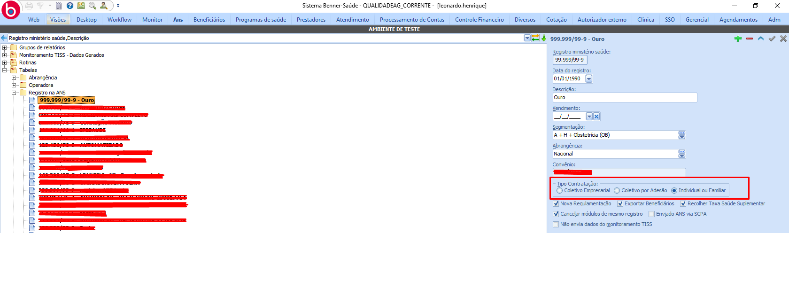

## Endereço residencial

> Beneficiários > Aba Endereço > Endereços

Para que seja possível realizar o cancelamento do beneficiário, é necessário que o mesmo possua endereço residencial cadastrado.

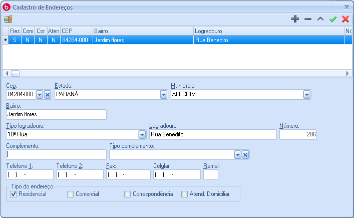

## Telefone no endereço residencial

> Beneficiários > Aba Endereço > Endereços > Telefone

Para que seja possível realizar o cancelamento do beneficiário, é necessário que o mesmo possua telefone informado no cadastro do endereço residencial.

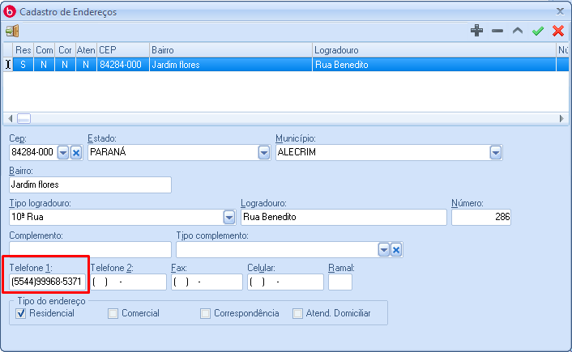

## Parametros gerais de atendimento

> Adm > Atendimento > Central de atendimento > Solicitação

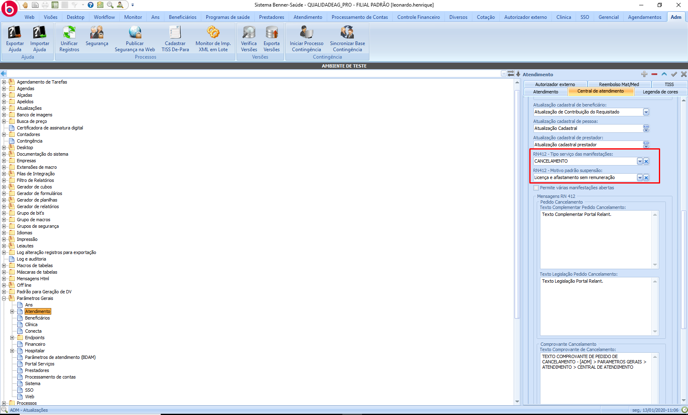

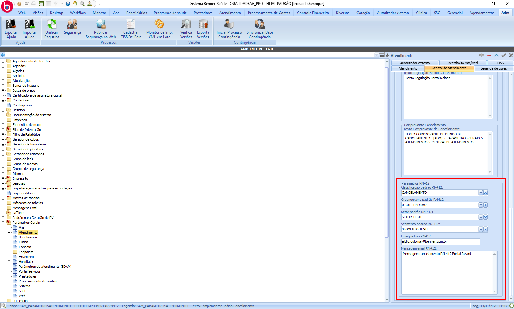

* **RN412 - Tipo serviço das manifestações:** Tipo de serviço para criação do atendimento.

    ##### Inserido em: >Atendimento > Tabelas > Central de atendimento > Outros serviços

* **RN412 - Motivo padrão suspensão:** Motivo padrão utilizado para suspender o beneficiário.

    ##### Inserido em: >Beneficiários > Tabelas > Motivo de suspensão

* **Cassificação padrão RN412:** Classificação do atendimento gerado.

    ##### Inserido em: >Atendimento > Tabelas > Central de atendimento > Outros serviços

* **Organograma padrão RN412:** Indica o organograma padrão para solicitações de cancelamento via portal de serviços.

    ##### Inserido em: >Diversos > Filiais > Organograma

* **Setor padrão RN412:** Setor padrão de atendimento para solicitações de RN412.

    ##### Inserido em: >Adm > Tabelas do cliente > Tipos de setores

* **Segmento padrão RN412:** Indica o segmento padrão referente a RN412.

    ##### Inserido em: >Adm > Segmentos

* **E-mail padrão RN412:** Indica qual e-mail receberá as notificações de solicitações de cancelamento de beneficiários.

* **Mensagem email RN412:** Corpo do e-mail da notificação de solicitações de cancelamento de beneficiários.

## Solicitação de cancelamento (Titular)

O atendimento de solicitações de cancelamento realizadas pelo titular, devem ser realizadas pela central de atendimento em:

> Atendimento > Monitor de Outros Serviços

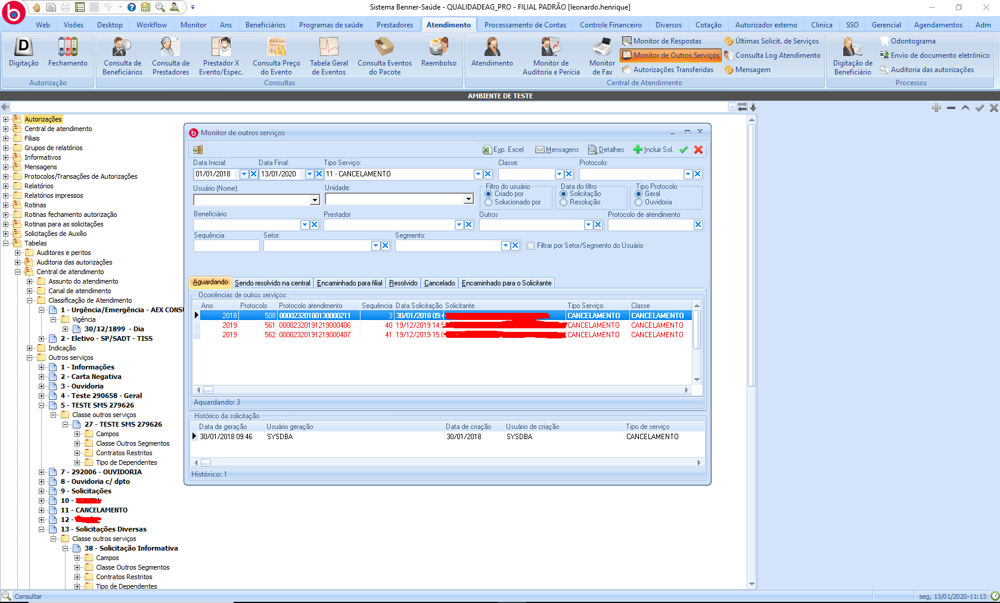

## Solicitação de cancelamento (Contratante)

Para que o contratante realize a solicitação de cancelamento, o mesmo deve informar a data de cancelamento, motivo de cancelamento e de forma opcional a data final de atendimento do beneficiário.

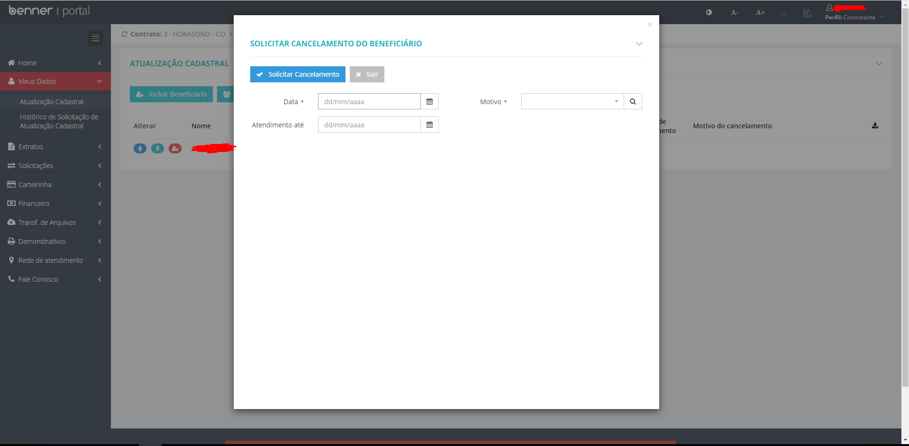

## Motivos de cancelamento (Contratante)

Os motivos de cancelamento exibidos para o contratante são inseridos em:

> Beneficiários > Tabelas > Motivos de cancelamento

Obs: É necessário executar a sincronização de Motivos de "Cancelamento do Beneficiário" para que os motivos sejam atualizados.

## Atendimento da solicitação de cancelamento (Contratante)

Para aprovar ou recusar o cancelamento da solicitação do contratante é necessário utilizar o monitor de Análise/Pendência. Para aprovar a solicitação, é necessário liberar todas as mensagens.
Para que a solicitação seja cancelada, é necessário que seja recusado no mínimo 1 mensagem.

> Beneficiários > Web > WEB:Movimentação de Beneficiários > Monitor de Análise/Pendência > Mensagens

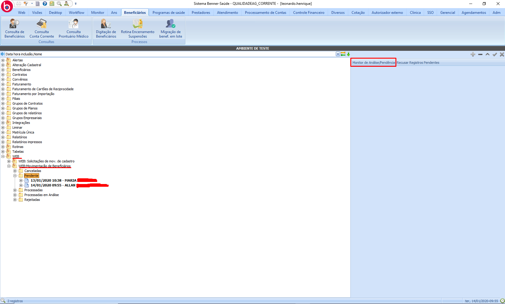

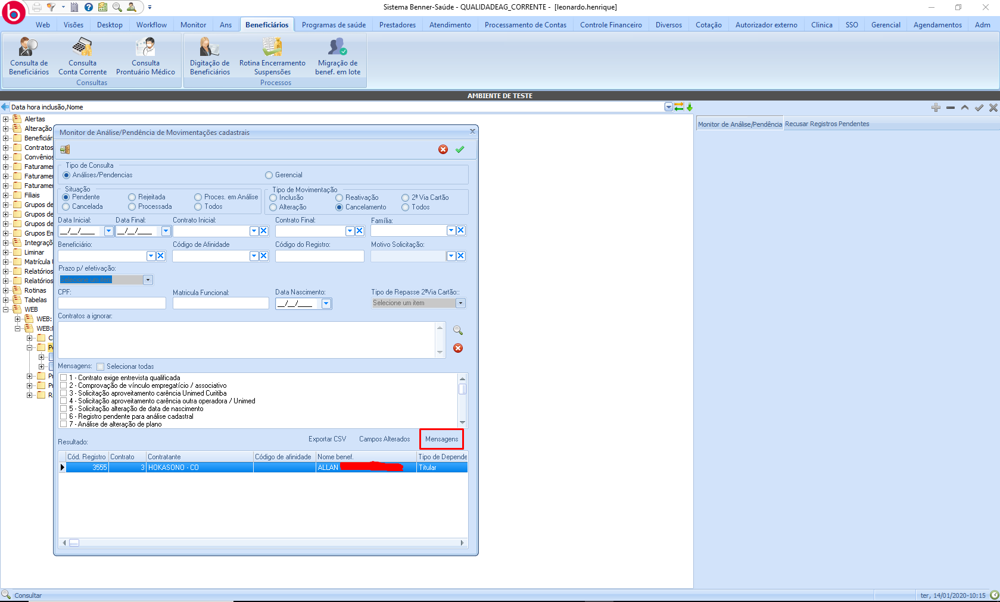

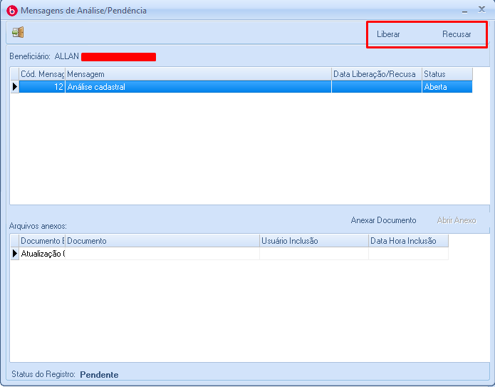

## Sincronizações

Para realizar a solicitação de cancelamento de beneficiário é recomendado que os dados estejam atualizados no portal executando as seguintes sincronizações:

* Motivos de Cancelamento do Beneficiário.
* Cadastros Alterados do Beneficiário.
* Endereços Alterados do Beneficiário.
* Situação das atualizações cadastrais do beneficiário.