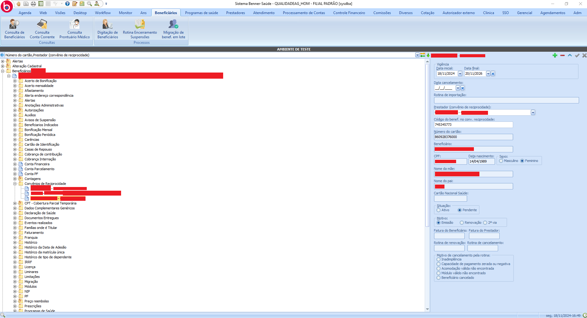
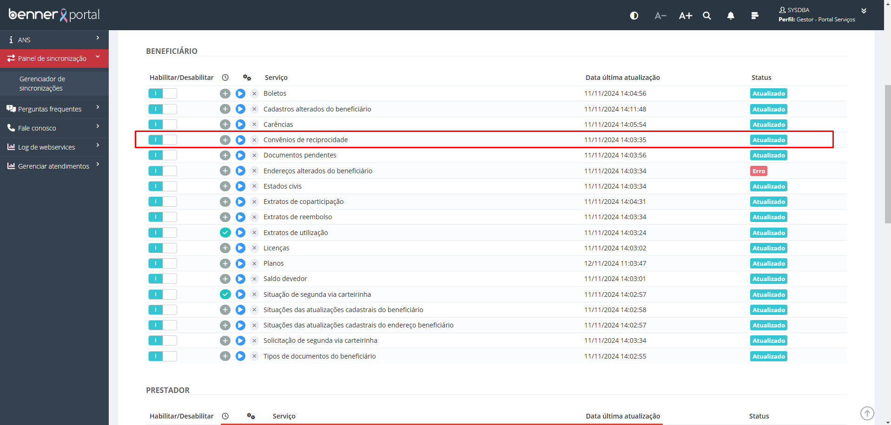
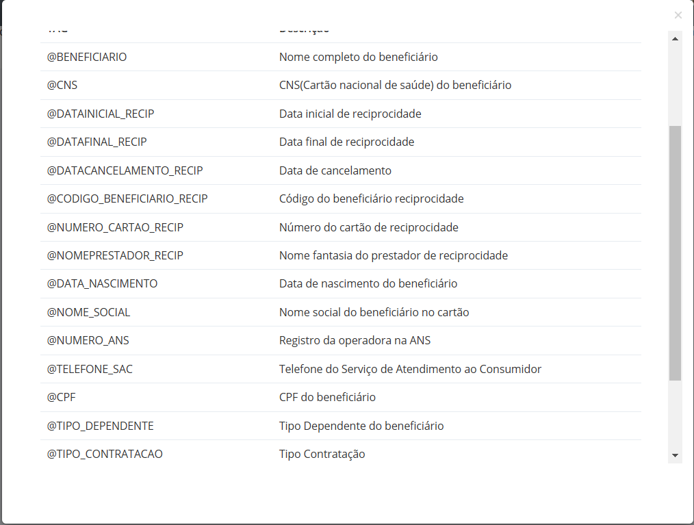
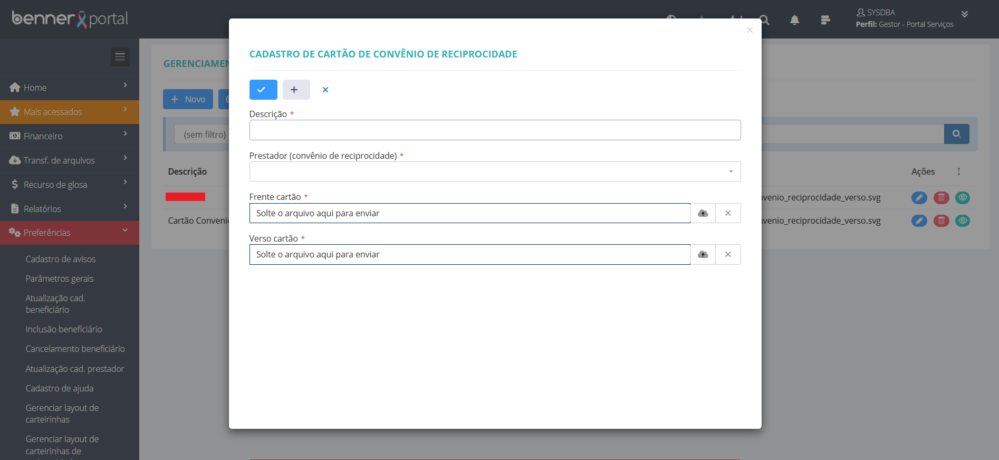
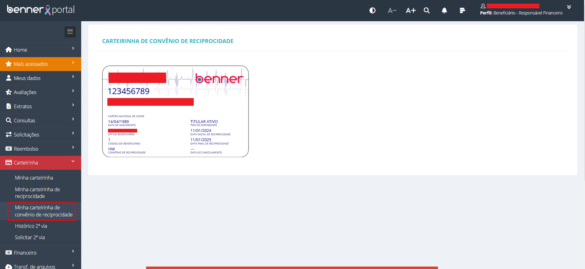

# Parametrização de carteirinha de convênio de reciprocidade

1. **[Introdução](#introdução)**
2. **[Parametrização no sistema saúde](#parametrização-no-sistema-saúde)**
3. **[Sincronização](#sincronização)**
4. **[Parametrização do layout](#parametrização-do-layout)**
5. **[Visualização do cartão](#visualização-do-cartão)**

## Introdução

Neste manual será abordado, de forma simples, as parametrizações necessárias para a utilização da funcionalidade da carteirinha de convênio de reciprocidade.

## Parametrização no sistema saúde

> [Beneficiários] > Beneficiários > Convênios de reciprocidade

É necessário incluir o registro de convênio de reciprocidade nos beneficiários com vigência válida e prestador do convênio de reciprocidade. Somente serão exibidos para seleção os prestadores que possuírem o flag "Convênio de reciprocidade" marcado.

## Sincronização

> [Gestor] > Painel de sincronização > Gerenciador de sincronizações

Para que as informações de convênios de reciprocidade dos beneficiários estejam disponíveis no portal, é necessário executar a sincronização "Convênios de reciprocidade".

## Parametrização do layout

> Editor de imagens vetoriais

Assim como nas demais funcionalidades de carteirinha do portal de serviços, é necessário criar um layout de cartão no formato ".svg". No layout do cartão deverá ser utilizado as tags de informações disponibilizadas pelo portal de serviços.
Obs: As tags disponíveis na funcionalidade "Gerenciar layout de carteirinhas de reciprocidade por convênio" são diferentes da funcionalidade de cartão padrão do portal de serviços.

Tags disponíveis.

> [Gestor]  > Preferências > Gerenciar layout de carteirinhas de reciprocidade por convênio > Novo

Para incluir o novo layout o gestor deve inserir uma descrição para identificação do cartão no grid da página de parametrização, selecionar o prestador do convênio de reciprocidade e incluir o arquivo ".svg" da frente e verso do cartão. Para que o beneficiário visualize o seu cartão, é necessário que o prestador utilizado na parametrização do portal seja o mesmo prestador utilizado no cadastro de convênio de reciprocidade do beneficiário na **[parametrização no sistema saúde](#parametrização-no-sistema-saúde)**.
Obs: Para seleção de prestadores o portal de serviços exibe apenas os prestadores presentes em sua própria base de dados, portanto, os dados devem estar atualizados

## Visualização do cartão

> [Beneficiário] > Carteirinha > Minha carteirinha de convênio de reciprocidade

Na página "Minha carteirinha de convênio de reciprocidade" será exibido o cartão de reciprocidade do beneficiário caso todos os passos anteriores tenham sido executados.

