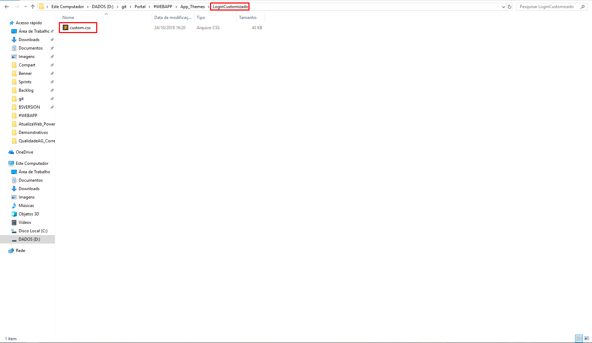

# Customização do Portal De Serviços

1.  **[Introdução](#introdução)**
2.  **[Customização - Geral](#customização-geral)**
3.  **[Customização - Login](#customização-login)**
4.  **[Customização - Princiapl](#customização-principal)**
5.  **[Customização - Rede de Atendimento](#customização-rede-de-atendimento)**
6.  **[Customização - Favicon](#customização-favicon)**
7.  **[Lembretes](#lembretes)**

## Introdução

Neste manual será abordado de forma simples como alterar os temas pré-definidos do Portal(WES), plano de fundo da página de login e seu logo, logo da página principal, o ícone que está localizado na aba do navegador e um exemplo de como aplicar scripts na página de login.

> Nota: É importante que para a realização da customização o conceito de camadas do WES esteja claro (Camadas 20 e 50), pois será necessário alterar artefatos da camada Benner (20) para a camada Cliente (50). Caso contrário as alterações realizadas não serão utilizadas uma vez que a camada ativa será a maior.

## Customização Geral

Inicialmente é necessário acessar o Portal de Serviços com usuário que possua papel “Desenvolvedor”, ativa o modo desenvolver, alterar o papel e então ativar a customização dos itens que serão alterados:

> Ativar Desenvolvimento

> Desenvolvedor > Configuações 

> Desenvolvedor > Configuações > Customização

>Desenvolvedor > Configuações > Customização > Ativar a customização dos itens que serão alterados

Ao selecionar para customizar a página de login exibirá janela para selecionar qual é a forma de login desejada: da camada anterior (no formato padrão do Portal), ao lado direito, no centro com outro padrão, e no centro sem imagem de fundo.
Escolha a opção que desejar e então clique no botão “Salvar e Reiniciar” para aplicar as alterações.

>Selecionar a forma de login

>Salvar e reiniciar

Feito isso será criado os arquivos necessários na camada do Cliente (50) dentro da pasta de instalação da aplicação do Portal, é Através destes arquivos que serão realizadas as alterações de tema, imagem, logo, etc.

## Customização Login
O arquivo Login50.aspx deve ter sido criado e é através dele que é aplicado o tema na página de login. É necessário alterar a tag “Theme”.

>Alterar tag theme

É possível utilizar os temas padrões do WES existentes na pasta “App_Themes” ou criar um tema próprio (copiando e colando um tema base existente):

>Temas padrões

>Tema customizado

Após o tema criado, é necessário alterar no Login50.aspx o tema.

>Tema alterado

Dentro da pasta do tema recém-criado existirá um CSS onde é possível realizar as alterações para o estilo da página de login, inclusive o logo e a imagem de fundo.

>CSS Custom

>Alterar logo da tela login

>Logo alterado da tela de login

>Alterar imagem de fundo da tela de login

>Imagem de fundo alterada da tela de login

>Alterar Bordas e cor do botão da tela de login

>Bordas e cor do botão alterados da tela de login

Na página Login50.aspx é possível alterar a cor do botão da rede de atendimento e também aplicar scripts para ajustar o login como desejar.

>Alterar botão rede de atendimento da tela de login

>Botão rede de atendimento alterado da tela de login

>Aplicar script para ajustar tela de login

>Script aplicado na tela de login

Também é necessário ajustar a customização da página de novo usuário, para isso é necessário copiar o arquivo “default.css” do caminho ~Content/css/Portal/Public/NovoUsuario para ~Content/css/public e renomea-lo para “custom.css”.

>Tela de cadastro de novo usuário.

>Arquivo default.css

>Arquivo default.css renomeado para custom.css

Neste novo arquivo custom.css é possível alterar o logo, imagem de fundo e as cores.

>Alterar Logo tela cadastro de usuário

>Logo alterado da tela de cadastro de usuário

>Alterar imagem de fundo da tela de cadastro de usuário

>Imagem de fundo alterada da tela de cadastro de usuário

>Alterar cores da tela de cadastro de usuário

>Cores alteradas na tela de cadastro de usuário

## Customização Principal

É necessário alterar a tag “Theme” do web.config para alterar o tema da página principal do Portal, pode-se escolher entre os temas padrões do Portal.

>Arquivo Wheb.config

>Temas disponiveis no portal

>Benner - padrão portal

>Blue

>Dark blue

>Default

>Grey

>Light

>Light2

Para alterar a logo da página principal é necessário ir na pasta do tema escolhido e criar um arquivo cópia do custom.css na camada 50 e nele alterar a imagem da logo.

>Cópia do arquivo custom.css

>Alterar logo da página principal

>Logo da página principal alterado

É importante também alterar a logo do tema de alto-contraste, para isto repita os passos feito no tema escolhido e no arquivo “Default50.master” na raiz do Portal altere o css que é utilizado para o alto-contraste.

>Tela principal em alto-contraste

>Cópia custom.css no tema de alto-contraste

>Alterar logo da página principal no tema de alto-contraste

>Arquivo Default50.master

>Alterar o arquivo Default50.master

>Logo da página principal no tema de alto-contraste alterado

## Customização Rede de Atendimento

A página da Rede de Atendimento utiliza um layout diferente, por isso também é necessário ajustá-la.
Para customizar a rede de atendimento é necessário criar um css cópia do “index.css” e renomear o arquivo para “custom.css” e a partir deste ajustar o css como desejado.

>Cópia custom.css na tela da rede de atendimento

>Alterar logo na tela da rede de atendimento

>Logo da tela rede de atendimento alterado

>Alterar cor de fundo do topo da tela da rede de atendimento

>Cor de fundo alterada da tela de rede de atendimento 

## Customização Favicon

Para alterar o ícone que é exibido no navegador é necessário substituir o arquivo “favicon50.ico” na pasta raíz da aplicação do Portal, é de extrema importância que o arquivo seja no formato ICO.

>Arquivo favicon50.ico antes de alterar o ícone

>Icone no navegador antes de alterar o ícone

>Arquivo favicon50.ico depois de alterar o ícone

>Icone no navegador depois de alterar o ícone

## Lembretes

>Lembrando que é possível alterar os artefatos de camada Cliente (50) como desejar, ou seja, é possível customizar a página de login e os estilos dos temas da forma que mais agrada ao cliente.

>Após finalizar as customizações desejadas é necessário desativar o modo desenvolvedor do Portal de Serviços.
