# Extrato de coparticipação - Requisitos

1. **[Introdução](#introdução)**
2. **[AG](#ag)**  
  2.1. **[Fatura(AG)](#Fatura-(AG))**  
  2.2. **[Documento (AG)](#documento-(AG))**  
  2.3. **[Demais parâmetros](#demais-parâmetros)**
3. **[MG](#mg)**  
  3.1. **[Fatura (MG)](#Fatura-(MG))**  
  3.2. **[Documento (MG)](#documento-(MG))**
4. **[Portal](#portal)**  
  4.1 **[Parametrização](#parametrização)**  
  4.2 **[Sincronização](#sincronização)**

## Introdução

Para que o extrato de coparticipação seja exibido no portal, será necessário seguir os requisitos abaixo.

# AG

## Fatura (AG)

> Beneficiários > Beneficiários > Conta Financeira > Faturas

* **Fatura:** Para que o extrato de coparticipação seja exibido no portal é necessário que:
  * O tipo de faturamento da fatura seja "Autogestão".
  * Possua lançamento com "Tipo de lançamento financeiro" Participação Financeira.
  * Possua Módulo com "Tipo" Utilização.

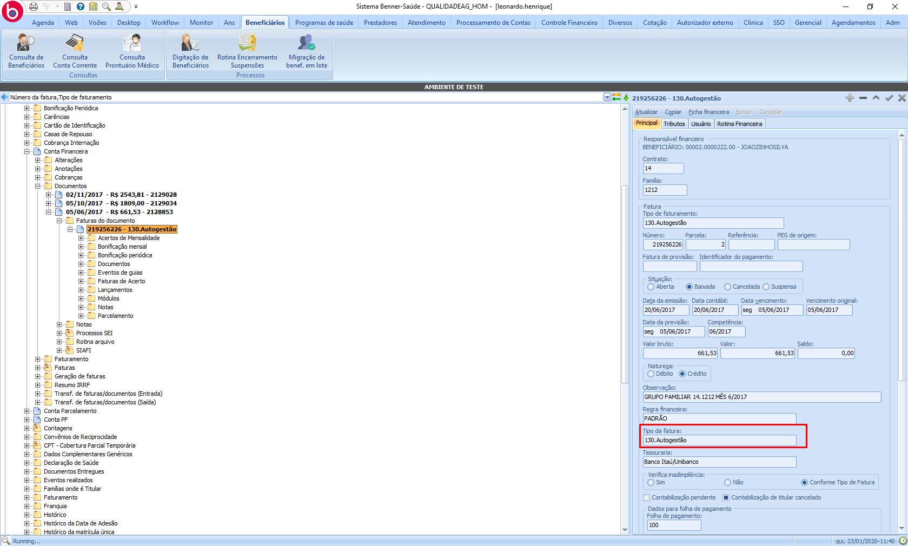

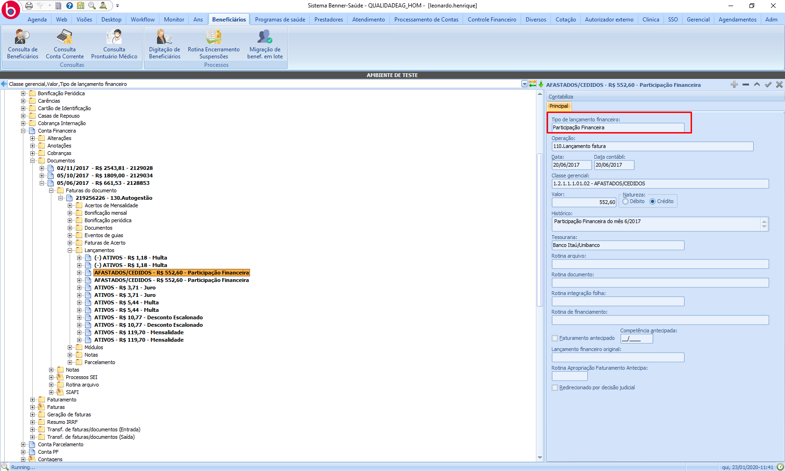

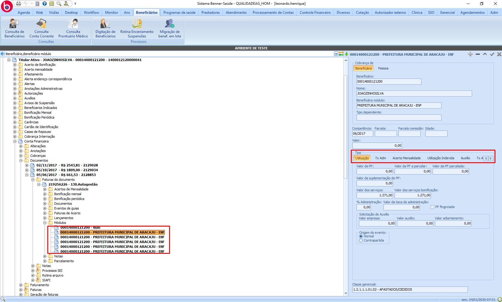

## Documento (AG)

> Beneficiários > Beneficiários > Conta Financeira > Documentos

* **Documento:** Para que o extrato de coparticipação seja exibido no portal é necessário que:

  * A "Natureza" do documento seja Crédito.
  * O documento não esteja cancelado.
  * Possua fatura com os requisitos citados anteriormente.

    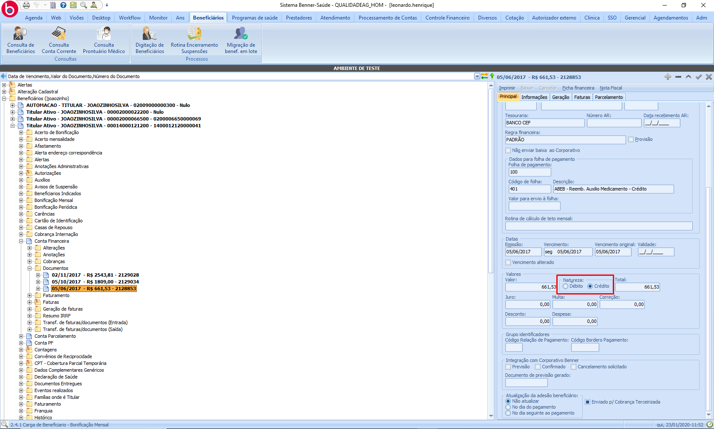

    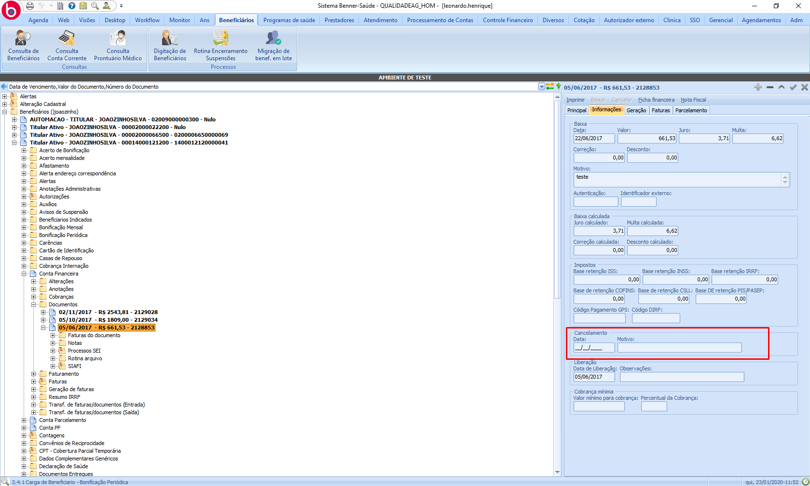

    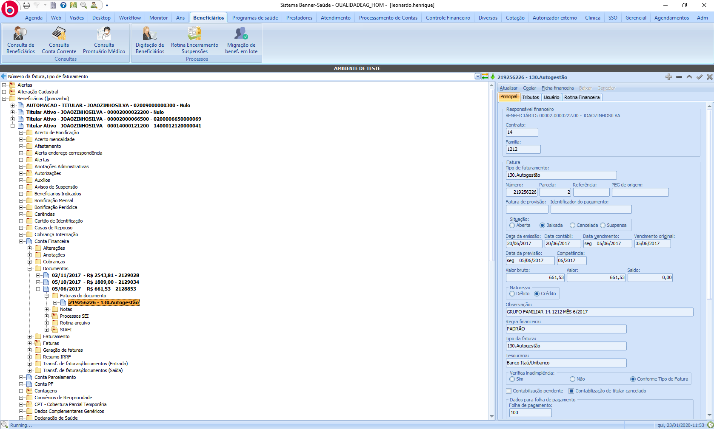

## Demais parâmetros

> Processamento de Contas > Peg > GUIA

"Eventos de guias" de reembolso onde a guia possui AbatePF marcado, não serão exibidas nos detalhes da coparticipação.

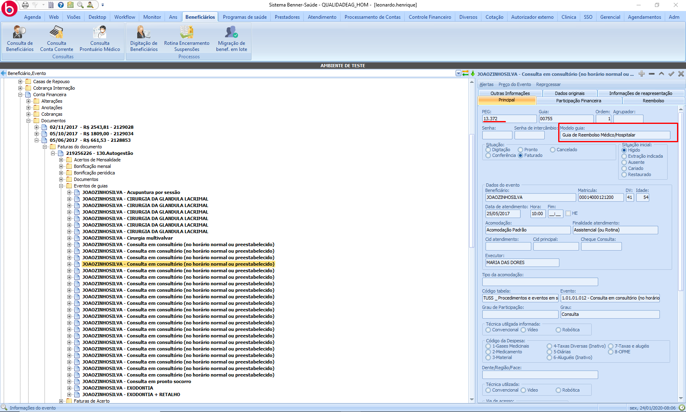

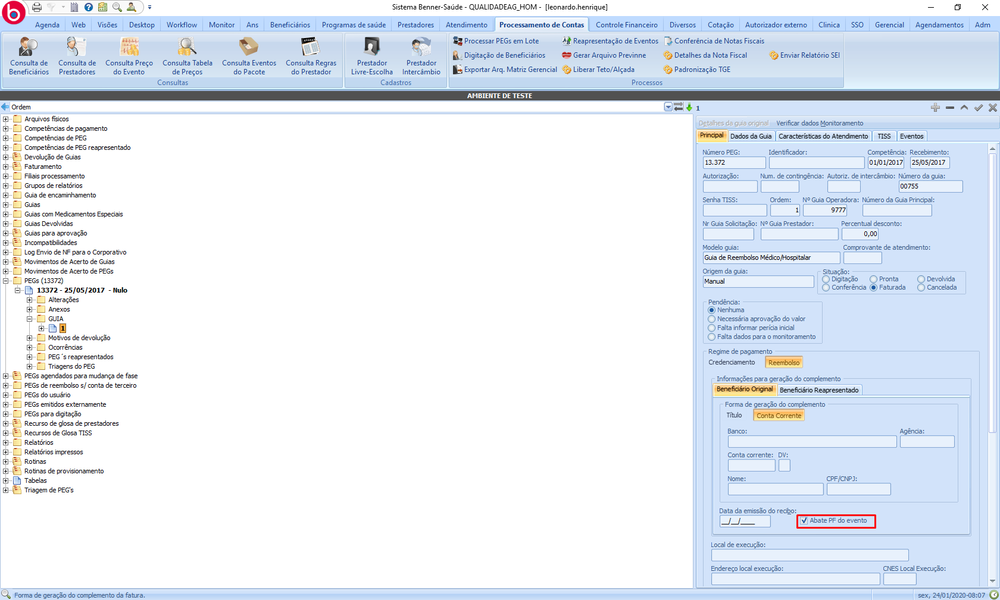

A importação das informações de coparticipação pode ser realizada com base na competência do documento ou pela data de vencimento. Definido pelo parâmetro a seguir.

> Adm > Parâmetros Gerais > Portal Serviços > Principal > Busca Histórico de coparticipação por

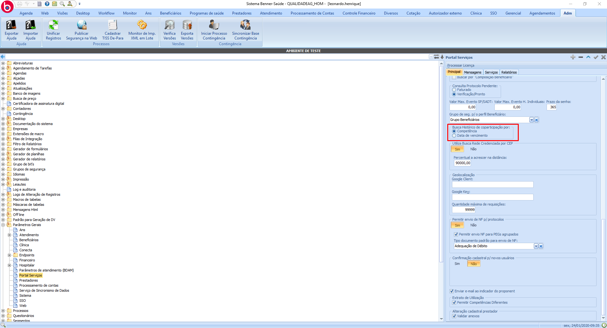

# MG

## Fatura (MG)

> Beneficiários > Beneficiários > Conta Financeira > Faturas

* **Fatura:** Para que o extrato de coparticipação seja exibido no portal é necessário que:
  * O tipo de faturamento da fatura seja "Pré-Pagamento".
  * Possua lançamento com "Tipo de lançamento financeiro" Participação Financeira.
  * Possua Módulo com "Tipo" Utilização.

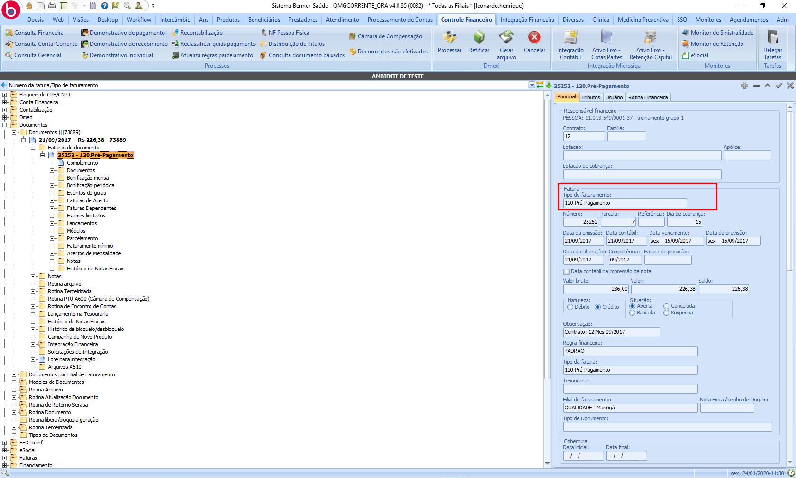

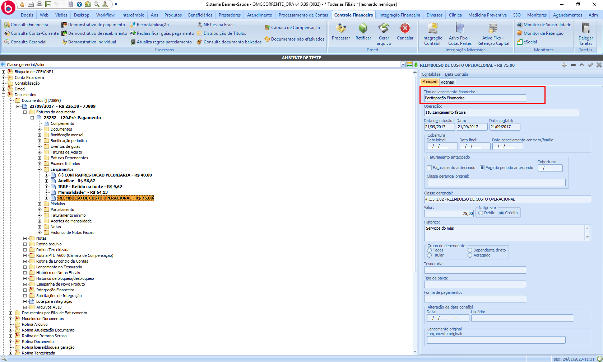

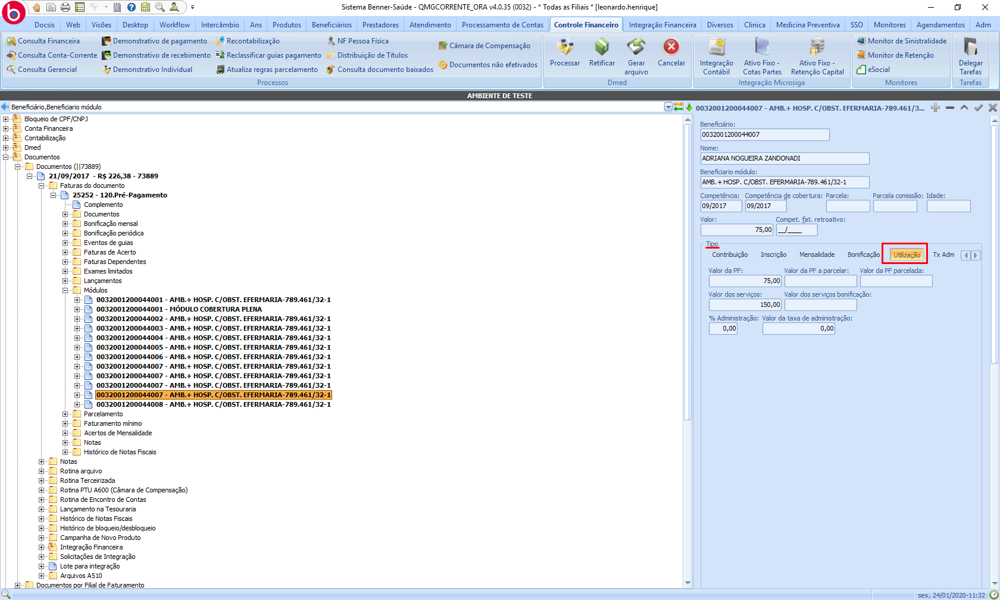

## Documento (MG)

> Beneficiários > Beneficiários > Conta Financeira > Documentos

* **Documento:** Para que o extrato de coparticipação seja exibido no portal é necessário que:

  * A "Natureza" do documento seja Crédito.
  * Possua fatura com os requisitos citados anteriormente.

    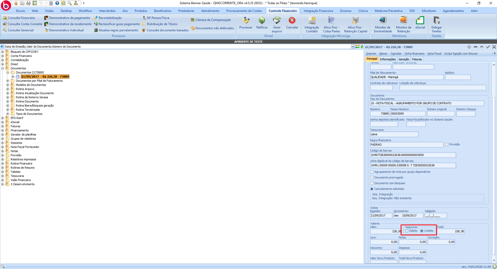

# Portal

## Parametrização

> Portal > Gestor - Portal Serviços > Preferências > Parâmetros Gerais > Período

No campo "Sincronizar Extratos de Coparticipacao por:" deve ser inserido o período desejado para importação de extratos de coparticipação, a parametrização pode ser feita por Período (Dias) ou por Competência (Mês).

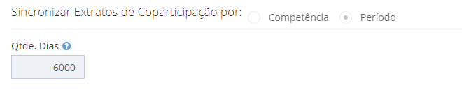

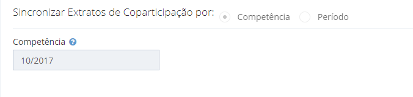

## Sincronização

> Portal > Gestor - Portal Serviços > Painel de Sincronização > Gerenciador de Sincronizações

Para que os dados sejam apresentados no portal é necessário executar a sincronização "Extratos de Coparticipação".

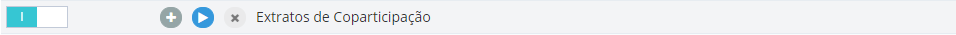
