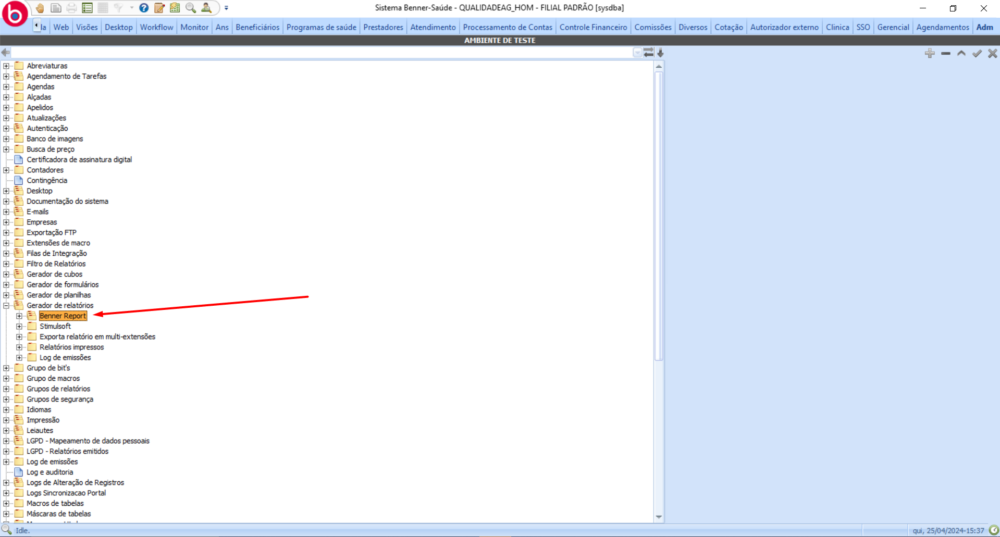
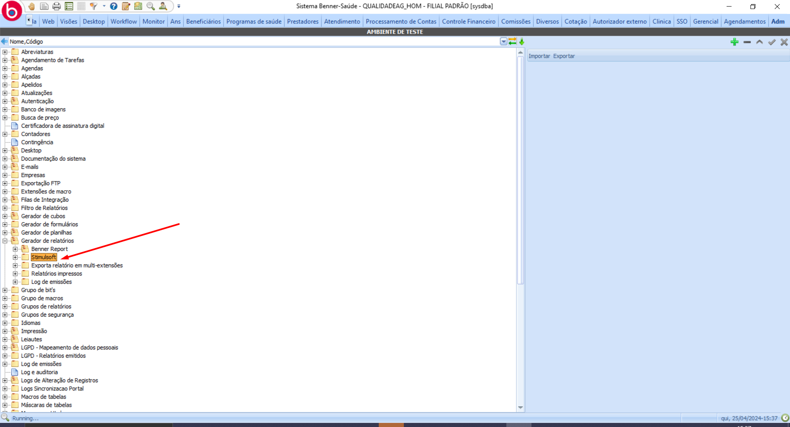
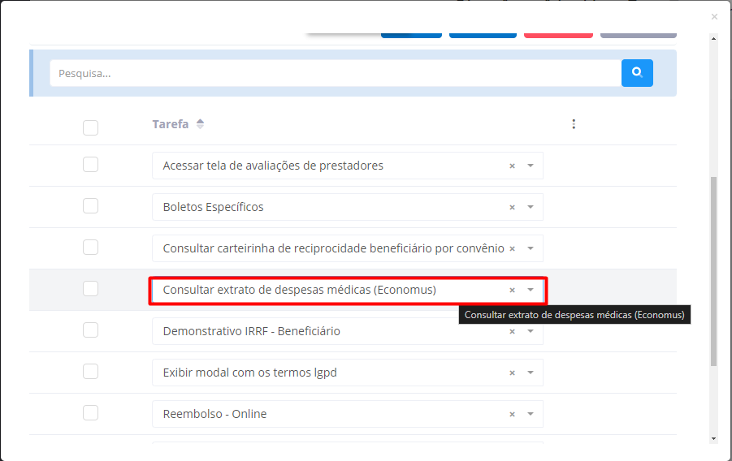

# Extrato de despesas médicas - ECONOMUS

1. **[Introdução](#introdução)**
2. **[AG](#ag)**  
  2.1. **[Relatório](#relatório)**  
  2.2. **[Parâmetros do relaório](#parâmetros-do-relatório)**  
  2.3. **[Serviço](#serviço)**  
3. **[Portal](#portal)**  
  3.1 **[Parametrização](#parametrização)**  
  3.2 **[Tarefa](#tarefa)**

# Introdução

Para que seja possível a emissão do extrato de despesas médicas no portal, será necessário seguir os requisitos abaixo.

 

# AG

## Relatório

> Adm > Gerador de relatórios 

* **Benner Report:** 

* **Stimulsoft:** 

Independente de como o relatório está construido, o mesmo deve estar preparado para emissão via serviço (utilizando session var)

Obs: Por se tratar de uma funcionalidade específica para o cliente Economus, por padrão é utilizado o relatório: **Extrato de Despesas Médicas Portal - C.ECO.RV.001-03**.

## Parâmetros do relatório

|  Parâmetro |  Tipo |  
|---|---|
|handleBeneficiario|long|
|veiodoPortalservicos| char|
|dataInicial|dateTime|
|dataFinal|dateTime|
|listarDependentes|bool|

## Serviço

O serviço utilizado para emissão do relatório é o *api/portal/EmissaoRelatorio/EmitirRelatorio*

Exemplo:

~~~~json
{
    "CodigoRelatorio": "C.ECO.RV.001-03",
    "ParametrosRelatorio": {
        "veiodoPortalservicos" : "S",
        "dataInicial": "2024-04-18",
        "dataFinal": "2024-04-18",
        "listarDependentes": true,
        "handleBeneficiario": 134
    },
    "api/portal/EcoRelatorios/ImportarRelatorioExtratoDespesasMedicas"
}
~~~~
 

# Portal

## Parametrização

> Administrador > Configurações > Papéis

Para que o usuário tenha acesso ao a funcionalidade, é necessário que a tarefa "**Consultar extrato de despesas médicas (Economus)**" esteja vínculado ao papel.

Os parâmetros utilizados da funcionalidade (tipo de filtro e relatório) estão disponíveis para alteração apenas via Builder/BD.

Entidade: ECO_PARAMETROS

|  Parâmetro |  Tipo | Obs. |  
|---|---|---|
|FILTRORELATORIODESPESASMEDICAS| lista | Informe o valor 1 para utilizar o filtro por competência ou 2 para utilizar o filtro por período|
|RELATORIODESPESASMEDICAS|string| Informe o código do relatório disponível no AG |

