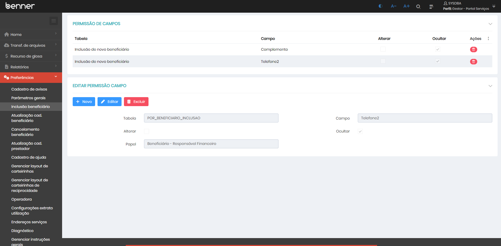
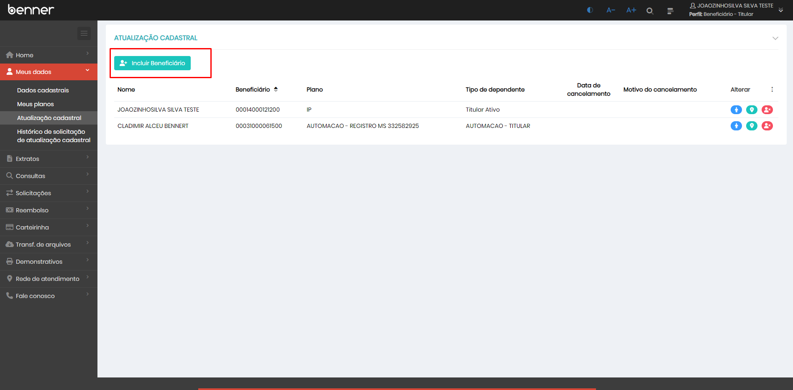
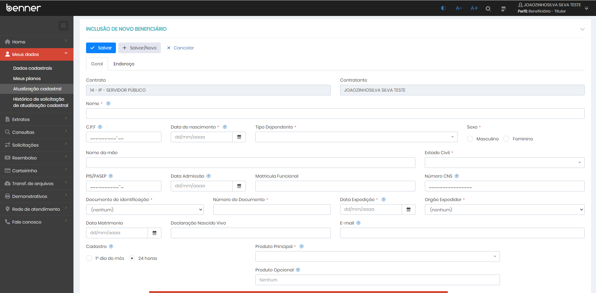
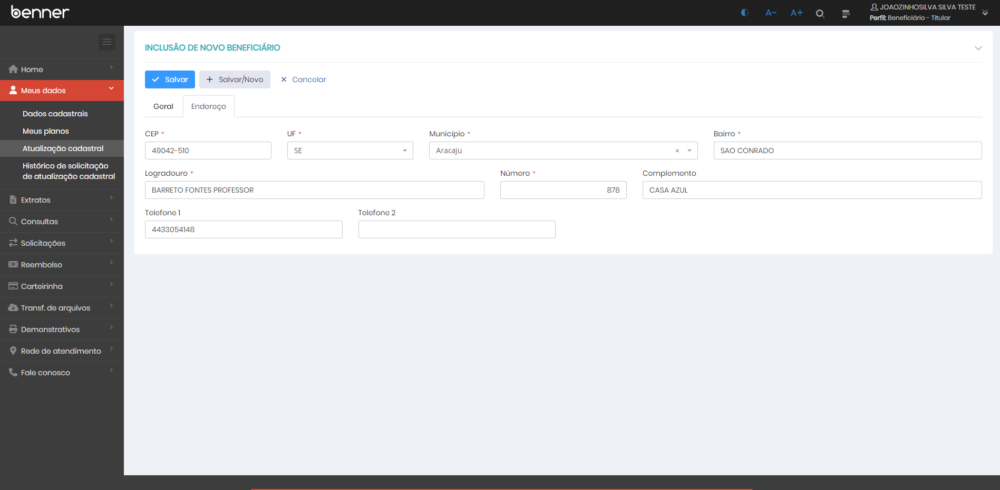
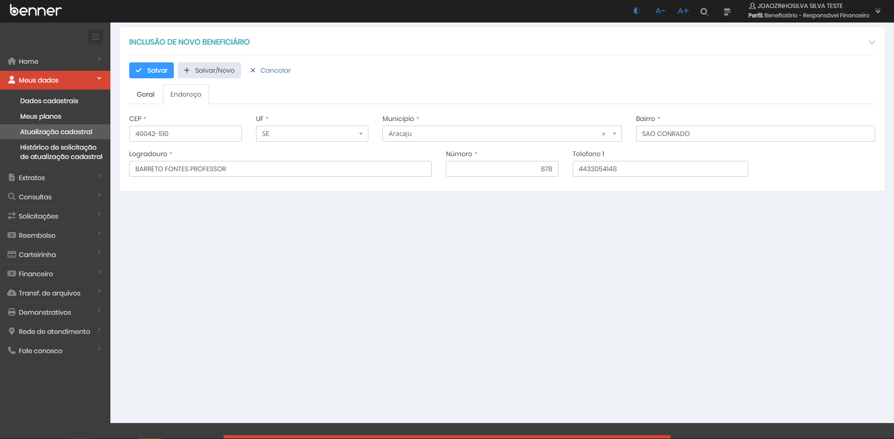
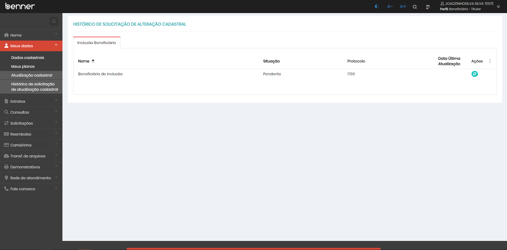
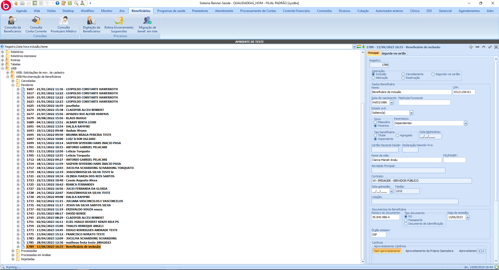
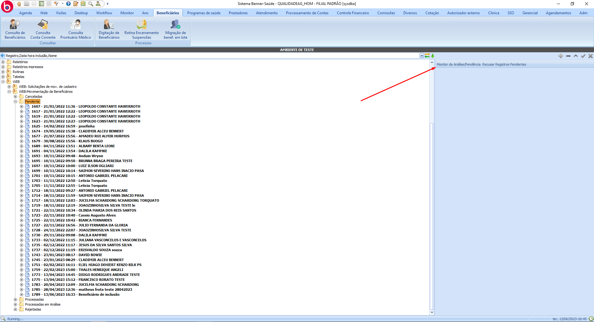
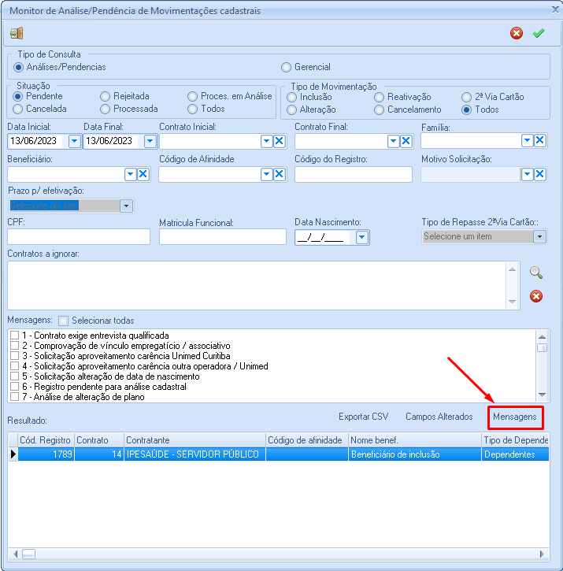
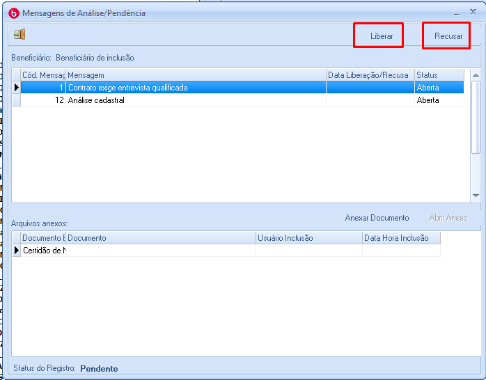

# Inclusão de beneficiário

1.  **[Introdução](#introdução)**
2.  **[Parametrização de campos](#parametrização-de-campos)**
3.  **[Solicitação de inclusão](#solicitação-de-inclusão)**
4.  **[Histórico de solicitação](#histórico-de-solicitação)**
5.  **[AG](#ag)**

## Introdução

Para que o usuário do **Portal** possa solicitar a inclusão de um beneficiário, é necessário que as tarefas *"Inclusão de Beneficiário"* e *"Histórico Inclusão Beneficiário"* estejam associadas ao seu papel de Beneficiário. A funcionalidade de inclusão de beneficiários pode ser customizada pelo gestor do portal de serviços, para que o mesmo possa acessar a página de customização é necessário que a tarefa *"Campos Inclusão de Beneficiário"* esteja associada ao seu papel.

## Parametrização de campos

> Gestor - Portal serviços > Preferências > Inclusão beneficiário

Ao acessar a página será exibido um grid contendo os campos parametrizados (Caso existam), ao clicar em um registro do grid será exibido de forma detalhada as permissões:

* **Tabela:** Tabela ao qual o campo com permissão alterada pertence;
* **Campo:** Campo que terá sua permissão alterada;
* **Alterar:** Indica se será concedido a permissão de alteração da informação do campo no momento da solicitação;
* **Ocultar:** Indica se o campo deve ser ocultado no momento da solicitação;
* **Papel:** Indica o papel ao qual as permissões concedidas serão aplicadas;

*OBS:* Por padrão todos os campos são exibidos no momento da solicitação, sendo necessário a parametrização apenas em casos onde a operadora opte por esconder um campo, ou torná-lo somente leitura.

## Solicitação de inclusão

> Beneficiário > Meus dados > Atualização cadastral > Incluir Beneficiário

Ao acessar a página será exibido o formulário para inclusão de beneficiário seguindo as regras de permissões de campos:

Formulário com permissões de campos parametrizados.

## Histórico de solicitação

> Beneficiário > Meus dados > Histórico de solicitação de atualização cadastral

Após o envio da solicitação de inclusão a mesma poderá ser acompanhada através da página de histórico de solicitação, sendo possível que o usuário atualize a situação manualmente pelo botão da coluna ações sem a necessidade de aguardar a sincronização, também é possível visualizar as informações preenchidas no momento da solicitação bastando apenas clicar sobre a solicitação:

## AG

> Beneficiários > WEB > WEB:Movimentação de Beneficiários > Pendentes *OU* Processadas em análise

Após o envio da solicitação a mesma já estará disponível no sistema saúde para conferência. A solicitação poderá ser direcionada para a carga de solicitações pendentes ou processadas em análises, o direcionamento será definido pela parametrização do "Motivo Análise/Pendência".

Para que a solicitação seja aprovada é necessário que todos os motivos de análise/pendência sejam liberados.

Para que a solicitação seja recusada é necessário que ao menos um motivo de análise/pendência seja recusado.

