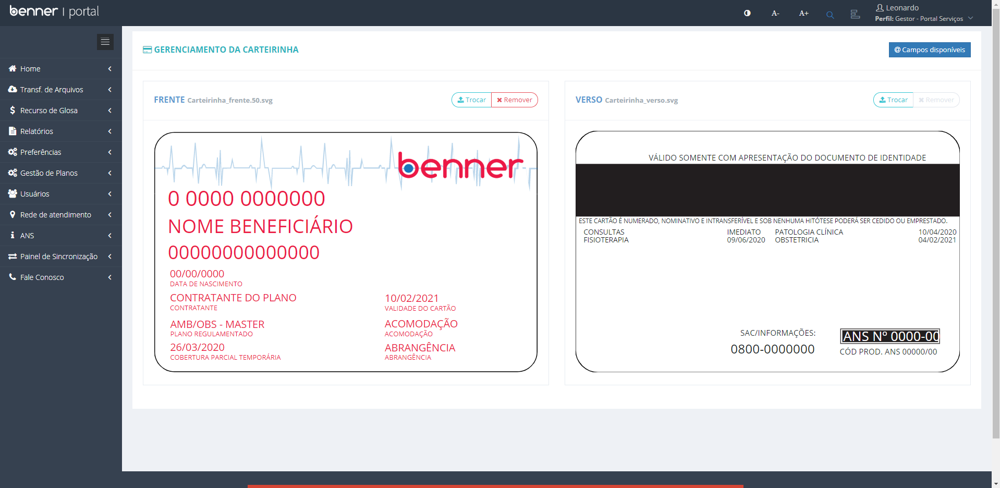

# Layout de carteirinha

1. **[Introdução](#introdução)**
2. **[Arquivo .svg](#arquivo-.svg)**
3. **[Campos Disponíveis](#campos-disponíveis)**
4. **[Incluindo campos na carteirinha](#incluindo-campos-na-carteirinha)**
5. **[Upload de novo layout](#Upload-de-novo-layout)**

## Introdução

Neste manual será abordado de forma simples as parametrizações necessárias para a utilização da funcionalidade da carteirinha do beneficiário.

## Arquivo .svg

WES\Portal\content\images\Carteirinha\

Os arquivos de layout da carteirinha se encontram no endereço acima. Por padrão a nomenclatura dos arquivos são "carteirinha_frente.svc" e "carteirinha_verso.svg", após realizar o upload de um novo layout, será criado os arquivos "carteirinha_frente.50.svg" e "carteirinha_verso.50.svg". Antes de qualquer alteração é recomendado a realização de um backup dos arquivos.

## Campos Disponíveis

> Gestor - Portal Serviços > Preferências > Gerenciar Layout de Carteirinhas > @Campos Disponíveis

* **@Campos Disponíveis:** A funcionalidade exibe todos os campos disponíveis a serem parametrizados no layout da carteirinha.

## Incluindo campos na carteirinha

> Editor de imagens vetoriais.  
Obs: Para o desenvolvimente deste manual será usado o Inkscape

* **Inclusão:** Para que o campo seja incluído na carteirinha, é necessário incluir a tag no layout utilizando o editor de imagens vetoriais. Lembrando que a tag deve seguir o padrão apresentado no "@Campos Disponíveis" (Caixa alta).

## Upload de novo layout

> Gestor - Portal Serviços > Preferências > Gerenciar Layout de Carteirinhas > Trocar

Para utilizar uma nova carteirinha no portal de serviços, é necessário realizar o upload do arquivo .svg através do papel de gestor.

