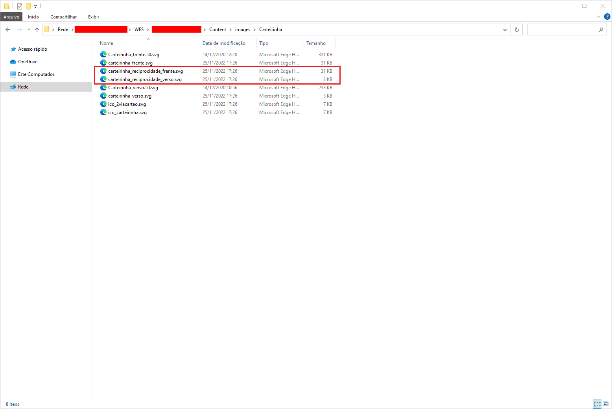
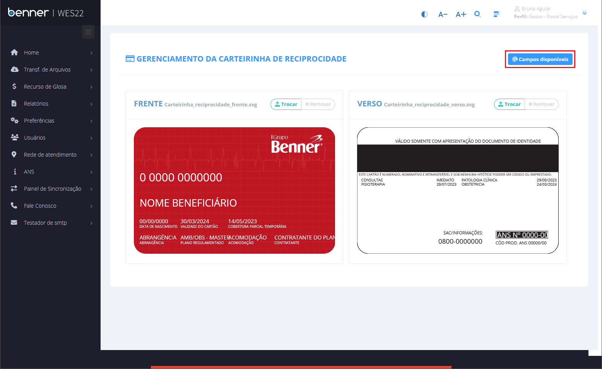
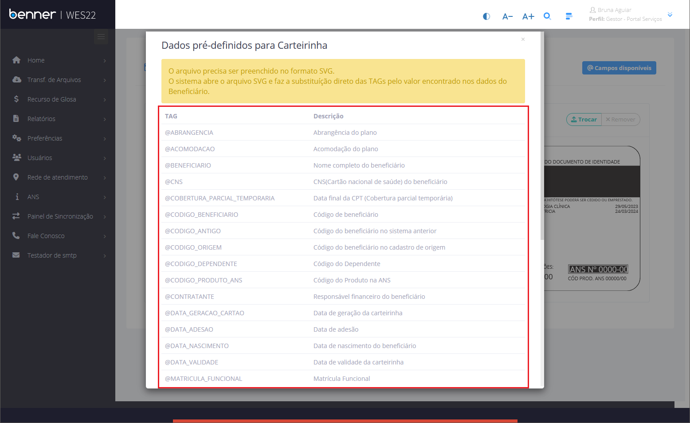
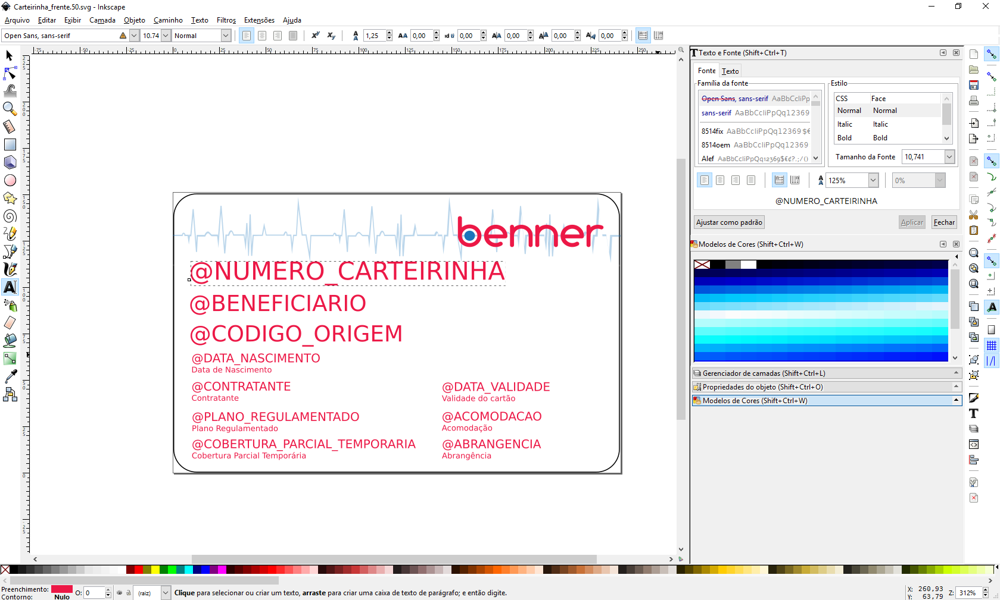
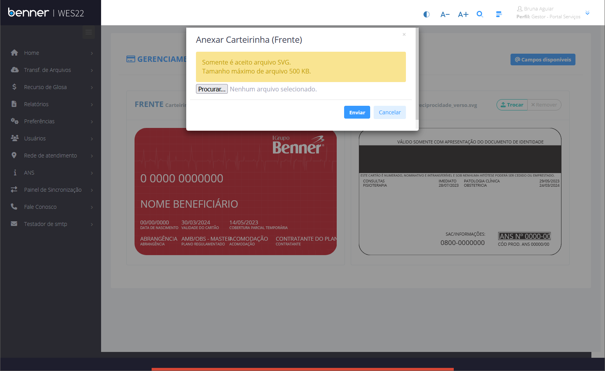
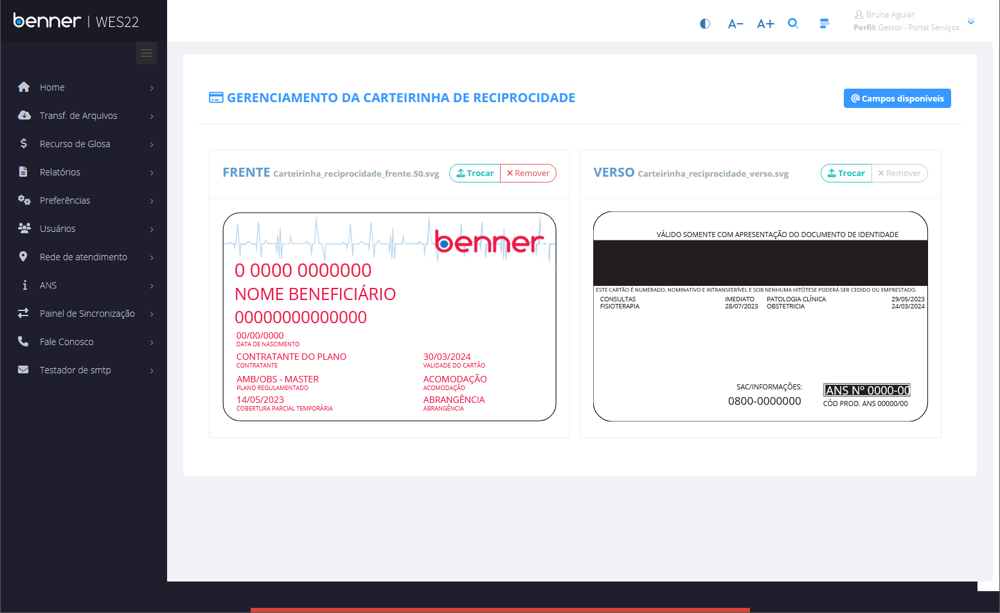
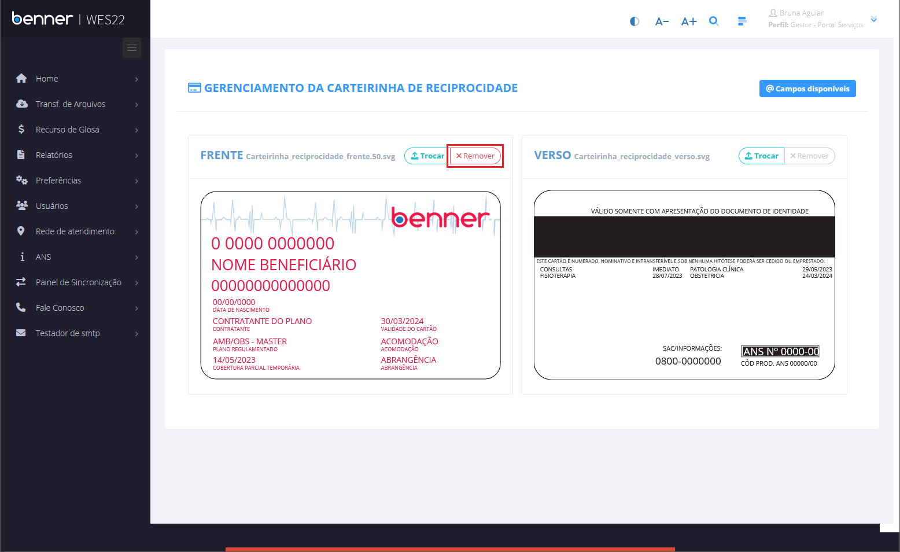

# Layout de carteirinha

1. **[Introdução](#introdução)**
2. **[Arquivo .svg](#arquivo-.svg)**
3. **[Campos Disponíveis](#campos-disponíveis)**
4. **[Incluindo campos na carteirinha](#incluindo-campos-na-carteirinha)**
5. **[Upload de novo layout](#Upload-de-novo-layout)**

## Introdução

Neste manual serão abordadas, de forma simples, as parametrizações necessárias para a utilização da funcionalidade da carteirinha de reciprocidade

## Arquivo .svg

> WES\Portal\content\images\Carteirinha\

Os arquivos de layout da carteirinha se encontram no endereço acima. Por padrão a nomenclatura dos arquivos são "carteirinha_reciprocidade_frente.svc" e "carteirinha_reciprocidade_verso.svg", após realizar o upload de um novo layout, serão criados os arquivos "carteirinha_reciprocidade_frente.50.svg" e "carteirinha_reciprocidade_verso.50.svg". Antes de qualquer alteração é recomendada a realização de um backup dos arquivos.

## Campos Disponíveis

> Gestor - Portal Serviços > Preferências > Gerenciar Layout de Carteirinhas de Reciprocidade > @Campos Disponíveis

* **@Campos Disponíveis:** Ao clicar no botão, são exibidos todos os campos disponíveis a serem parametrizados no layout da carteirinha.

## Incluindo campos na carteirinha

> Editor de imagens vetoriais.  
Obs: Para o desenvolvimento deste manual será usado o Inkscape.

* **Inclusão:** Para que o campo seja incluído na carteirinha, é necessário incluir a tag no layout utilizando o editor de imagens vetoriais. Lembrando que a tag deve seguir o padrão apresentado na tela de **Dados pré-definidos para Carteirinha** (Caixa alta).

## Upload de novo layout

> Gestor - Portal Serviços > Preferências > Gerenciar Layout de Carteirinhas de Reciprocidade > Trocar

Para utilizar uma nova carteirinha no portal de serviços, é necessário realizar o upload do arquivo *.svg* através do papel de gestor.

Para isso, clique no botão **Trocar**.

Selecione o arquivo desejado e clique em **Enviar**

Feito isso, o novo layout será apresentado na tela.

Para voltar ao layout padrão, basta clicar no botão **Remover** como indicado na imagem abaixo.

