# Pagamento Pendente de Nota fiscal

1. **[Introdução](#introdução)**
2. **[AG](#ag)**  
  2.1 **[Pagamento](#pagamento)**  
  2.2 **[Caso 1](#caso-1)**  
  2.3 **[Caso 2](#caso-2)**  
  2.4 **[Caso 3](#caso-3)**
3. **[Portal](#portal)**  
  3.1 **[Sincronização](#sincronização)**
4. **[Como funciona](#como-funciona)**

## Introdução

Para o funcionamento da rotina de pagamento pendente de nota fiscal, será necessário seguir as seguintes parametrizações.

# AG

## Pagamento

Para que o pagamento pendente de nota fiscal seja exibido no portal, deve se enquadrar em uma das situações a seguir.

### Caso 1

"Tipo documentos fiscais" deve ser "Nota fiscal"

O Documento fiscal não deve possuir nota

O valor do pagamento deve ser maior que 0

O pagamento deve estar fechado

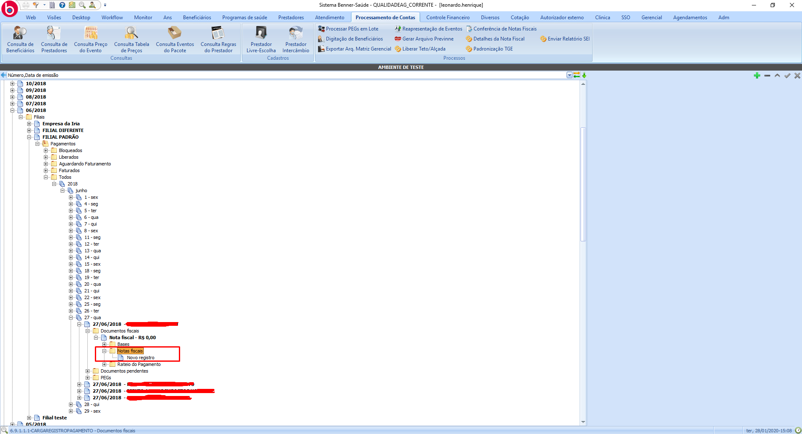

### Caso 2

"Tipo documentos fiscais" deve ser "Nota fiscal"

O documento deve possuir Nota fiscal com status "Indeferido"

O valor do pagamento deve ser maior que 0

O pagamento deve estar fechado

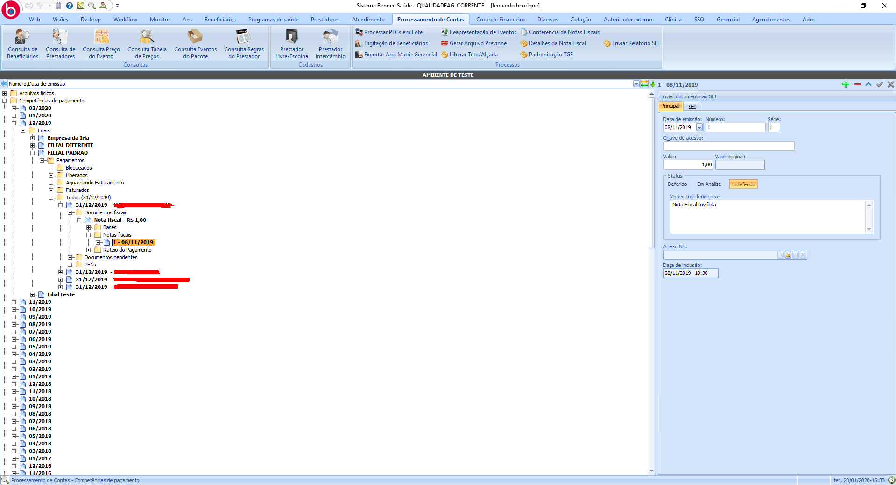

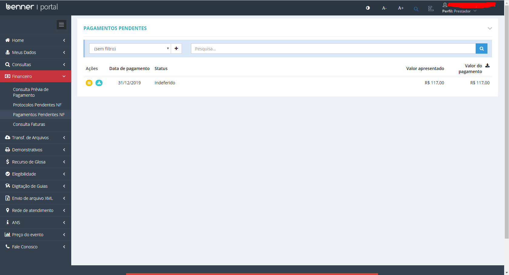

### Caso 3

"Tipo documentos fiscais" deve ser "Nota fiscal"

O documento deve possuir Nota fiscal com status "Em Análise"

O valor do pagamento deve ser maior que 0

O pagamento deve estar fechado

O Status da conciliação deve ser "Não conciliado"

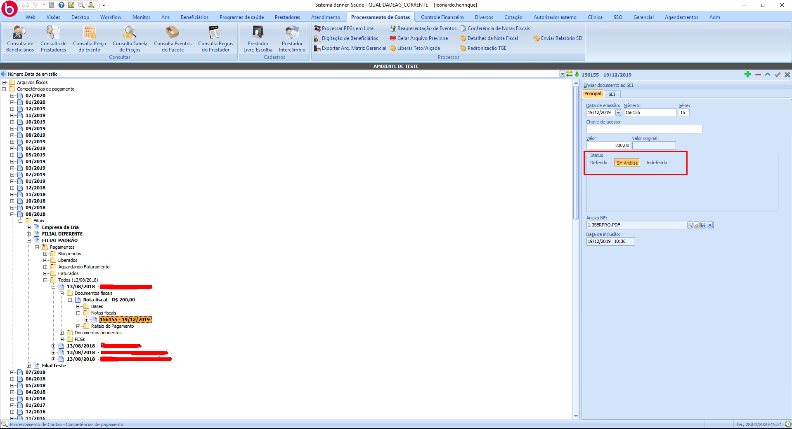

# Portal

## Sincronização

> Painel de Sincronização > Gerenciador de Sincronizações > Pagamentos Pendentes de Nota Fiscal

A sincronização será realizada buscando pagamentos pendentes de nota fiscal que se enquadram em algum dos casos citados anteriormente.

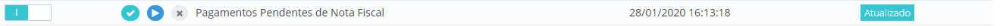

## Como funciona

Ao vincular uma nota fiscal ao pagamento, será enviado o número da nota, série da nota, Data de emissão, valor, anexo e caso tenha sido incluído itens na nota, os mesmos também serão enviados. Todas as informações serão vínculadas ao registro de pagamento.

Pagamento pendente de NF.
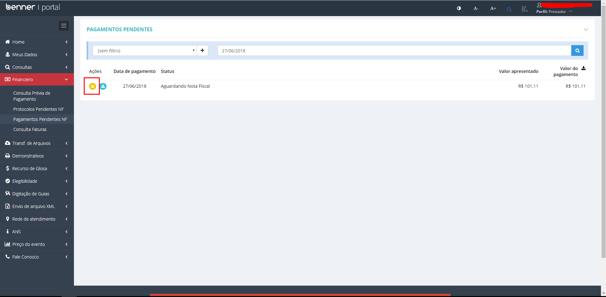

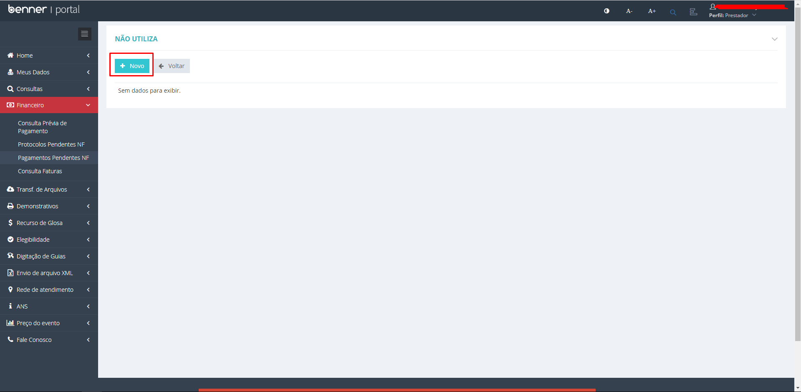

Anexado nota fiscal ao pagamento.
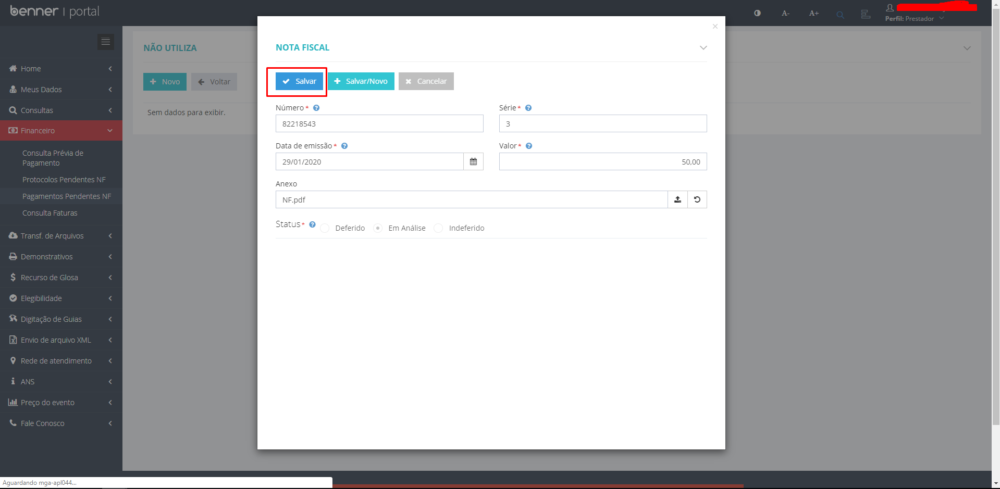

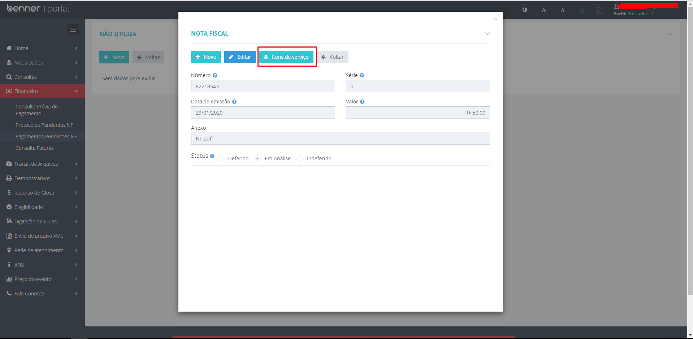

Incluído item na nota fiscal.
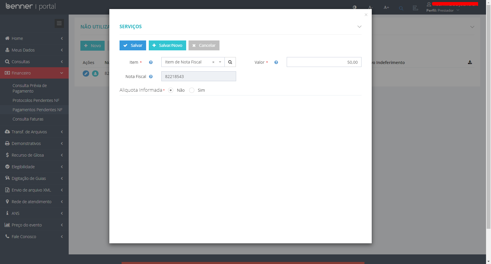

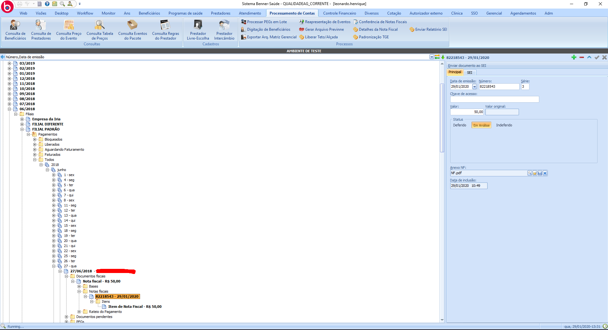

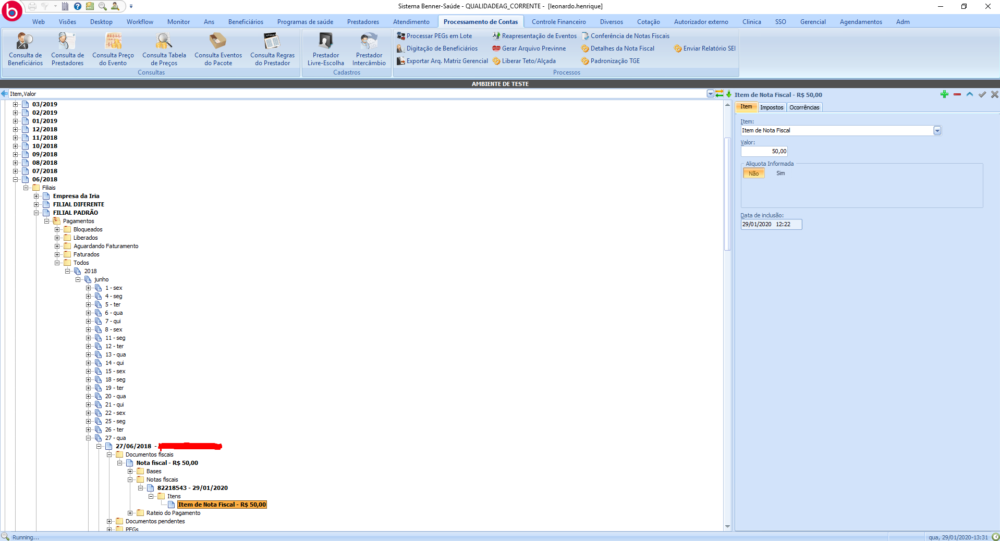

Nota indeferida.
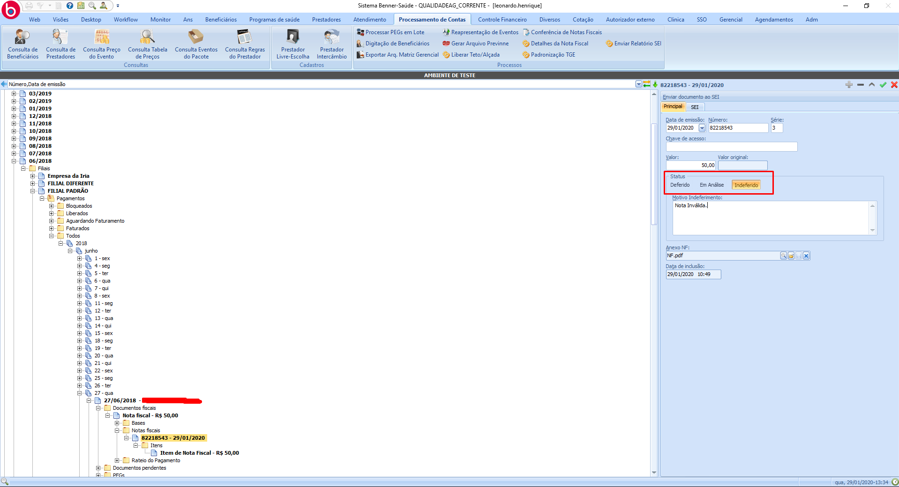

Sincronização executada.
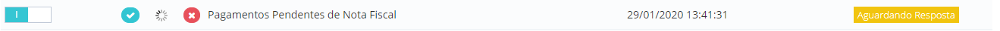

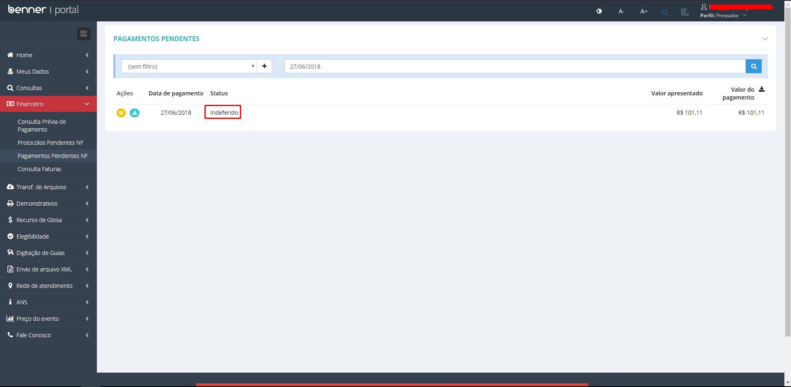
