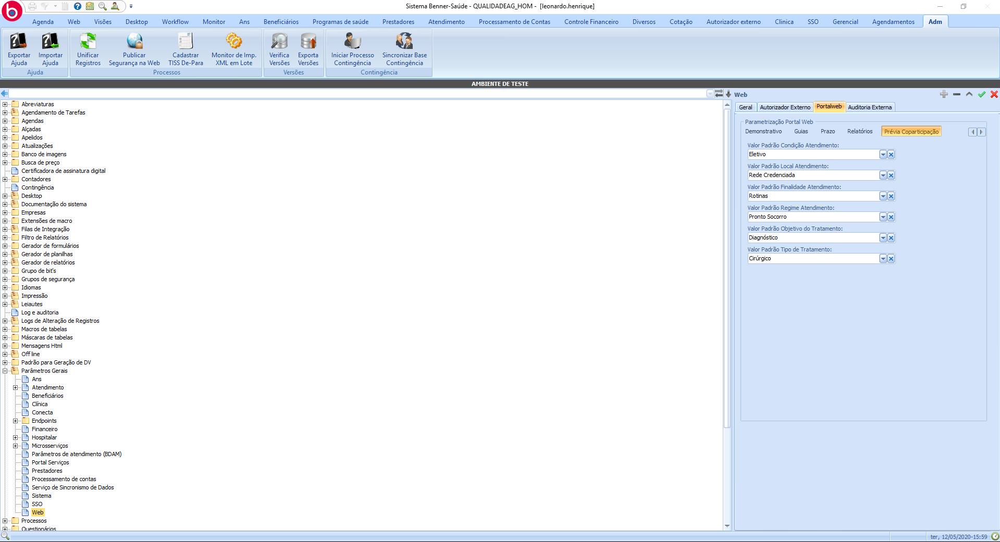
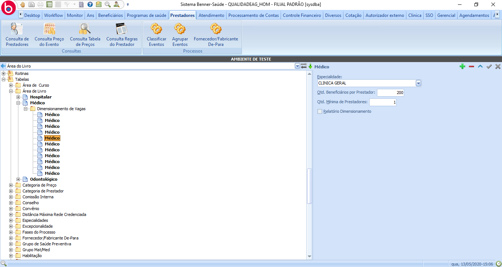
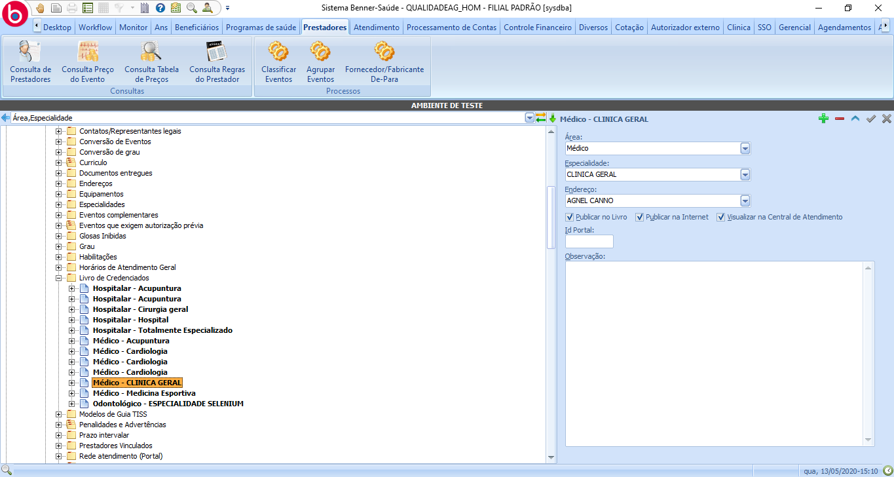
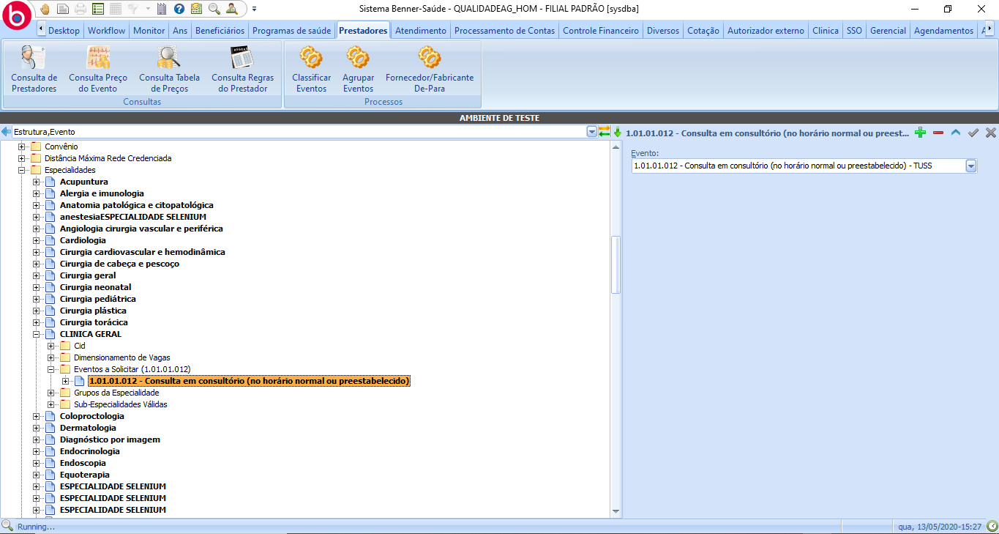
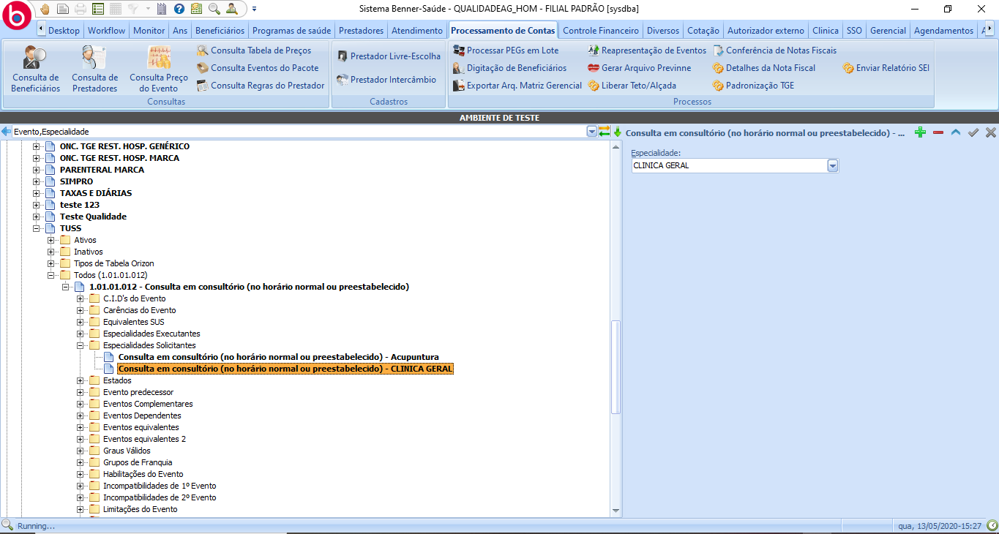

# Parametrizações - Prévia de coparticipação

1.  **[Introdução](#introdução)**
2.  **[Configuração por contrato](#configuração-por-contrato)**
3.  **[Ver mapa](#ver-mapa)**
4.  **[Campos parametrizados](#campos-parametrizados)**
5.  **[Valores Padrão](#valores-padrão)**
6.  **[Pré-requisitos](#pré-requisitos)**

## Introdução

Para realizar a parametrização da prévia de coparticipação é necessário qua a tarefa *"Configurar consulta prévia de coparticipação"* esteja associada ao papel de gestor ou ao papel de realizará a parametrização.

## Configuração por contrato

> Gestor > Preferências > Prévia de coparticipação

**Configuração:** Será apresentado o botão de editar onde o mesmo habilitará o usuário a alterar o campo contratos, informando quais contratos poderão utilizar a prévia de coparticipação.

## Ver mapa

> Gestor > Preferências > Prévia de coparticipação

**Configuração:** Será apresentado o botão editar onde o mesmo habilitará o usuário a alterar o campo Ver Mapa, o mesmo possibilita o beneficiário a visualizar um mapa com o endereço da rede credenciada a partir das informações da consulta de prévia de coparticipação.

## Campos parametrizados

> Gestor > Preferências > Prévia de coparticipação

**Campos parametrizados:** é disponibilizado a opção do gestor escolher quais campos podem ser visíveis e quais serão obrigatórios.

*Ao clicar em novo é apresentado ao gestor os campos que podem ser parametrizados, o label (dica dentro de campo), visibilidade do campo e obrigatoriedade.*

## Valores Padrão

> AG > Adm > Parâmetros Gerais > WEB > Portal Web > Prévia de coparticipação

**Configuração:** Será apresentado o botão editar onde o mesmo habilitará o usuário a alterar os valores padrão para algumas das informações necessárias para se realizar a consulta de prévia de coparticipação caso os mesmos não sejam informados pelo beneficiário.

## Pré-requisitos

Pré-requisitos para que um prestador seja listado na consulta de prévia de coparticipação

> Evento utilizado como exemplo: 1.01.01.012 - Consulta em consultório (no horário normal ou preestabelecido)

#### 1 - Cadastrar área do livro

> Prestadores > Tabelas > Área do Livro > Dimensionamento de Vagas

As áreas devem ter seus dimensionamentos de vagas cadastrados, fazendo assim um vínculo entre área e especialidade.

#### 2 - Cadastrar prestador ao livro de credenciados

> Prestadores > Cadastro de prestadores > Selecionar Prestador > Informações Cadastrais > Livro de Credenciados

Ao cadastrar o prestador ao livro de credenciados é realizado o vínculo entre área x especialidade x endereço. 

*O Prestador em questão deve estar credenciado e o endereço deve ser do tipo atendimento.*

#### 3 - Especialidade x Evento

> Prestador > Tabelas > Especialidades > Selecionar Especialidade > Eventos a Solicitar

Para que o prestador em questão seja exibido ao consultar o evento 1.01.01.012, ao menos uma de suas especialidades deve ter o evento 1.01.01.012 vinculado à carga 'Eventos a Solicitar'.

Pode ser realizado o caminho inverso, realizando o vínculo das especialidades solicitantes ao evento.

> Processamento de Contas > Tabelas > TGE – Tabela Geral de Eventos > Selecionar Tabela > Selecionar Evento > Especialidades Solicitantes

