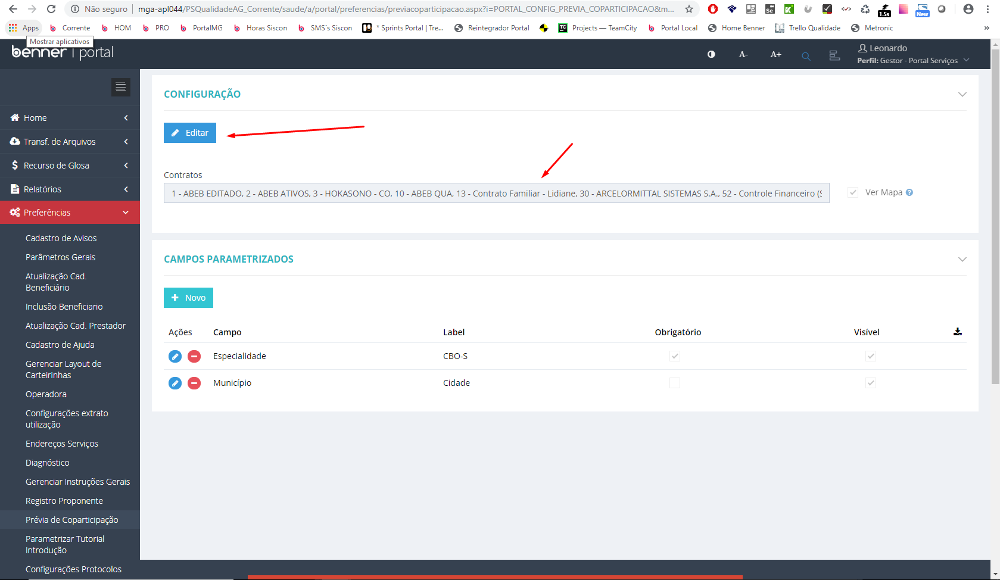
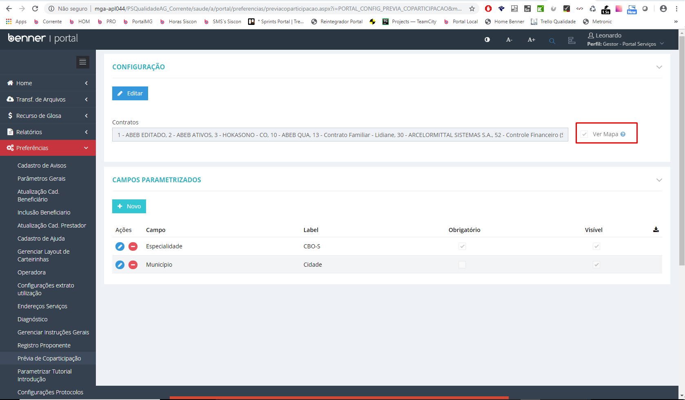
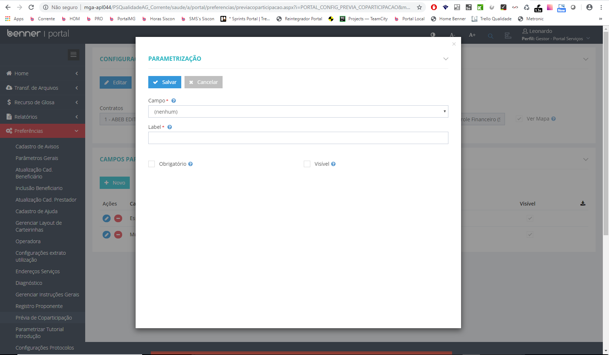

# Parametrizações - Prévia de coparticipação

1.  **[Introdução](#introdução)**
2.  **[Configuração por contrato](#configuração-por-contrato)**
3.  **[Ver mapa](#ver-mapa)**
4.  **[Campos parametrizados](#campos-parametrizados)**

## Introdução

Para realizar a parametrização da prévia de coparticipação é necessário qua a tarefa *"Configurar consulta prévia de coparticipação"* esteja associada ao papel de gestor ou ao papel de realizará a parametrização.

## Configuração por contrato

> Gestor > Preferências > Prévia de coparticipação

**Configuração:** Será apresentado o botão de editar onde o mesmo habilitará o usuário a alterar o campo contratos, informando quais contratos poderão utilizar a prévia de coparticipação.

## Ver mapa

> Gestor > Preferências > Prévia de coparticipação

**Configuração:** Será apresentado o botão editar onde o mesmo habilitará o usuário a alterar o campo Ver Mapa, o mesmo possibilita o beneficiário a visualizar um mapa com o endereço da rede credenciada a partir das informações da consulta de prévia de coparticipação.

## Campos parametrizados

> Gestor > Preferências > Prévia de coparticipação

**Campos parametrizados:** é disponibilizado a opção do gestor escolher quais campos podem ser visíveis e quais serão obrigatórios.

*Ao clicar em novo é apresentado ao gestor os campos que podem ser parametrizados, o label (dica dentro de campo), visibilidade do campo e obrigatoriedade.*