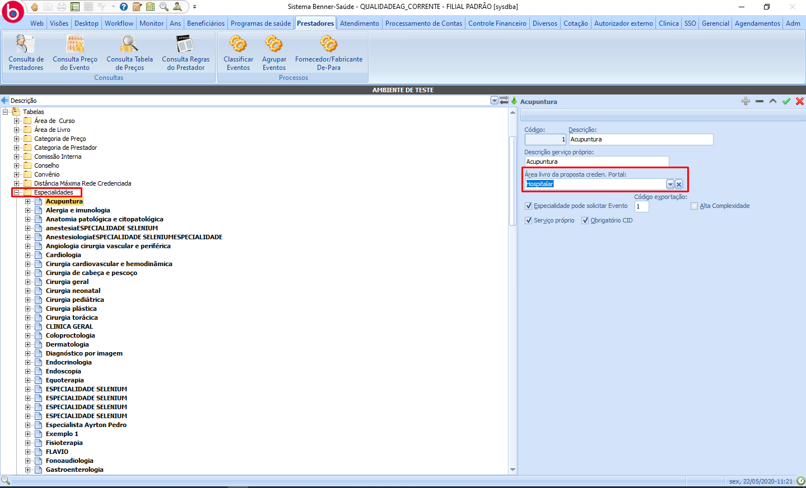

# Parametrizações - Proponente

1.  **[Introdução](#introdução)**
2.  **[Processo inicial por tipo de prestador](#processo-inicial-por-tipo-de-prestador)**
3.  **[Especialidade](#especialidade)**
4.  **[Serviços contratados](#serviços-contratados)**
5.  **[Tipos de documentos](#tipos-de-documentos)**
6.  **[Sincronizações](#sincronizações)**

## Introdução

Parametrizações necessárias no saúde para o funcionarmento do proponente no portal.

> Nota: É importante lembrar que é necessário que o serviço de envio de email esteja funcionando corretamente para que o cadastro do proponente assim como outras areas do portal funcione.*

Para realizar a parametrização do proponente é necessário que previamente existam dados referentes ao tipo de prestador, tipo de processo e fases do processo.

## Processo inicial por tipo de prestador

> Prestadores > Tabelas > Processo inicial por tipo de prestador

* **Tipo prestador:** para que seja possível criar o processo pelo portal a área de atuação selecionada deve ser a mesma parametrizada no tipo prestador.
* **Processo:** indica o tipo de processo que será criado na solicitação de proponente.
* **Fase inicial:** indica a fase inicial que será criada dentro do processo.

## Especialidade

> Prestadores > Tabelas > Especialidade

Define as especialidades que serão apresentadas para seleção pelo proponente.

## Serviços contratados

> Prestadores > Tabelas > Serviços contratados

Define os serviços que serão apresentados para a seleção pelo proponente.

## Tipos de documentos

> Prestadores > Tabelas > Tipo de Prestador > Documentos exigidos

Define os tipos de documentos que serão apresentados para a seleção pelo proponente no envio de documento.

## Sincronizações

Sincronizações a serem efetuadas pelo portal antes de fazer o cadastro de uma proposta:

* Tipo de prestador.
* Tabelas do prestador.
* Tabelas do proponente.
* Especialidade do prestador.