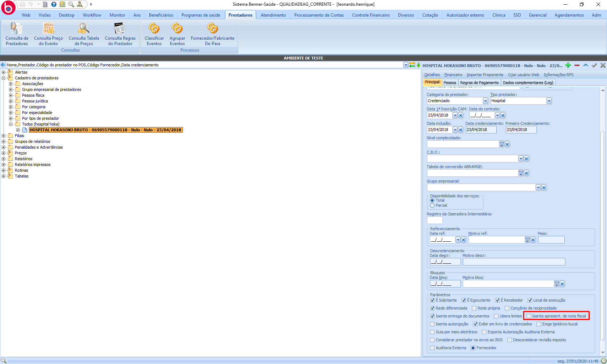
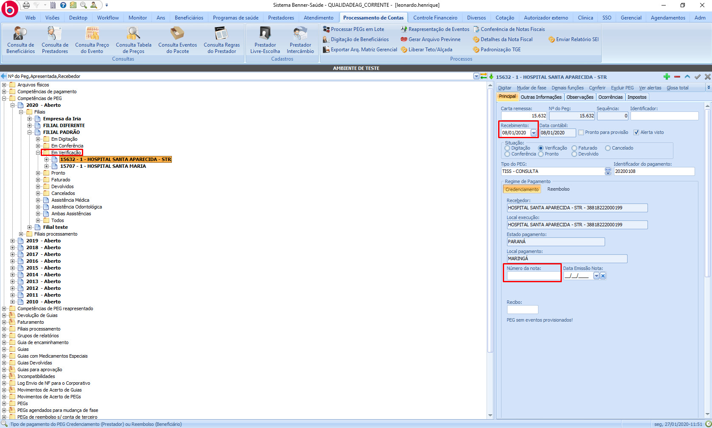
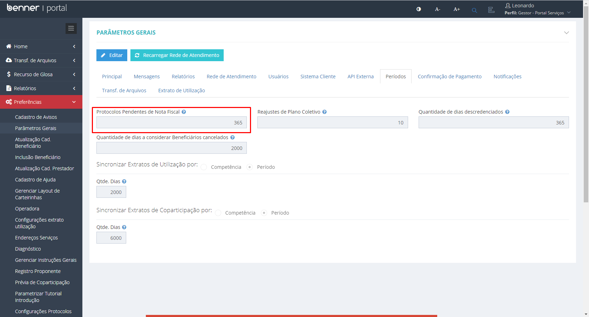
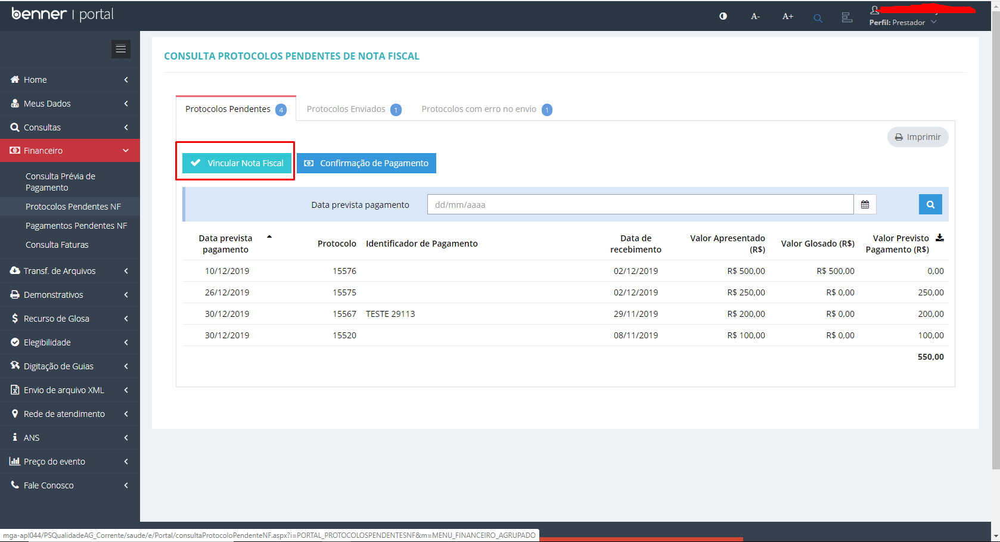
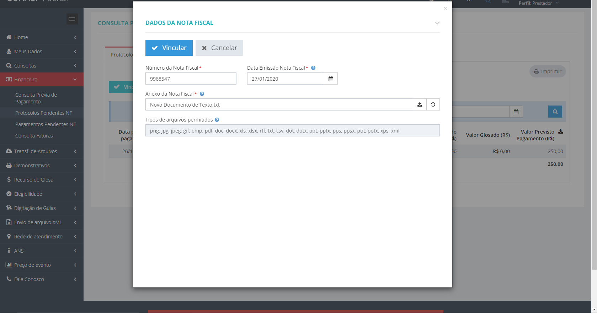
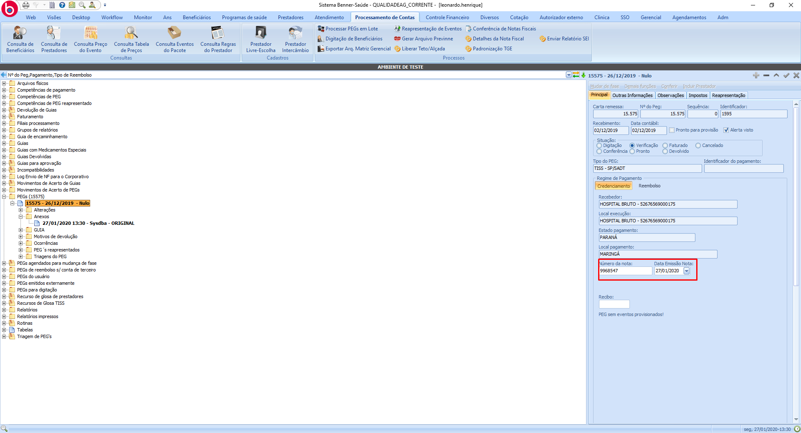
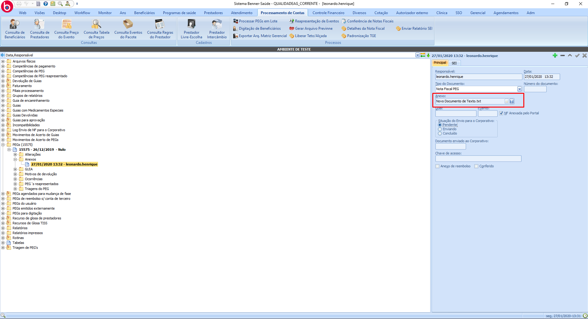

# Protocolo Pendente de Nota fiscal - Requisitos

1. **[Introdução](#introdução)**
2. **[AG](#ag)**  
  2.1 **[Isenta Apresent. de nota fiscal](#isenta-apresent.-de-nota-fiscal)**  
  2.2 **[Peg](#peg)**
3. **[Portal](#portal)**  
  3.1 **[Parâmetro para período de sincronização](#parâmetros-para-período-de-sincronização)**  
  3.2 **[Sincronização](#sincronização)**

## Introdução

Para o funcionamento da rotina de protocolo pendente de nota fiscal, será necessário seguir as seguintes parametrizações.

# AG

## Isenta Apresent. de nota fiscal

> Prestadores > Cadastro de prestadores > Prestador

Para que o prestador possa usar a funcionalidade, o campo "Isenta apresent. de nota fiscal" deve estar desmarcado.

## Peg

Para que o peg seja exibido na funcionalidade de protocolo pendente de nota fiscal, o mesmo deve atender os seguintes requisitos.

#### O campo "Número da nota" deve estar vazio

> Processamento de Contas > PEGs

#### A data de recebimento deve estar dentro do período parametrizado no portal

> Processamento de Contas > PEGs

#### O Peg não deve possuir NF vínculada

> Processamento de Contas > Conferência de Notas Fiscais

#### O peg deve estar ao menos na fase de verificação para que seja exibido na funcionalidade

> Processamento de Contas > Competências de PEG

# Portal

## Parâmetro para período de sincronização

> Preferências > Parâmetros Gerais > Períodos

No campo "Protocolos Pendentes de Nota Fiscal", deve ser inserido o número de dias desejado para a busca de protocolos pendentes de nf.

## Sincronização

> Painel de Sincronização > Gerenciador de Sincronizações > Protocolos Pendentes de Nota Fiscal

A sincronização será realizada buscando protocolos dentro do período parametrizado, e que estejam dentro dos critérios mencionados anteriormente.

## Como funciona

Ao vincular uma nota fiscal ao protocolo, será enviado o número da nota, data de pagamento e anexo para o sistema saúde. Todas as informações serão vinculadas ao peg.

