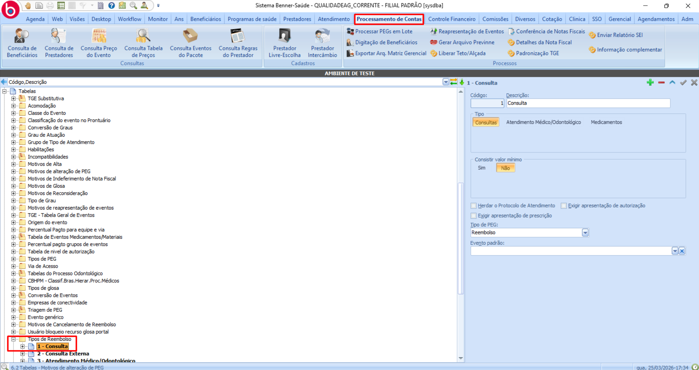
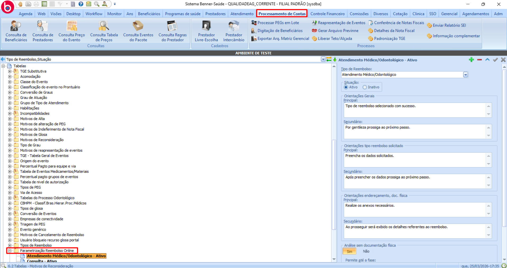
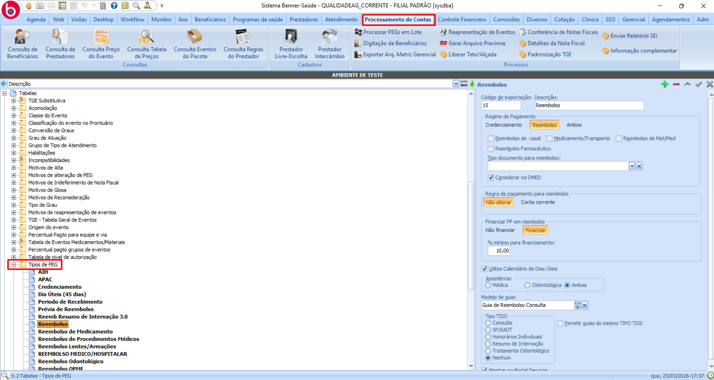
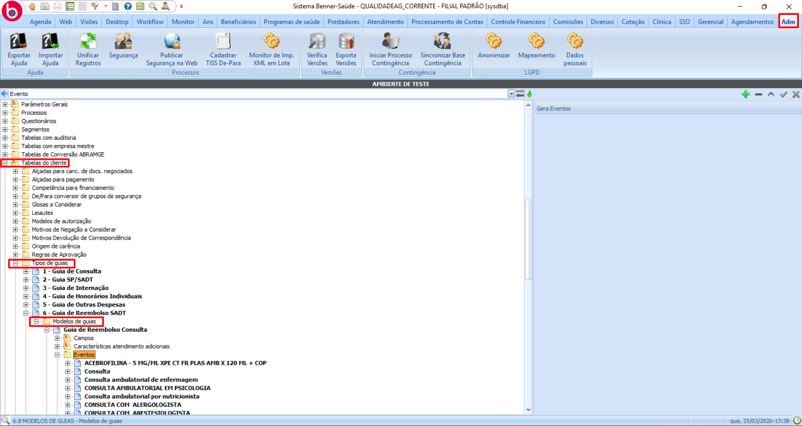

# Parametrizações - Reembolso on-line

1.  **[Introdução](#1-introdução)**
2.  **[Tipo de Reembolso](#2-tipo-de-reembolso)**
3.  **[Tipo de reembolso online](#3-tipo-de-reembolso-on-line)**
4.  **[Eventos disponíveis para Reembolso de consulta](#4-eventos-disponíveis-para-reembolso-de-consulta)**
5.  **[Parametrização geral](#5-parametrização-geral)**
6.  **[Contratos](#6-contratos)**

   
## 1. Introdução

Para que o reembolso on-line funcione no **Portal** é necessário qua a tarefa *"Reembolso online"* esteja associada ao papel de Beneficiário ou ao papel de realizará a parametrização.

## 2. Tipo de Reembolso

> [AG] > Processamento de contas > Tabelas > Tipos de reembolso

Ao iniciar a inclusão de um novo tipo de reembolso, os seguintes campos serão apresentados para a parametrização:

* **Descrição:** nome do reembolso que será apresentado no portal;
* **Tipos:**
  * **Consultas:** permite ao beneficiário preencher os campos CPF/CNPJ do prestador, nome do prestador, evento, nome do profissional, data do atendimento, sigla do conselho do profisisonal, número da inscrição no conselho, estado, valor total pago, número da nota fiscal;
  * **Atendimento médico/odontológico:** permite ao beneficiário preencher os campos CPF/CNPJ do prestador, nome do prestador, data do atendimento, data da emissão da nota fiscal/recibo, nome do profissional, sigla do conselho do profissional, número da inscrição no conselho, estado, valor total pago, número da nota fiscal/recibo;
  * **Medicamento:** permite ao beneficiário preencher os campos CPF/CNPJ do prestador, nome do prestador, data do atendimento, data da emissao da nota fiscal/recibo, valor total pago, número da nota fiscal/recibo;
    * Para o tipo *medicamento*, existe a possibilidade de habilitar para o beneficiário preencher uma lista de medicamentos. Para realizar uma inserção na lista, é necessário que o beneficiário informe o *evento*, *quantidade* e *valor total*.
    * Para este tipo de reembolso é possível informar o grau medicamento na parametrização.
* **Valor mínimo (S/N; Informar valor):** não permite que o beneficiário solicite um reembolso com valor menor que o mínimo informado;
* **Exige autorização (S/N):** é adicionado o campo obrigatório *autorização*, não permitindo que o beneficiário solicite um reembolso sem informar uma autorização existente no sistema saúde;
* **Exige prescrição (S/N):** é adicionado o campo obrigatório *prescrição*, não permitindo que o beneficiário solicite  um reembolso sem informar uma prescrição existente no sistema saúde;
* **Tipo de PEG:** quando o reembolso é criado no saúde, será do tipo informado na parametrização;
* **Evento padrão:** quando, na solicitação, não são preenchidas as informações referentes ao evento, será utilizado o evento parametrizado para a criação da guia;

## 3. Tipo de reembolso on-line 

> [AG] > Processamento de contas > Tabelas > Parametrização reembolso on-line

Ao iniciar a inclusão de uma nova parametrização de reembolso on-line, os seguintes campo serão apresentados para parametrização:

* **Tipo de reembolso:** tipo de reembolso on-line (carga: Tipos de reembolso);
* **Situação:** define-se se o reembolso está ativo ou não;
* **Mensagem informativa ao usuário:**
  * **Passo 1, 2 e 3:** é possível parametrizar a mensagem informativa principal e uma mensagem secundária para o beneficiário, quando estiver no passo correspondente;
* **Análise sem documentação física (S/N. Em qual a fase é permitida):** permite a análise da solicitação sem documentação física, sendo possível escolher até qual fase será permitida, sendo elas: *conferência*, *verificação* e *pronto*;
* **Prazo para apresentação da documentação física:** prazo para o beneficiário apresentar a documentação física;
* **Motivo glosa de cancelamento da documentação física:** glosa padrão para cancelamento da documentação física.

---

## 4. Eventos disponíveis para Reembolso de Consulta

Para que um evento seja exibido na solicitação de reembolso do tipo consulta, é necessário que ele esteja corretamente vinculado em uma **cadeia de parametrizações**.  

A exibição dos eventos segue o fluxo abaixo:

**Parametrização Reembolso On-line → Tipo de reembolso → Tipo de PEG → Modelo de guia → Eventos**

### 4.1. Parametrização do Reembolso On-line
> [AG] > Processamento de contas > Tabelas > Parametrização reembolso on-line > Selecionar o **Tipo de reembolso**

Nesta etapa é definido qual tipo de reembolso será utilizado na solicitação de reembolso do portal.

### 4.2. Tipo de Reembolso

> [AG] > Processamento de Contas > Tabelas > Tipos de Reembolso Selecionar o **Tipo de PEG**

### 4.3. Tipo de PEG

> [AG] > Processamento de Contas > Tabelas > Tipos de PEG > Seleciona o **Modelo de guia**

### 4.4. Modelo de Guia

> [AG] > Adm > Tabelas do Cliente > Tipos de Guias > Modelos de Guias

O Modelo de Guia contém a **lista de eventos** que poderão ser selecionados na solicitação de reembolso.

---

## 5. Parametrização geral

> Adm > Parametros gerais > Processamento de contas > Reembolso on-line (aba)

No caminho informado deve ser apresentado os seguintes campos para parametrização:

* **Orientações gerais - Dados bancários:** mensagem padrão alertando beneficiário sobre os dados bancários:
  * **Mensagem principal e secundária:** escolha da operadora;
* **Orientações gerais - Dados bancários incompletos:** mensagem padrão alertando beneficiário sobre os dados bancários:
  * **Mensagem principal e secundária:** escolha da operadora;
* **Validar data emissão nota expirada (S/N; Quantidade de dias para a validação):** define o prazo de dias para o beneficiário enviar a solicitação de reembolso a partir da data de emissão da nota;

---

## 6. Contratos

> Beneficiários > Contratos > Tipo de reembolso

Ao incluir um novo registro na carga, é habilitado aos beneficiários do contrato a realizar o tipo de reembolso escolhido.