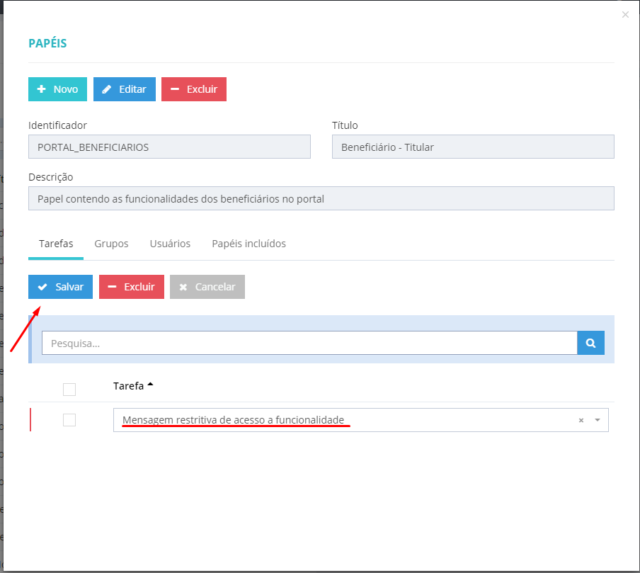
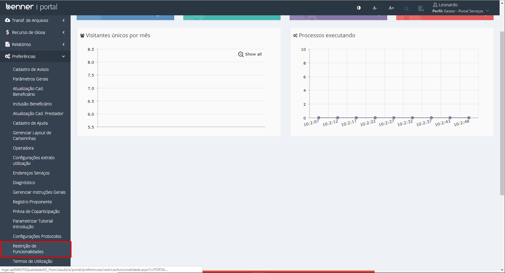
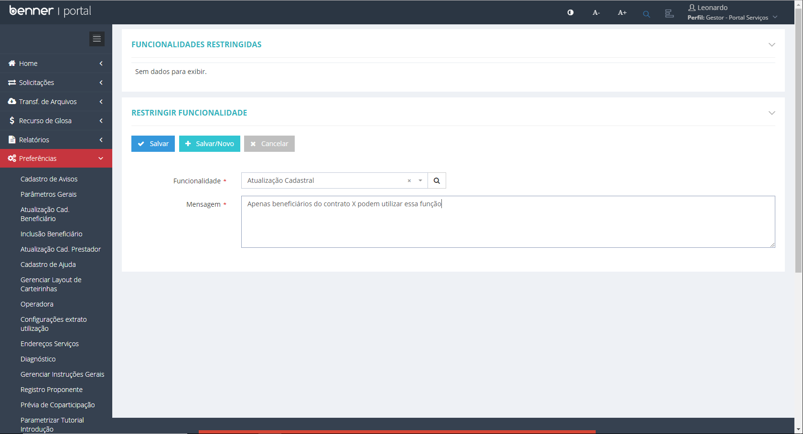
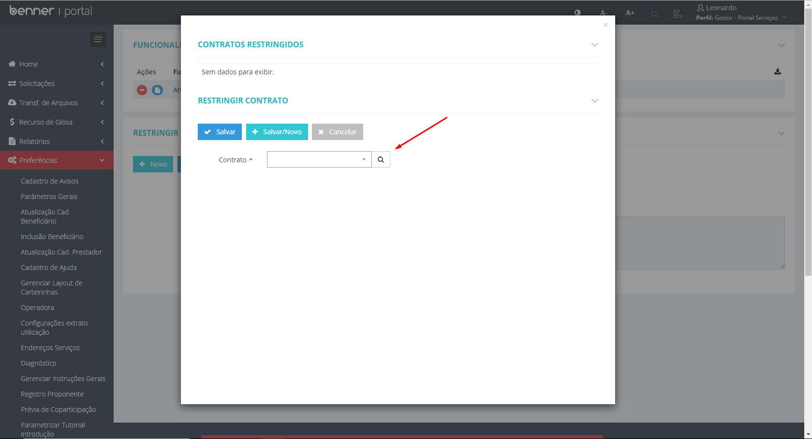

# Parametrizações - Restrição de Funcionalidade

1.  **[Introdução](#introdução)**
2.  **[Parametrização de tarefa para beneficiário](#parametrização-de-tarefa-para-beneficiário)**
3.  **[Parametrização de tarefa para gestor](#parametrização-de-tarefa-para-gestor)**
4.  **[Restringindo Funcionalidade](#restringindo-funcionalidade)**

## Introdução

Para que a restrição de funcionalidade funcione no **Portal** é necessário qua a tarefa *"Mensagem restritiva de acesso a funcionalidade"* esteja associada ao papel de Beneficiário e que a tarefa *"Restringir funcionalidades do beneficiários conforme contrato"* esteja associada ao papel que realizará a parametrização.

## Parametrização de tarefa para beneficiário

> Administrador > Configurações > Papéis > Papel(Beneficiário) > Incluir tarefa > *"Mensagem restritiva de acesso a funcionalidade"*

A parametrização concede as configurações necessárias para que a mensagem de restrição seja apresentada para o beneficiário.

## Parametrização de tarefa para gestor

> Administrador > Configurações > Papéis > Papel(Gestor) > Incluir tarefa > *"Restringir funcionalidades do beneficiários conforme contrato"*

A parametrização habilita o menu Restrição de Funcionalidades para o papel selecionado. 

## Restringindo Funcionalidade

> Gestor > Parametros gerais > Restrição de Funcionalidades

No caminho informado deve ser apresentado os seguintes campos para parametrização:

* **Restringir Funcionalidade:** Exibe as funcionalidades que podem ser restringidas.
* **Mensagem:** Mensagem que será exibida ao beneficiário quando acessar a funcionalidade restringida.

Após salvar a parametrização deve ser inserido um novo registro no grid Funcionalidades Restringidas onde é possível excluir a prametrização ou incluir os contratos que terão a funcionalidade restringida.

* **Vincular Contrato:** Exibe os contratos.

