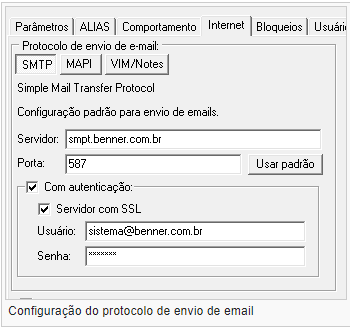
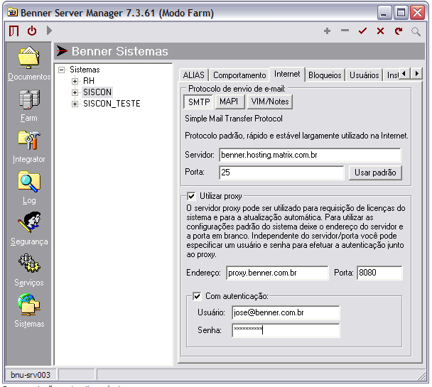

# Envio de emails - Servidor SMTP

O mecanismo utilizado para enviar emails varia conforme o protocolo de envio, parâmetros de sistema, etc.

O protocolo é configurado na aba Internet do sistema desejado:

No caso de protocolo SMTP, as mensagem serão enviadas utilizando as configurações de servidor e porta informadas no Server Manager. Caso existirem configurações de SMTP informadas no cadastro do usuário (Z_GRUPOUSUARIOS) estas terão preferência. Este protocolo suporta processos de servidor e agendamento de envio de email e deve ser adotado como padrão.

No caso de protocolo MAPI, as mensagem são enviadas com o cliente padrão da estação. ex: MS Outlook Express, MS Outlook e todos compatíveis com o MAPI. Este protocolo não suporta processos de servidor, nem agendamento de envio de email.

No caso de protocolo VIM/Notes, as mensagem são enviadas utilizando o cliente de Lotus Notes instalado na estação. Este protocolo não suporta processos de servidor, nem agendamento de envio de email.

A preferência deve ser sempre pelo SMTP. Os protocolos MAPI e VIM/Notes não são mais suportados e existem por questões de compatibilidade.

Além desta configuração, existem alguns parâmetros de sistema que influenciam no envio dos emails. Estes parâmetros são configurados na aba Parâmetros e estão listados abaixo:

* USEDOTNETMAIL - Utiliza o componente padrão do .NET Framework para envio de email (Padrão na Tecnologia 13.0)

* USEINDY - Utiliza o componente Indy do Delphi para envio de email. (Não disponível a partir da versão 14.1)

Na Tecnologia 13.0 caso nenhum desses dois parâmetros esteja informado e o protocolo selecionado for SMTP será utilizado o componente de envio de email do .NET Framework. Neste caso para forçar o uso do componente legado wodSmtp (arquivo Comum wodSMTP.OCX) é necessário informar USEDOTNETMAIL=N. Em versões de Tecnologia inferiores a 13.0, caso nenhum parâmetro esteja informado, será utilizado o componente wodSmtp que requer o arquivo Comum wodSMTP.OCX.

Na versão 13.1 ou inferior o parâmetro USEINDY tem prioridade se estiver ligado. Na versão 14.1 ou superior o parâmetro USEINDY é ignorado.

## Proxy

Caso o acesso a Internet seja feito através de um servidor Proxy é necessário configurar o Server Manager.

No Server Manager, ícone Sistemas, selecione o sistema desejado e clique na aba Internet, ligue a opção Utilizar Proxy.

Se todas as informações adicionais forem deixadas em branco serão utilizadas as configurações definidas em Opções da Internet no Painel de Controle. Caso as configurações definidas em Opções da Internet não sejam suficientes é necessário informar o Endereço do servidor e a Porta do Proxy.

Adicionalmente pode-se informar um usuário e senha caso seja necessário fazer um acesso Autenticado.

Após a configuração clique em Salvar.

