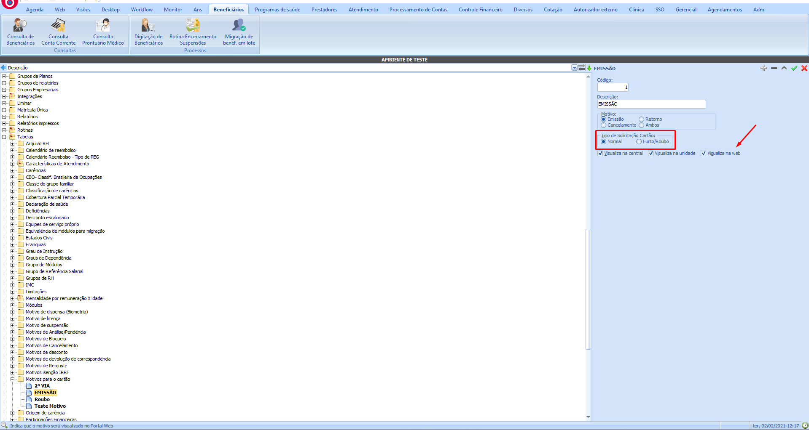
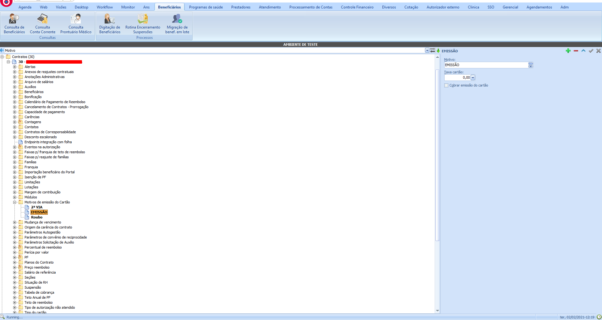
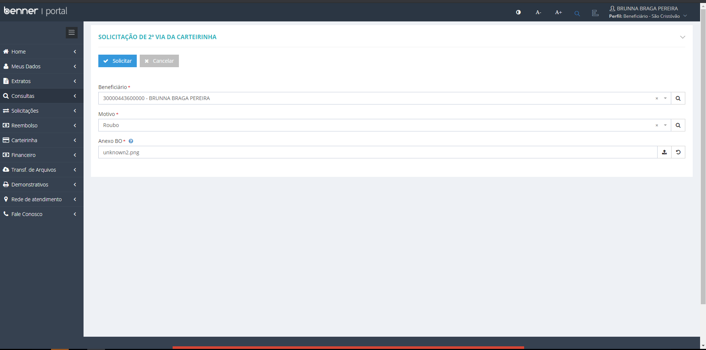
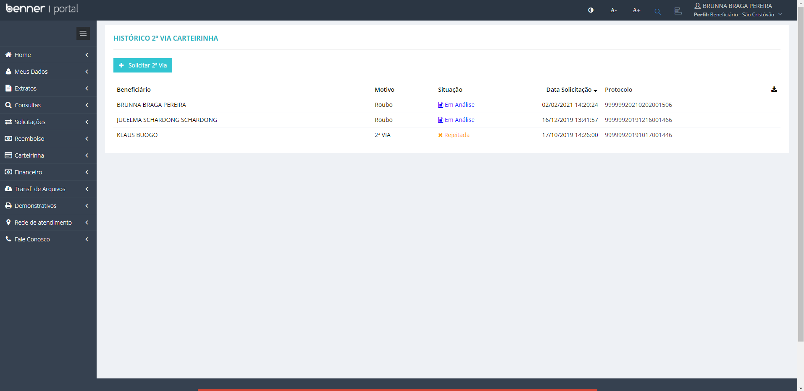
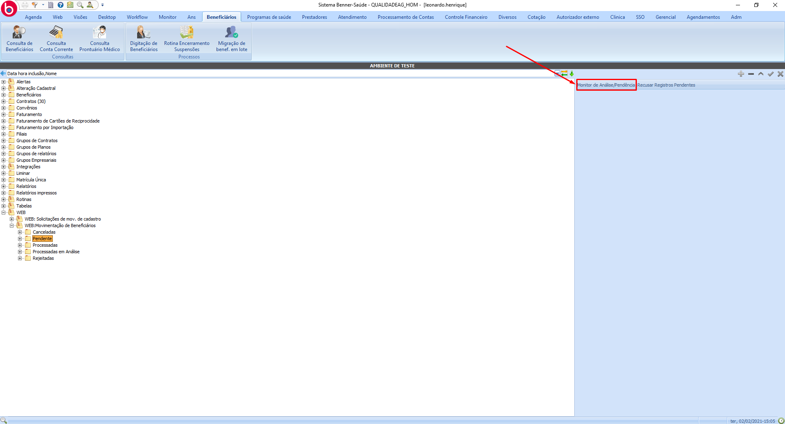
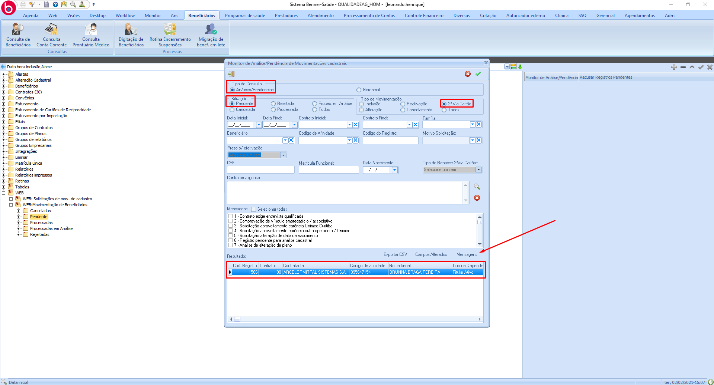
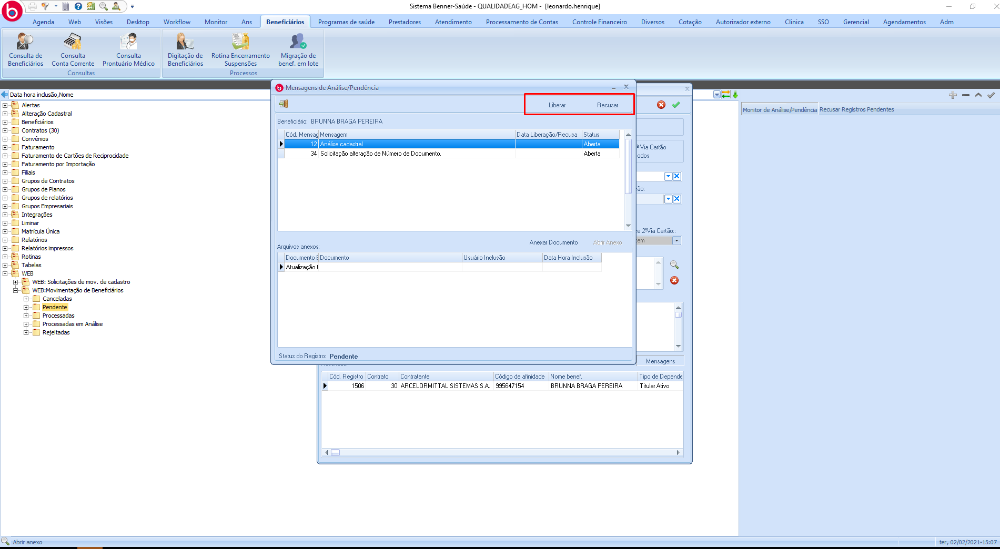
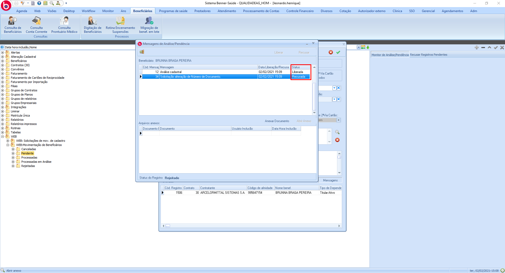
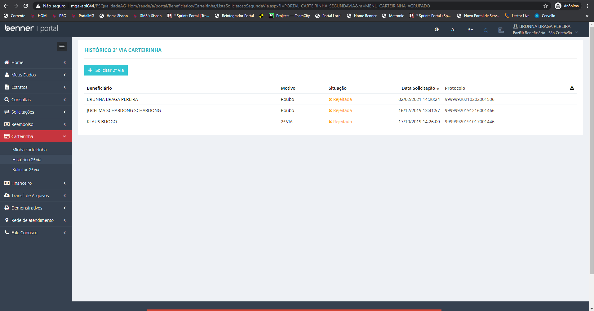

# Solicitação 2ª via cartão

1. **[Introdução](#introdução)**
2. **[Motivos para emissão](#Motivos-para-emissão)**
3. **[Sincronizações](#Sincronizações)**
4. **[Solicitando 2ª via de carteirinha pelo portal](#Solicitando-2ª-via-de-carteirinha-pelo-portal)**
5. **[Atendimento de solicitações](#Atendimento-de-solicitações)**

## Introdução

Neste manual será abordado de forma simples as parametrizações necessárias para a utilização da funcionalidade de solicitação 2ª via de carteirinha.

## Motivos para emissão

> Beneficiários > Tabelas > Motivos para o cartão

Para a exibição dos motivos de solicitação de 2ª via de cartão no portal, primeiramenre será necessário criar um motivo de cartão com o flag "Visualiza na web" no sistema Saúde.

Caso o "tipo de solicitação cartão" seja "Furto/Roubo", será exibido um campo para anexo de arquivos no momento da solicitação de 2ª via.

> Beneficiários > Contratos > Motivos de emissão do cartão

O motivo criado anteriormente deverá ser vinculado aos contratos que poderão solicitar o mesmo.

## Sincronizações

> Gestor - Portal Serviços > Painel de Sincronização > Gerenciador de Sincronizações > Contratos motivo cartão

Para que os motivos sejam exibidos no portal, é necessário executar a sincronização "Contratos motivo cartão".

> Gestor - Portal Serviços > Painel de Sincronização > Gerenciador de Sincronizações > Solicitação de Segunda Via Carteirinha

A sincronização "Solicitação de Segunda Via Carteirinha" realizará o envio de solicitações com status "Solicitada" para análise no sistema saúde.

> Gestor - Portal Serviços > Painel de Sincronização > Gerenciador de Sincronizações > Situação de Segunda Via Carteirinha

Para que o status das solicitações de 2ª via da carteirinha sejam atualizadas, será necessário executar a sincronização "Situação de Segunda Via Carteirinha".

## Solicitando 2ª via de carteirinha pelo portal

> Beneficiário > Carteirinha >  Solicitar 2ª via

A página "Solicitação de 2ª via da carteirinha" permite ao beneficiário solicitar sua 2ª via de cartão indicando o motivo e o beneficiário a ter o cartão emitido. Caso o motivo seja furto/roubo, um novo campo será exibido para o anexo do BO.

> Beneficiário > Carteirinha > Histórico 2ª via

O beneficiário poderá acompanhar o status de sua solicitação através da funcionalidade "Histórico 2ª via". O status da solicitação somente será atualizado após a execução da sincronização "Situação de Segunda Via Carteirinha".

## Atendimento de solicitações

> Beneficiários > WEB > WEB:Movimentação de Beneficiários > Monitor de Análise/Pendência

A liberação/recusa da solicitação de 2ª via é feita por meio da aprovação ou recusa das mensagens de pendência. Caso todas mensagens tenham sido aprovadas, a solicitação também é aprovada, caso alguma pendência tenha sido negada, a solicitação também será negada.

