# Parametrizações - Solicitações Diversas

1.  **[Introdução](#introdução)**
2.  **[Sistema AG](#sistema-ag)**

    2.1 **[Prazo para resolução](#prazo-para-resolução)**

3.  **[Sistema Portal](#sistema-portal)**
4.  **[Atendimento das Solicitações](#atendimento-das-solicitações)**

## Introdução

Neste manual será abordado a configuração e utilização da funcionalidade *“Solicitações Diversas”* no **Portal**. Usaremos como exemplo uma solicitação de cancelamento de beneficiário.

> Nota: É importante ressaltar que a funcionalidade de ‘Solicitações Diversas’ foi implementada em conjunto com o **sistema AG** e **não está limitada apenas a Cancelamento de Beneficiário**. Seu propósito pode se estender a quaisquer necessidades que o cliente venha a ter quanto a solicitações do Beneficiário.

## Sistema AG
**Criar ou ajustar os outros serviços e as classes que se deseja exibir no portal.**

Como exemplo no ambiente de homologação da Qualidade, será utilizado o serviço de 'CADASTRO' e a classe 'CANCELAMENTO'. Para que esta classe esteja disponível no Portal, a mesma deve-se *'Permitir Solicitação Portal Serviços'*.

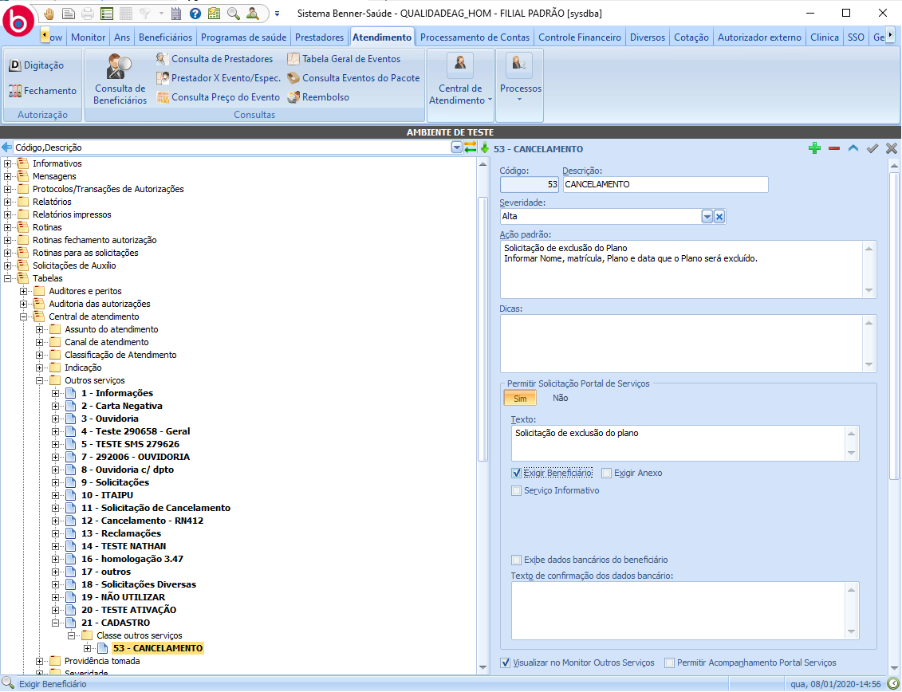

**Texto:** texto informado neste campo será exibido para o beneficiário no portal.

**Exigir Beneficiário:** permite que seja selecionado um ou mais dependentes à solicitação.

**Exigir Anexo:** exige que sejam inclusos anexos na solicitação.

**Serviço Informativo:** solicitação não poderá ser enviado para o sistema AG. Sendo exibido para o beneficiário apenas um texto informativo quando o mesmo selecionar esta classificação.

**Exibe dados bancários do beneficiário:** Exibe os dados bancários para que o beneficiário possa conferir se as informações estão corretas (ideal para solicitações que exijam transações bancárias).

**Texto de confirmação de dados bancários:** texto informado neste campo será exibido juntamente aos dados bancários do beneficiário.

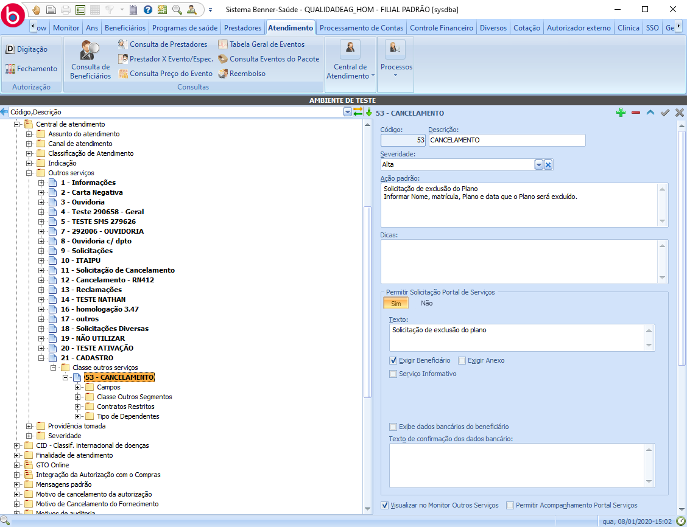

**Cargas**

* **Campos:** podem-se criar campos para que sejam exibidos no portal (criar formulários, porém com uma limitação de validações de tipos de campos disponíveis).

-  *Campo tipo Data* : Será exibido no Portal um campo para digitação de Data.

-  *Campo tipo Valor* : Será exibido no Portal um campo para digitação de valor Decimal.

 -  *Campo Tipo Período* : Será exibido no Portal um campo para digitação tipo Data. É necessário que seja criado dois campos tipo Período, o primeiro(período inicial) deve ter sua Ordem preenchida com um valor menor que o segundo(período final).

 -  *Campo tipo Texto* : Será exibido no Portal uma caixa de texto para digitação.

 -  *Campo tipo Lógico* : Será exibido no Portal um Checkbox para marcação. 

 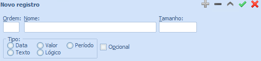

* **Classe Outros Segmentos:** segmentos vinculados às solicitações desta classe.

* **Contratos Restritos:** beneficiários de contratos parametrizados neste campo não terão acesso a esta classe de serviço.

* **Tipo de dependentes:** restringe a inclusão de dependentes, podendo adicionar apenas dependentes dos tipos informados nesta carga.

## Prazo para resolução

Para alterar o prazo de resolução do atendimento, é necessário habilitar "Processo de Ouvidoria - SIM".

 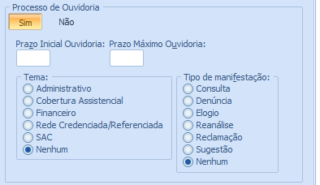

 No campo *'Prazo Inicial Ouvidoria'* e *'Prazo Final Ouvidoria'* , digite o prazo **em dias**. Após isso, salve a Solicitação.
 Volte ao *Processo de Ouvidoria* , marque para *'Não'* e salve novamente.

Essa parametrização é necessária para que o Portal receba corretamente o valor do prazo de resolução da solicitação.
Vale lembrar que se manter parametrizado *'Processo de Ouvidoria - Sim'*, a solicitação deixará de ser uma *'Solicitação Diversa'* e será exibida apenas na funcionalidade de **Reclamação/Sujestão** no Portal.

## Sistema Portal

Com usuário administrador, deve-se adicionar tarefa *'Solicitações Diversas'* ao papel  *'Beneficiário Titular'*.

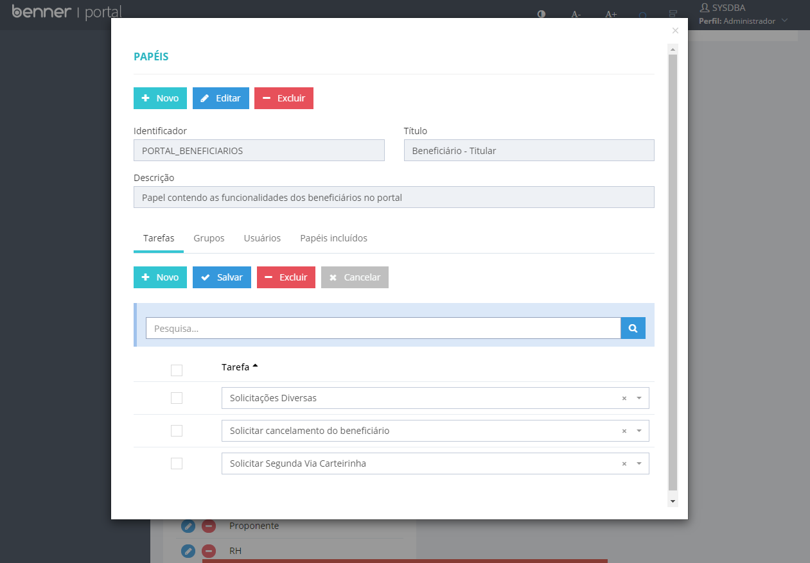

Os tipos de serviços e classificações parametrizadas serão importados/atualizados através a execução da sincronização de 'Tipo de Serviço' disponível no 'Painel de Sincronizações'.

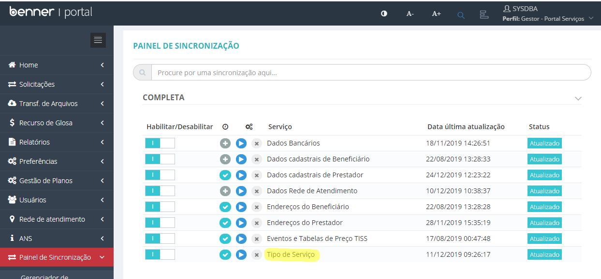

Para o Beneficiário estará disponível um novo item de menu 'Solicitações > Diversas'.

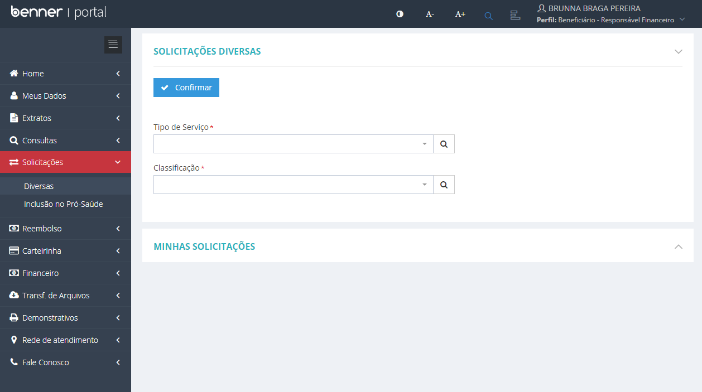

O beneficiário deve selecionar o tipo de serviço, a classificação desejada e clicar no botão 'Confirmar'.

Caso haja informações obrigatórias, o mesmo deverá informá-las antes de enviar a solicitação a operadora.

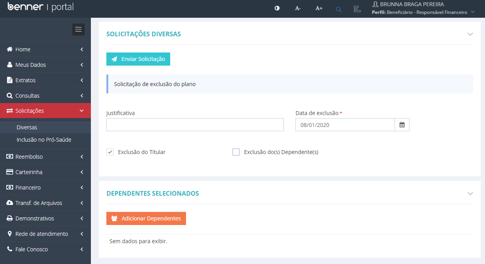

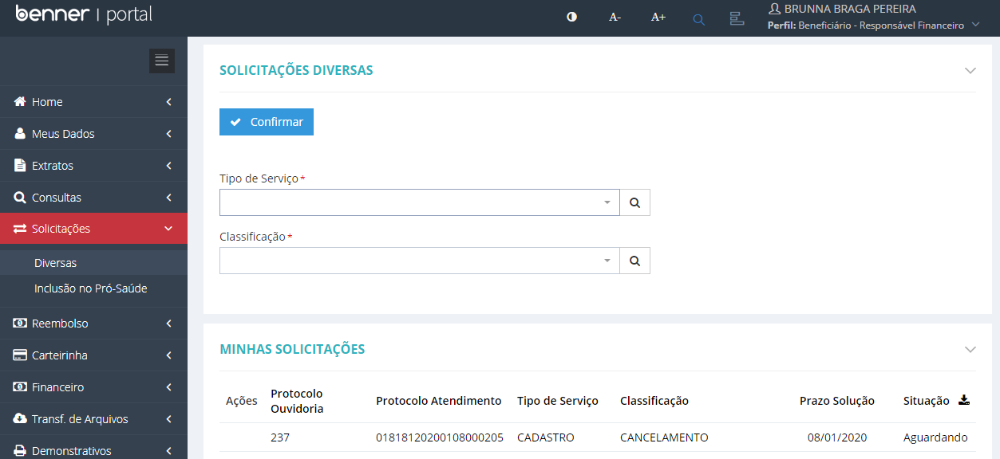

>Obs: dados das solicitações são atualizados assim que o beneficiário acessa a funcionalidade.

## Atendimento das Solicitações

Solicitação será atendida através do monitor de outros serviços seguindo o fluxo padrão de atendimento.

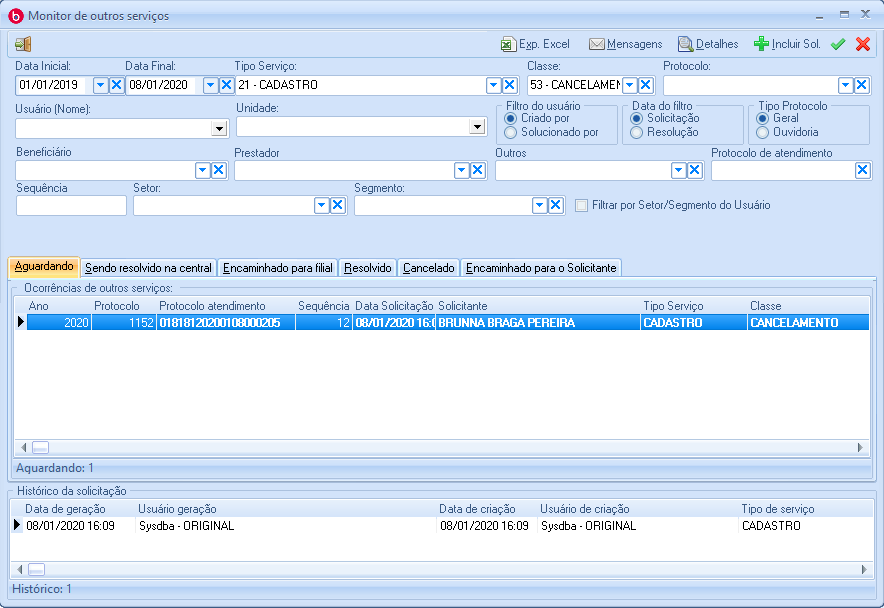

Ao selecionar a solicitação, no campo 'Texto' da aba 'Assunto' estarão os dados informados pelo beneficiário no formulário da solicitação realizada.

Exemplo:

Dados Informados:

- Justificativa: 
- Data de exclusão: 08/01/2020
- Exclusão do Titular: Sim
- Exclusão do(s) Dependente(s): Não

Beneficiário Solicitante:
- MARIA ABADIA COSTA

## Retorno de Solicitações

Caso seja necessário retornar a solicitação ao beneficiário (para solicitar um anexo, por exemplo), deve-se marcar a opção **Solicitante** em **Encaminhar**.

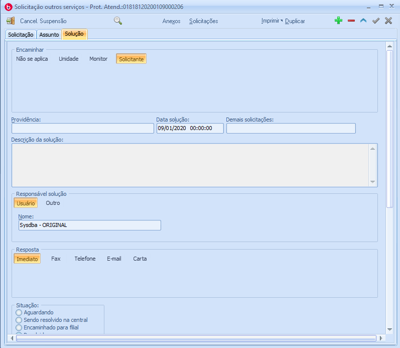

Ao acessar o Portal, a solicitação estará com situação 'Encaminhado para o Solicitante', e em 'Ações', será possivel anexar arquivos.

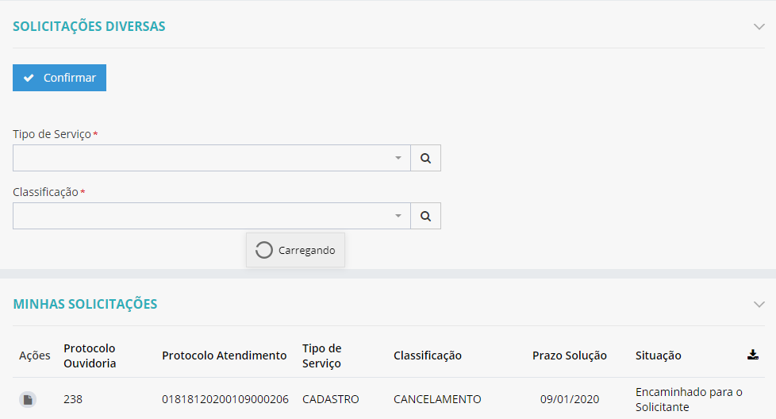

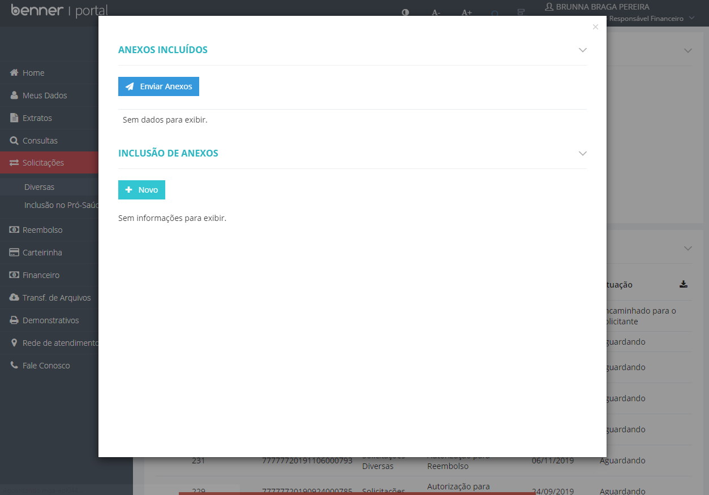

Ao clicar em 'Enviar Arquivos', o mesmo será enviado para o  Sistema AG.

No Sistema AG, acesse:

>Monitor de outros processos > Assunto > Apresentado

O campo 'Anexo' possui o arquivo enviado no Portal, em formato '.zip'.

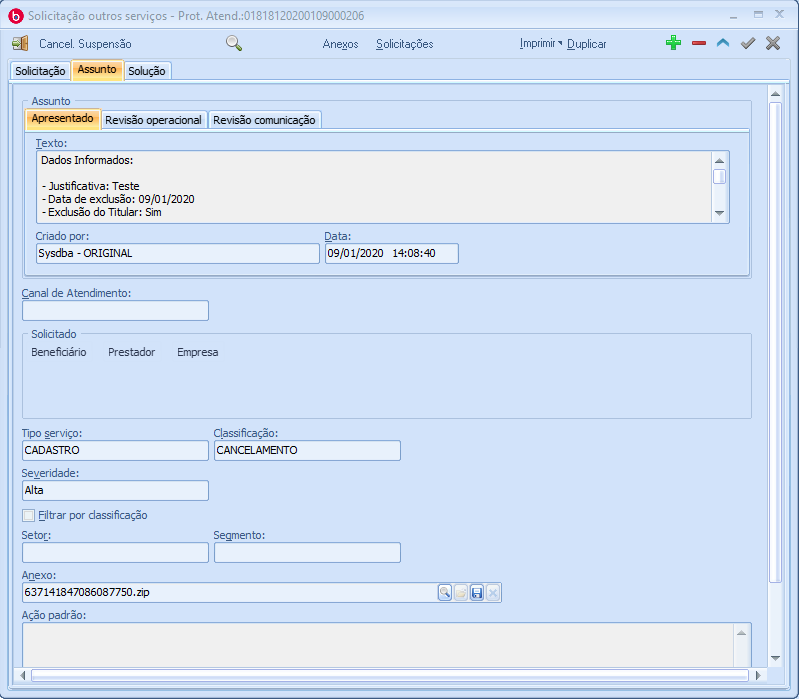