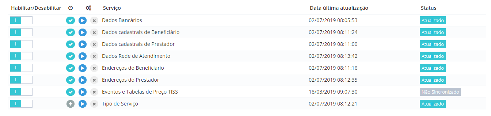
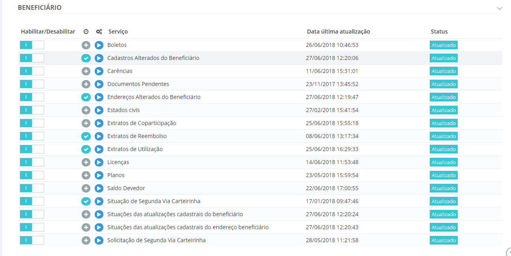
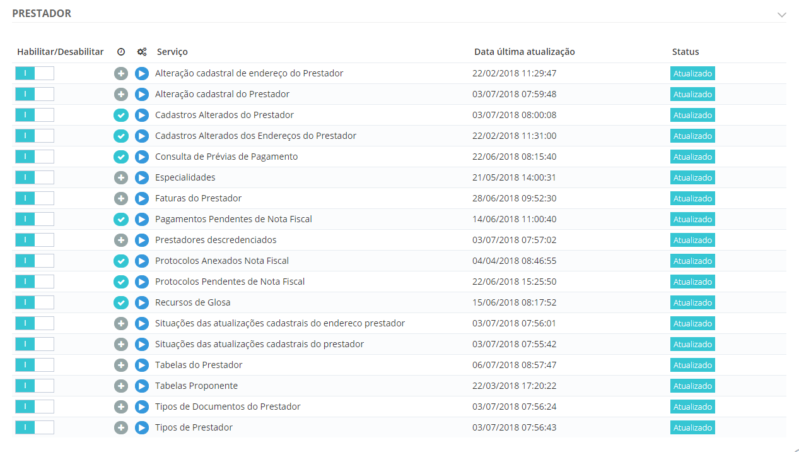
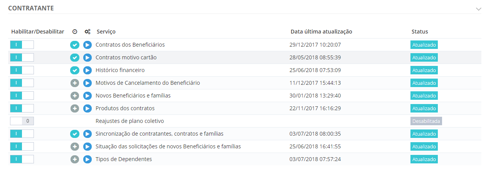

# Sincronizações Portal

1.  **[Introdução](#introdução)**
2.  **[Sincronizações completas](#sincronizações-completas)**
3.  **[Sincronizações de beneficiário](#sincronizações-de-beneficiário)**
4.  **[Sincronizações de prestador](#sincronizações-de-prestador)**
5.  **[Sincronizações de contratante](#sincronizações-de-contratante)**

## Introdução

Resumo das ações de sincronização do portal.

> Nota: É importante lembrar que é necessário que o endereço cliente esteja parametrizado corretamente.*

## Sincronizações completas

> Painel de Sincronização > Gerenciador de Sincronizações

* **Dados Bancários:** Importa todos os dados de bancos e agências das contas financeiras dos usuários do Portal.
* **Dados cadastrais de Beneficiário:** Importa todos os beneficiários para o Portal, sincronização grande, não recomendado executar diariamente.
* **Dados cadastrais de Prestador:** Importa todos os prestadores para o Portal, sincronização grande, não recomendado executar diariamente.
* **Dados Rede de Atendimento:** Importa os prestadores da rede credenciada para o Portal.
* **Endereços do Beneficiário:** Importa todos os endereços de beneficiários para o Portal, sincronização grande, não recomendado executar diariamente.
* **Endereços do Prestador:** Importa todos os endereços de prestador para o Portal, sincronização grande, não recomendado executar diariamente.
* **Eventos e Tabelas de Preço TISS:** Importa todas as tabelas de eventos (TGE) para o Portal, sincronização grande, recomendado executar somente quando há alterações nas tabelas de eventos.
* **Tipo de Serviço:** Importa todos os tipos de serviço para o Portal.

## Sincronizações de beneficiário

> Painel de Sincronização > Gerenciador de Sincronizações
* **Boletos:** Importa as informações de boletos gerados no saúde.
* **Cadastros Alterados do Beneficiário:** Importa todas as alterações dos beneficiários já importados para o Portal.
* **Carências:** Importa os dados de carência dos beneficiários.
* **Documentos Pendetes:**
* **Endereços Alterados do Beneficiário:** Importa todas as alterações dos endereços dos beneficiários já importados para o Portal.
* **Estados civis:** Importa os estados civis parametrizados no saúde
* **Extratos de Coparticipação:** Importa os extratos de coparticipação das famílias dos usuários beneficiários para o Portal. Dependendo do número de usuários e famílias a sincronização pode ser grande, não recomendado realizar diariamente.
* **Extrato de Reembolso:** Importa os extratos de reembolso das famílias dos usuários beneficiários para o portal. Dependendo do número de usuários e famílias a sincronização pode ser grande, não recomendado realizar diariamente.
* **Extratos de Utilização:** Importa os extratos de utilização das famílias dos usuários beneficiários para o Portal. Dependendo do número de usuários e famílias a sincronização pode ser grande, não recomendado realizar diariamente.
* **Licenças:** Importa os dados de licenças dos beneficiários.
* **Planos:** Importa os dados de planos dos beneficiários.
* **Saldo Devedor**
* **Situação de Segunda Via Carteirinha:** Atualiza as situações das solicitações de segunda via de carteirinha realizada pelos beneficiários.
* **Situações das atualizações cadastrais do beneficiário:** Atualiza as situações das solicitações de alteração cadastrais realizadas pelos beneficiários.
* **Situações das atualizações cadastrais do endereço beneficiário:** Atualiza as situações das solicitações de alteração de endereços realizadas pelos beneficiários.
* **Solicitação de Segunda Via Carteirinha:** Exporta para o Saúde as solicitações de segunda via de carteirinha realizadas pelos beneficiários.

## Sincronizações de prestador

> Painel de Sincronização > Gerenciador de Sincronizações

* **Alteração cadastral de endereço do Prestador:** Exporta para o Saúde as solicitações de alteração de endereço realizadas pelos prestadores.
* **Alteração cadastral do Prestador:** Exporta para o Saúde as solicitações de alteração cadastral realizadas pelos prestadores.
* **Cadastros Alterados do Prestador:** Importa todas as alterações dos prestadores já importados para o Portal.
* **Cadastros Alterados dos Endereços do Prestador:** Importa todas as alterações dos endereços dos prestadores já importados para o Portal.
* **Consulta de Prévias de Pagamento:** Importa os dados de prévias de pagamento existentes no saúde.
* **Especialidades:** Importa as especialidades parametrizadas no saúde.
* **Faturas do Prestador:** Importa os dados de faturas do prestador para o Portal.
* **Pagamentos Pendentes de Nota Fiscal:** Importa para o Portal os dados de pagamentos que estão pendentes de Nota Fiscal.
* **Prestadores descredenciados:** Importa para o Portal os prestadores que foram descredenciados.
* **Protocolos Anexados Nota Fiscal:** Importa para o Portal os protocolos com nota fiscal anexada.
* **Protocolos Pendentes de Nota Fiscal:** Importa para o Portal os protocolos que estão pendentes de nota fiscal.
* **Recursos de Glosa:** Importa para o Portal protocolos passíveis de recurso de glosa.
* **Situações das atualizações cadastrais do endereço prestador:** Atualiza as situações das solicitações de alteração de endereços realizadas pelos prestadores.
* **Situações das atualizações cadastrais do prestador:** Atualiza as situações das solicitações de alteração cadastrais realizadas pelos prestadores.
* **Tabelas do Prestador:** Importa para o portal as informações necessárias para realizar alteração dos prestadores (conselho, área de atuação, etc.)
* **Tabelas Proponente:** Importa para o portal as informações necessárias para realizar a solicitação de credenciamento (serviços, equipamentos, etc.)
* **Tipos de Documentos do Prestador:** Importa para o Portal os tipos de documentos que o prestador pode incluir em certos cadastros/solicitações.
* **Tipos de Prestador:** Importa para o Portal os tipos de prestador parametrizados no saúde.

## Sincronizações de contratante

> Prestadores > Tabelas > Tipo de Prestador > Documentos exigidos

* **Contratos dos Beneficiários:** Importa para o Portal os dados dos contratos parametrizados no saúde.
* **Contratos motivo cartão:** Importa para o Portal os motivos de solicitação de cartão do contrato.
* **Histórico Financeiro:** Importa para o Portal os dados referentes ao histórico financeiro.
* **Motivos de Cancelamento do Beneficiário:** Importa para o portal os motivos de cancelamento de beneficiário.
* **Novos Beneficiários e famílias:** Exporta para o Saúde os novos beneficiários incluídos pelo Portal.
* **Produtos dos contratos:** Importa para o Portal os dados referente ao módulo dos contratos
* **Reajustes de plano coletivo:** Sincronização somente para os sistemas MG.
* **Sincronização de contratantes, contratos e famílias:** Importa para o Portal todos os contratantes, juntamente com seus contratos e famílias. Sincronização grande, não recomendado executar diariamente.
* **Situação das solicitações de novos Beneficiário e famílias:** Atualiza a situação das solicitações de inclusão de novos beneficiários realizadas pelo Portal.
* **Tipos de Dependentes:** Importa para o Portal os tipos de dependentes parametrizados no saúde.

